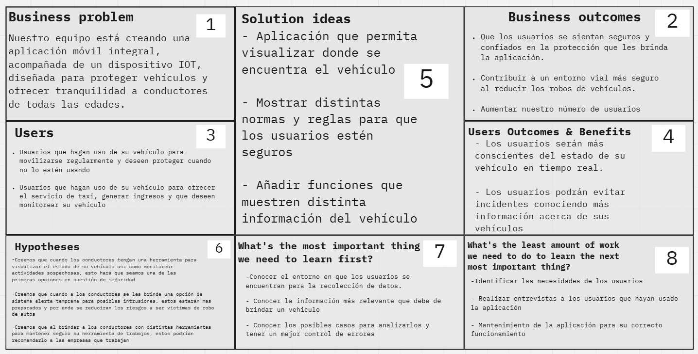

# **Capítulo I: Presentación**
La introducción es crucial para establecer el marco en el cual se desarrollará el proyecto. Proporcionará una visión general de los objetivos, antecedentes y alcance del trabajo que se va a realizar. Además, sirve para contextualizar la importancia del proyecto, destacando las razones que lo motivan y los problemas que busca resolver.

## 1.1. Startup Profile
El perfil de una startup es crucial para comprender su visión, sus valores fundamentales y su propuesta única en el mercado. En este punto, exploraremos los elementos clave que definen la identidad y el potencial de una startup, desde su historia hasta su enfoque innovador y sus metas a largo plazo.

### 1.1.1. Descripción de la Startup
Nosotros, un grupo de estudiantes comprometidos con hacer una diferencia en nuestra sociedad, nos enfrentamos a uno de los desafíos más apremiantes: la creciente delincuencia, especialmente el robo de automóviles. Esta problemática afecta a innumerables personas, generando preocupación y estrés en la vida cotidiana. En respuesta, presentamos con orgullo nuestra solución: una aplicación móvil diseñada para proporcionar seguridad y protección a la comunidad. Nuestra aplicación móvil se enfoca directamente en combatir la inseguridad de autos mediante la implementación de un sistema de vigilancia altamente eficiente y reactivo a través de un dispositivo IOT. Con esto, buscamos restaurar la tranquilidad en dejar un vehículo estacionado en cualquier lugar.

### 1.1.2. Perfiles de integrantes del equipo

|                                                |                                                                                                                                                                                                                                                                                                                                                                                                                                                      |
|------------------------------------------------|------------------------------------------------------------------------------------------------------------------------------------------------------------------------------------------------------------------------------------------------------------------------------------------------------------------------------------------------------------------------------------------------------------------------------------------------------|
|  | Mi nombre es Fabrizio Alessandro Sanchez Zamora con código de estudiante u202213652, soy estudiante de Ingeniería de Software. Entre mis conocimientos se encuentran el manejo de lenguajes de programacion como C++, JavaScript y Python, asi como también se manejar SQL, Html y CSS. Como miembro del equipo, me comprometo a colaborar con mis compañeros para poder presentar un buen proyecto grupal.                                          |
|       | Mi nombre es Juan Diego Cueto Dominguez, mi codigo de estudiante es u202012207, actualmente soy estudiante de la carrera de Ingeniería de Software. Cuento con conocimiento y experiencia en el uso de Git y GitHub, con el cual estaré apoyando a mis compañeros. Además poseo mucha práctica con los lenguajes de programación C++, JavaScript, Python , HTML5 y CSS3. Estoy dispuesto a apoyar y trabajar en el tiempo y momento que se requiera. |
|       | Mi nombre es Paolo Del Carmen Martinez Villanueva con código de estudiante u202010039, soy estudiante de la carrera de Ingeniería de Software. Cuento con conocimientos en lenguajes de programación como C++, C#, JavaScript, Python, HTML y CSS. Como miembro del equipo me comprometo a apoyar y colaborar con mis compañeros durantela realización del proyecto para poder brindar una solución de calidad innovadora. |
|                                                |                                                                                                                                                                                                                                                                                                                                                                                                                                                      |

## 1.2. Solution Profile
El perfil de solución nos ayudará a comprender cómo nuestro producto o servicio se relacionará con las necesidades y desafíos de nuestro grupo de interés. Esto nos permitirá definir las características y beneficios que mejor satisfarán las necesidades de nuestros clientes, lo que facilitará la comunicación y la conexión con nuestra audiencia objetivo en el futuro.
### 1.2.1 Antecedentes y problemática
Los antecedentes y la problemática proporcionan el contexto y la base sobre la cual se desarrolla un proyecto. Los antecedentes suelen incluir información histórica, investigaciones previas y datos relevantes que conducen al reconocimiento de un problema o necesidad. La problemática describe los desafíos o dificultades específicas que enfrenta una situación o un grupo de personas, lo cual justifica la necesidad de una intervención o solución.

- #### Antecedentes
El Perú es un país bastamente afectado por la problemática mencionada. (**Inseguridad ciudadana**) Según el Barómetro de
las Américas 2017, Perú es el segundo país en América con las cifras más altas de inseguridad
ciudadana, superado solo por Venezuela (LAPOP, 2017). Asimismo, se ha encontrado que más
del 70% de los peruanos sienten inseguridad ciudadana en el país (Alegre, Alata, & Oshigue,
2017), un resultado alarmante y similar a países en guerra (Muggah & Aguirre, 2018).

La inseguridad ciudadana se manifiesta en Lima principalmente a través de robos callejeros
sin violencia (Alegre, Alata, Oshige, & De La Cruz, 2018). La investigadora peruana Patricia
Zárate indica que la población limeña sufre de robo de carteras, celulares y billeteras cuando
camina, viaja en el bus o en el auto (La República, 2018). Asimismo, el IX informe de Lima Cómo
Vamos, señala que la cifra de personas afectadas por esta modalidad llega a un 52,2% (Alegre et
al., 2018). Por último, el grupo de jóvenes de 15 a 33 años se encuentra en mayor riesgo; el 33,6%
de personas de este grupo han sufrido de algún acto producto de la inseguridad ciudadana (García
Zanabria et al., 2019)
#### Uso de la técnica  The 5'W's w Y 2'H's
Presentación del modelo de las preguntas 5Ws y 2 hs con la que se analizaron los antecedentes y la problemática que abarca nuestro proyecto.

| LAS 5W y 2H | Pregunta                                                | Descripción                                                                                                                                                                                                                                                                                                   |
|-------------|---------------------------------------------------------|---------------------------------------------------------------------------------------------------------------------------------------------------------------------------------------------------------------------------------------------------------------------------------------------------------------|
| Who?        | ¿Quién es afectado?                                     | Las personas que poseen un vehículo, ya sea para uso personal o para prestar servicios de taxi, son las principales afectadas. Aquellos que dependen de sus vehículos para trabajar necesitan proteger tanto su propiedad como su fuente de ingresos, especialmente frente al creciente riesgo de robo. |
| What?       | ¿Cuál es el problema?                                   | El problema radica en la insuficiente seguridad frente a los robos vehiculares. Nuestro enfoque está en mejorar la protección de los vehículos mediante la implementación de un software y un dispositivo que incrementen significativamente su seguridad.                                                                                                                                                                                                                                                                                                             |
| When?       | ¿Cuándo sucede el problema?                             | El problema surge principalmente cuando los vehículos están estacionados, ya sea durante períodos cortos o en casos de asaltos a mano armada.|
| Where?      | ¿Dónde surge el problema?                               | Los robos de vehículos pueden ocurrir en cualquier lugar, pero son más frecuentes en áreas con alta concentración de personas. En nuestro país, especialmente en la capital (Lima) y sus alrededores, es donde se registra el mayor número de incidentes. Según fuentes como la Diprove y la PNP, en Lima se reportan aproximadamente de 20 a 25 robos de vehículos (incluyendo sustracción y robo de autopartes) al día.                                                                                                                                                                                                                                                                                                              |
| Why?        | ¿Cuál es la causa del problema?                         | La "falta de seguridad en cuanto a robos vehiculares" se debe, en gran parte, a la escasez de herramientas que permitan salvaguardar los vehículos, como sistemas de rastreo o medidas de seguridad efectivas. Sin embargo, la causa de los robos está ligada a diversos factores, como la pobreza, la falta de conciencia, la ociosidad, entre otros.                                                                                                                                                                                                                                                                                                              |
| How?        | ¿Qué llevó a la persona a esta situación?               | Aunque el robo de un vehículo puede ocurrir en cualquier momento y lugar, existen formas de prevenirlo mediante el uso de servicios o software, como GPS o aseguradoras, aunque estos no siempre garantizan la efectividad esperada.                                                                                                                                                                                                                                                                                                              |
| How Much?   | ¿Cuál es la cantidad, duración o intensidad del evento? | En las zonas urbanas, no solo en Perú, los robos suelen ser de alta intensidad y ocurren en cuestión de minutos (aproximadamente 1 o 2 minutos).                                                                                                                                                                                                                                                                                                              |
### 1.2.2 Lean UX Process
El proceso Lean UX es una metodología ágil que revoluciona la forma en que se diseña y desarrolla productos digitales. En este punto, exploraremos los principios fundamentales de Lean UX y cómo se integran en el ciclo de desarrollo de productos. Desde la colaboración multidisciplinaria hasta la iteración rápida y la validación continua, descubriremos cómo este enfoque permite a los equipos crear productos centrados en el usuario de manera eficiente y efectiva.
- #### 1.2.2.1. Lean UX Problem Statements
El incremento alarmante de los robos de vehículos y el problema del estacionamiento indebido en Perú ha generado una situación crítica en cuanto a la seguridad ciudadana. Esta problemática afecta no solo la propiedad de los ciudadanos, sino también la seguridad pública y la movilidad urbana, creando un ambiente de desconfianza y temor entre la población.

Para abordar estos desafíos, es esencial implementar soluciones efectivas que mejoren tanto la seguridad como la movilidad urbana. Una propuesta innovadora es el desarrollo de una aplicación móvil conectada a los vehículos, que pueda detectar comportamientos sospechosos y ofrecer orientación sobre estacionamientos disponibles. Esta herramienta, al colaborar con las autoridades y la comunidad, contribuirá a crear un entorno más seguro y organizado.
- #### 1.2.2.2. Lean UX Assumptions
  ### **Business Assumptions**

    * **Pienso que mis clientes necesitan** una solución integral y fácil de usar para proteger sus vehículos del robo y encontrar estacionamientos seguros de manera rápida y conveniente.
    * **Estas demandas pueden ser satisfechas mediante**  el desarrollo de una aplicación móbil  que utilice algoritmos avanzados para detectar actividades sospechosas y ofrecer información en tiempo real sobre la disponibilidad de estacionamientos seguros.
    * **Los primeros clientes serán** propietarios  de vehículos urbanos que se encuentren preocupados por la seguridad de sus automóviles.
    * **La principal necesidad que los clientes tienen de mi servicio es** sentirse seguros al dejar sus vehículos estacionados y poder encontrar rápidamente un lugar para estacionar en entornos urbanos caóticos.
    * **Obtendré la mayor parte de mis clientes mediante** campañas de marketing digital dirigidas a comunidades urbanas y asociaciones de vecinos preocupadas por la seguridad y la movilidad en la ciudad.
    * **Generaré ingresos mediante** mediante la oferta de una suscripción mensual para acceder a funciones premium de la aplicación.
    * **El principal problema que puede afectar a mi producto es** la desconfianza inicial de los usuarios hacia la efectividad y la privacidad de la tecnología  utilizada en la aplicación.
    * **Abordaremos esta situación mediante** una sólida estrategia de comunicación que destaque los beneficios de seguridad y conveniencia de nuestra aplicación, así como mediante la implementación de medidas estrictas de protección de datos para garantizar la privacidad de los usuarios.    
  
      ### **Business Outcomes Assumptions**
        *  **Asumimos que** a implementación de nuestra aplicación móvil resultará en una reducción del 30% en los robos de vehículos en las áreas urbanas donde se utilice.
        * **Esperamos que** nuestras campañas de marketing digital generen un incremento del 50% en la cantidad de usuarios registrados durante los primeros seis meses después del lanzamiento.
        * **Proyectamos que** al menos el 25% de los usuarios de la aplicación optarán por la suscripción mensual premium dentro del primer año, lo que impulsará significativamente los ingresos recurrentes.
        * **Anticipamos que** la satisfacción del usuario, medida a través de encuestas y reseñas, alcanzará un nivel del 80% o más, lo que fortalecerá la confianza en la efectividad y privacidad de nuestra solución, reduciendo así las barreras de adopción.

  ### **User Assumptions**

    * **Piensamos que mis clientes necesitan** una solución integral y fácil de usar para proteger sus vehículos del robo y encontrar estacionamientos seguros de manera rápida y conveniente.
    * **Estas demandas pueden ser satisfechas mediante**  el desarrollo de una aplicación móbil  que utilice algoritmos avanzados para detectar actividades sospechosas y ofrecer información en tiempo real sobre la disponibilidad de estacionamientos seguros.
    * **Los primeros clientes serán** propietarios  de vehículos urbanos que se encuentren preocupados por la seguridad de sus automóviles.
    * **La principal necesidad que los clientes tienen de nuestro servicio es** sentirse seguros al dejar sus vehículos estacionados y poder encontrar rápidamente un lugar para estacionar en entornos urbanos caóticos.
    * **Obtendremos la mayor parte de nuestros clientes mediante** campañas de marketing digital dirigidas a comunidades urbanas y asociaciones de vecinos preocupadas por la seguridad y la movilidad en la ciudad.
    * **Generaremos ingresos mediante** mediante la oferta de una suscripción mensual para acceder a funciones premium de la aplicación.
    * **El principal problema que puede afectar a nuestro producto es** la desconfianza inicial de los usuarios hacia la efectividad y la privacidad de la tecnología  utilizada en la aplicación.
    * **Abordaremos esta situación mediante** una sólida estrategia de comunicación que destaque los beneficios de seguridad y conveniencia de nuestra aplicación, así como mediante la implementación de medidas estrictas de protección de datos para garantizar la privacidad de los usuarios.    
  
      ### **User Outcomes Assumptions**
        *  Los usuarios confiarán en la capacidad de la aplicación para proteger sus vehículos y encontrar estacionamientos seguros, basándose en la reputación de la marca y en las recomendaciones positivas de otros usuarios.
        * Los usuarios urbanos activos buscarán soluciones tecnológicas innovadoras para satisfacer sus necesidades de movilidad, que incluyan la protección de vehículos y la optimización del estacionamiento en áreas congestionadas.
        * Los usuarios estarán dispuestos a compartir cierta información personal y de ubicación con la aplicación si perciben un beneficio claro en términos de seguridad y conveniencia para proteger sus vehículos y encontrar estacionamiento.
        * Los usuarios estarán dispuestos a descargar y probar la aplicación si la encuentran intuitiva y fácil de usar, y si tienen una experiencia de usuario satisfactoria desde el primer uso.
        * Los usuarios urbanos que han enfrentado robos de vehículos o dificultades para encontrar estacionamiento valorarán especialmente las características de seguridad y búsqueda de estacionamiento que ofrece la aplicación.

- #### 1.2.2.3. Lean UX Hypothesis Statements

    * **Creemos que** si proporcionamos una opción de seguridad a los jóvenes propietarios de vehículos, entonces estos estarán más pendientes de sus autos y, en consecuencia, estarán más alertas, lo que debería reducir el índice de robos.
    * **Suponemos que** si los conductores cuentan con una herramienta para visualizar el estado de su vehículo y monitorear actividades sospechosas, entonces esta característica los motivará a elegir nuestra solución como una de las principales opciones en seguridad. Sabremos que estamos en lo correcto cuando recibamos reseñas positivas sobre esta herramienta.      
    * **Inferimos que** si ofrecemos a los conductores un sistema de alerta temprana para posibles intrusiones, entonces estarán mejor preparados para prevenir robos, reduciendo así el riesgo de ser víctimas. Evaluaremos esta hipótesis mediante encuestas sobre cuántos robos se han evitado a tiempo gracias a esta implementación.
    * **Podemos lograr nuestro objetivo** si proporcionamos a los conductores herramientas para asegurar sus vehículos de trabajo, entonces es probable que recomienden nuestra solución a las empresas en las que trabajan. Validaremos esta hipótesis cuando obtengamos contratos con otras empresas.

- #### 1.2.2.4. Lean UX Canvas
El Lean UX Canvas es una herramienta  que permite a los equipos plasmar y visualizar de manera concisa los aspectos clave de su proyecto. En este punto, exploraremos cómo el Canvas facilita la colaboración y la alineación del equipo al definir claramente el problema, la solución propuesta, los usuarios y sus necesidades, así como las métricas de éxito.
  
https://miro.com/welcomeonboard/b1loNjZ6VHg4ZEdVajg0dlBjaU93cjVINnFKanFJVXZUU1BEU3NFR0F4amhTdFRKOThwbDV2bGV1UjVTV0xGSXwzNDU4NzY0NTI0NzY3ODY5NDg5fDI=?share_link_id=395543112346

## 1.3. Segmentos objetivo.
Los segmentos objetivo son grupos específicos de usuarios a los que se dirige un producto o servicio en particular.    
Los segmentos objetivos identificados se definirán en la siguiente tabla:

| Segmento Objetivo                                                                                                                                                   |                                                                                                                      Características Demográficas                                                                                                                       |                                                                                                                                                                                                                                                                                                                                                                                                                                                                                                                                                                                                                                                                                                                                                                                                                                                                                                                                                                                                                                                                           Información estadística de sustento |
|:--------------------------------------------------------------------------------------------------------------------------------------------------------------------|:-----------------------------------------------------------------------------------------------------------------------------------------------------------------------------------------------------------------------------------------------------------------------:|--------------------------------------------------------------------------------------------------------------------------------------------------------------------------------------------------------------------------------------------------------------------------------------------------------------------------------------------------------------------------------------------------------------------------------------------------------------------------------------------------------------------------------------------------------------------------------------------------------------------------------------------------------------------------------------------------------------------------------------------------------------------------------------------------------------------------------------------------------------------------------------------------------------------------------------------------------------------------------------------------------------------------------------------------------------------------------------------------------------:|
| Individuos que utilizan vehículos para transporte personal o como herramienta de trabajo y desean implementar soluciones tecnológicas para garantizar su seguridad. | **Edad**: Variable  **Género:** Varía (Hombre y Mujer)  **Nivel de Educación:** Diverso, desde educación básica hasta la educación superior.  **Ubicación Geográfica:** Áreas urbanas y suburbanas con necesidades de estacionamientos seguros. | Según el INEI, estos grupos son los más afectados por el robo de vehículos, y se ha observado un incremento de más del 250% en el robo de vehículos en comparación con años anteriores (INEI, 2021). Además, según la Asociación Peruana de Empresas de Seguros, el segmento de jóvenes entre 18 y 25 años es particularmente vulnerable al robo de vehículos en el Perú. Esta población, que depende en gran medida de sus medios de transporte para la movilidad diaria y actividades laborales, enfrenta retos significativos debido al creciente número de incidentes. El estudio destaca la necesidad de implementar estrategias de prevención más efectivas y sugiere que el aumento en la incidencia de robos podría estar relacionado con factores como la ubicación de estacionamientos y la falta de sistemas de seguridad adecuados en los vehículos comúnmente utilizados por este grupo demográfico. La situación exige una atención especial por parte de las autoridades y las compañías de seguros para desarrollar políticas que resguarden mejor a los jóvenes y sus bienes (APESEG, 2023). |

## Bibliografía:
- Alegre, M., Alata, P., Oshige, A., & De La Cruz, L. (2018).*Encuesta Lima Cómo
  Vamos: Noveno Informe de Percepción sobre Calidad de Vida Editado*. Lima.
- La República. (2018, April 8). El Perú es el segundo país con las cifras más altas de
  inseguridad. Retrieved September 20, 2019, from
  https://larepublica.pe/sociedad/1223999-el-peru-es-el-segundo-pais-con-las-cifras-mas-altas-de-inseguridad-solo-venezuela-le-gana/
- LAPOP. (2017). *Americas Barometer, 2016/17. Latin American Public Opinion
  Project*. 
- García Zanabria, J., Sánchez Aguilar, A., & Hidalgo Calle, N. (2019). *Principales
  indicadores de seguridad ciudadana a nivel regional*. 