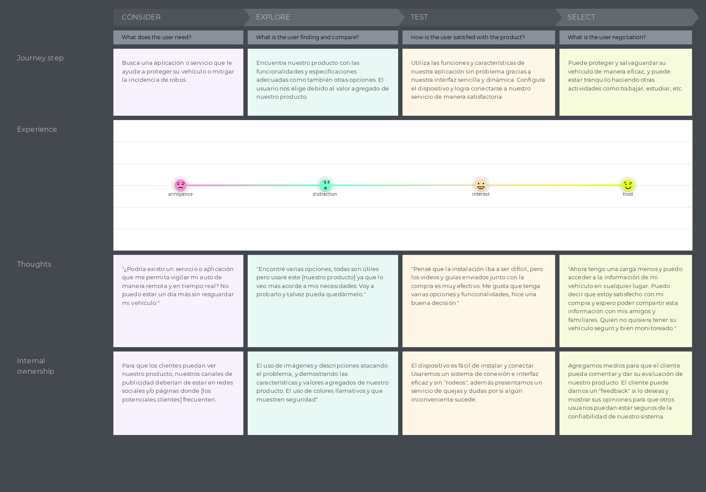
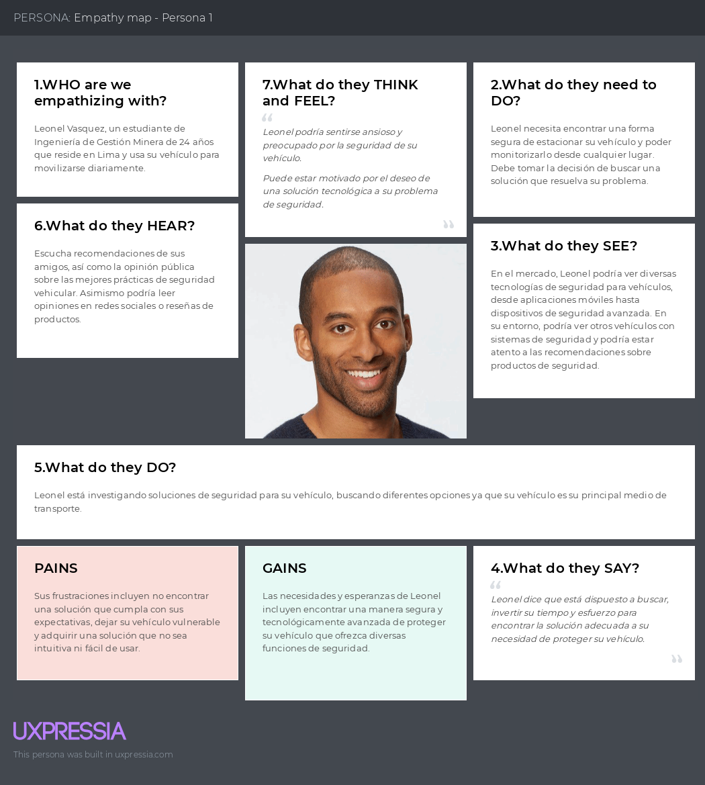
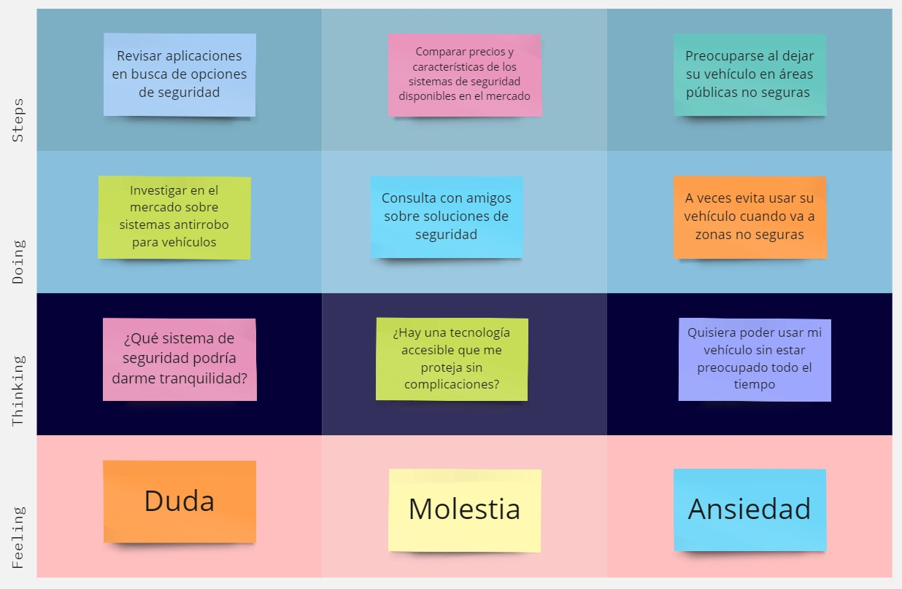
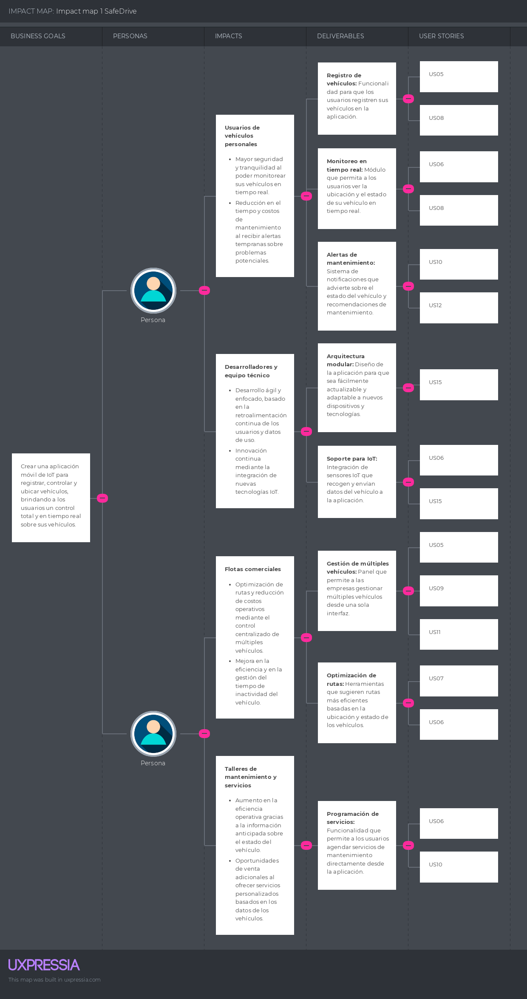

# **Capítulo II:  Requirements Elicitation & Analysis**
La recolección y análisis de requisitos es una etapa fundamental en el desarrollo de cualquier proyecto. Este proceso implica identificar, comprender y documentar las necesidades y expectativas de los stakeholders, así como los objetivos y restricciones del proyecto. Mediante diversas técnicas como entrevistas, encuestas y talleres de trabajo colaborativo, se busca obtener una comprensión clara y detallada de lo que se espera lograr con el proyecto. El análisis de estos requisitos permite establecer una base sólida para el diseño y desarrollo posterior, asegurando que el producto final satisfaga las necesidades del usuario y cumpla con los objetivos del negocio.
## 2.1. Competidores.
En la siguiente sección se presentarán los competidores, un análisis de las fortalezas de nuestro servicio frente a estas.

LoJack:
Es un sistema de recuperación de vehículos robados. LoJack utiliza tecnología de radiofrecuencia para rastrear vehículos en caso de robo.

En Route Technologies:
Es una empresa que ofrece soluciones de rastreo y telemetría para vehículos comerciales. Proveen sistemas GPS que permiten a las empresas monitorear en tiempo real la ubicacion de sus flotas, optimizar rutas y mejorar la eficiencia operativa.

CarLock:
Es un sistema de monitoreo y seguridad para vehículos que se enfoca en prevenir robos. CarLock utiliza un dispositivo que se conecta al puerto OBD del vehículo y a través de una aplicación movil los usuarios pueden recibir alertas en tiempo real.

### 2.1.1. Análisis competitivo.
El análisis competitivo nos brinda una visión clara de cómo nos comparamos con nuestros competidores en el mercado. Nos ayuda a identificar áreas en las que podemos mejorar, así como oportunidades para diferenciarnos y destacar. Esta comprensión nos permite desarrollar estrategias más efectivas como grupo, lo que nos ayuda a alcanzar nuestros objetivos y mantenernos competitivos en el mercado. 

<table border="1" style="text-align: center;">
	<tbody>
		<tr>
			<td colspan="6">Competitive Analysis Landscape</td>
		</tr>
		<tr>
			<td colspan="2">¿Por que llevar a cabo este análisis?</td>
			<td colspan="4">Llevar a cabo este análisis nos brindará información crítica que nos permitirá tomar decisiones más informadas y estratégicas para el desarrollo, comercialización y crecimiento de nuestra aplicación</td>
		</tr>
		<tr>
			<td colspan="2"></td>
			<td>SafeDrive</td>
			<td>LoJack</td>
			<td>En Route Technologies</td>
			<td>CarLock</td>
		</tr>
		<tr>
			<td rowspan="2">Perfil</td>
			<td>Overview</td>
			<td>Sistema que mitiga (y previene) los robos a vehículos.</td>
			<td>Sistema de recuperación de vehículos robados con tecnología avanzada de radiofrecuencia y GPS.</td>
			<td>Ofrece soluciones de gestión de flotas y rastreo de vehículos mediante GPS.</td>
			<td>Sistema de monitoreo de vehículos en tiempo real.
</td>
		</tr>
		<tr>
			<td>Ventaja competitiva ¿Que valor ofrece a los clientes?</td>
			<td>Monitoreo y vigilancia del vehículo en tiempo real.</td>
			<td>Ofrece una tasa de recuperación de vehículos del 90%, lo que lo convierte en uno de los sistemas más eficaces del mercado.</td>
			<td>Proporciona soluciones personalizables con capacidades avanzadas de análisis de datos y alertas en tiempo real.</td>
			<td>Accesible para los consumidores en general, fácil instalación y uso, además de notificaciones inmediatas.</td>
		</tr>
		<tr>
			<td rowspan="2">Perfil de Marketing</td>
			<td>Mercado objetivo</td>
			<td>Todos los conductores en general; jóvenes y taxistas principalmente.</td>
			<td>Propietarios de vehículos y aseguradoras</td>
			<td>Empresas de transporte y logística, grandes flotas comerciales.</td>
			<td>Conductores individuales, propietarios de pequeños negocios con vehículos, y entusiastas de la tecnología.</td>
		</tr>
		<tr>
			<td>Estrategias de marketing</td>
			<td>Promociones y anuncios en páginas, sitios web, periódicos, etc., lugares comunes donde se encuentre nuestro segmento objetivo.</td>
			<td>Presencia sólida en anuncios en televisión, colaboraciones con fuerzas del orden, y asociaciones con aseguradoras.</td>
			<td>Participaciones en ferias de tecnología y logística.</td>
			<td>Marketing digital, promociones en redes sociales.</td>
		</tr>
		<tr>
			<td rowspan="3">Perfil de Producto</td>
			<td>Productos &amp; Servicios</td>
			<td>Dispositivos, servicios y software</td>
			<td>Sistema de rastreo y recuperación de vehículos, servicios de apoyo al cliente y monitoreo.</td>
			<td>Software de gestión de flotas, dispositivos GPS, monitoreo de combustible, y rastreo de activos.</td>
			<td>Dispositivo de rastreo, aplicación móvil, y soporte en línea.</td>
		</tr>
		<tr>
			<td>Precios &amp; Costos</td>
			<td>Tarifas y precios de acuerdo a las necesidades del cliente</td>
			<td>Precios basados en suscripción anual o mensual con costos adicionales para servicios premium.</td>
			<td>Precios basados en la cantidad de vehículos y servicios adicionales contratados.</td>
			<td>Modelode suscripción mensual.</td>
		</tr>
		<tr>
			<td>Canales de distribución (Web y/o Móvil)</td>
			<td>Disponible en línea a través de la aplicación móvil y la plataforma web.</td>
			<td>Aplicación móvil, distribuidores autorizados, y plataformas en línea.
</td>
			<td>Aplicación móvil, plataforma web, y distribuidores corporativos.</td>
			<td>Disponible en línea, distribuidores y tiendas.</td>
		</tr>
		<tr>
			<td rowspan="4">Análisis SWOT</td>
			<td>Fortalezas</td>
			<td>
                <ul>
                    <li>Sistema de localización y sensores que muestran el entorno del vehículo en tiempo real.</li>
                </ul>
            </td>
			<td>
                <ul>
                    <li>Eficacia probada en la recuperación de vehículos, tecnología robusta.</li>
                </ul>
            </td>
			<td>
                <ul>
                    <li>Soluciones integradas y personalizables, soporte técnico dedicado.</li>
                </ul>
            </td>
			<td>
                <ul>
                    <li>Bajo costo, fácil de usar, y accesible para el mercado masivo.</li>
                </ul>
            </td>
		</tr>
		<tr>
			<td>Debilidades</td>
			<td>
                <ul>
                    <li>El sistema aún sigue en procesos de desarrollo y puede no tener todas las funcionalidades completas.</li>
                </ul>
            </td>
			<td>
                <ul>
                    <li>Alto costo de instalación y servicio, dependencia de la cobertura de radiofrecuencia.</li>
                </ul>
            </td>
			<td>
                <ul>
                    <li>Dependencia de una buena conectividad a internet.</li>
                </ul>
            </td>
			<td>
                <ul>
                    <li>Depende de la conexión a internet para funcionar correctamente.</li>
                </ul>
            </td>
		</tr>
		<tr>
			<td>Oportunidades</td>
			<td>
                <ul>
                    <li>Reconoce el estado del auto y notifica al usuario.</li>
                </ul>
            </td>
			<td>
                <ul>
                    <li>Expansión a mercados emergentes, integración con nuevas tecnologías como IA.</li>
                </ul>
            </td>
			<td>
                <ul>
                    <li>Integración de IA para optimización predictiva y expansión en mercados internacionales.</li>
                </ul>
            </td>
			<td>
                <ul>
                    <li>Expansión de funcionalidades, como integración con smart homes.</li>
                </ul>
            </td>
		</tr>
		<tr>
			<td>Amenazas</td>
			<td>
                <ul>
                    <li>El precio puede ser variable y en algunos casos molestoso.</li>
                </ul>
            </td>
			<td>
                <ul>
                    <li>Competencia creciente y adopción de nuevas tecnologías de rastreo.</li>
                </ul>
            </td>
			<td>
                <ul>
                    <li>Innovaciones tecnológicas rápidas en la industria que pueden dejar obsoletas ciertas soluciones.</li>
                </ul>
            </td>
			<td>
                <ul>
                    <li>Riesgo de ciberseguridad y competencia en el mercado de dispositivos IoT.</li>
                </ul>
            </td>
		</tr>
	</tbody>
</table>

### 2.1.2. Estrategias y tácticas frente a competidores.
Para destacar frente a la competencia, es crucial desarrollar estrategias y tácticas efectivas que permitan diferenciar nuestro producto o servicio y captar la atención del mercado. Algunas estrategias y tácticas que podríamos considerar incluyen:
 
1.  **Desarrollar una Propuesta de Valor Únic :**
    * Estrategia: Identificar y comunicar claramente un beneficio único o superior que ofrezca nuestro servicio en comparación con la competencia.
    * Táctica: Realizar encuestas a usuarios actuales y potenciales para identificar qué aspectos valoran más en un servicio de monitoreo de vehículos. Utilizar esta información para destacar un atributo clave en todos los mensajes de marketing.
2.  **Enfoque en la Experiencia del Usuario:**
    * Estrategia: Priorizar la facilidad de uso y la satisfacción del cliente en todos los aspectos del servicio, desde la instalación hasta el soporte.
    * Táctica: Desarrollar una interfaz de usuario intuitiva y realizar pruebas de usabilidad con grupos de usuarios diversos para asegurar que la aplicación sea fácil de usar.
3.  **Ampliar la Base de Usuarios:**
    * Estrategia: Expandir el alcance del producto a nuevos segmentos de mercado.
    * Táctica: Ofrecer pruebas gratuitas o promociones especiales para usuarios primerizos.
4.  **Marketing Digital Dirigido:**
    * Estrategia: Utilizar herramientas de marketing digital para llegar de manera efectiva a los segmentos de mercado más relevantes.
    * Táctica: Implementar campañas de anuncios segmentados en redes sociales y motores de búsqueda, para orientar los anuncios hacia conductores de vehículos en áreas de alto riesgo de robo.
5.  **Colaboraciones Estratégicas:**
    * Estrategia: Formar alianzas con otras empresas o instituciones para fortalecer la oferta del producto y aumentar su visibilidad.
    * Táctica: Establecer asociaciones con aseguradoras de vehículos para ofrecer descuentos a los usuarios que instalen nuestro sistema.

## 2.2. Entrevistas.
El propósito de las entrevistas es adquirir una comprensión profunda de las experiencias, perspectivas y opiniones de los segmentos de mercado seleccionados. Nuestro objetivo es obtener información valiosa que nos ayude a entender mejor a nuestro público objetivo y así mejorar nuestro conocimiento sobre los usuarios. Estas conversaciones nos permitirán obtener una visión más clara de las necesidades y deseos de nuestros usuarios, lo que nos ayudará a adaptar nuestros productos o servicios de manera más efectiva a sus requerimientos.
### 2.2.1. Diseño de entrevistas.
El diseño de entrevistas nos permitirá recopilar información valiosa sobre las experiencias, perspectivas y necesidades de nuestro grupo objetivo. Esto nos ayudará a comprender mejor sus preocupaciones y expectativas, lo que a su vez nos permitirá desarrollar soluciones más efectivas y adaptadas a sus requerimientos. Además, nos brindará la oportunidad de establecer una conexión significativa con nuestros usuarios, fortaleciendo así nuestra relación con ellos y mejorando la calidad de nuestro producto o servicio.
 

* **Información general**
1. ¿Cuál es tu nombre y ocupación?
2. ¿Cuál es tu edad?
3. ¿En que distrito vives?
4. ¿Que tipo de vehiculo posee?

* **Hábitos de conducción**
5. ¿Donde suele estacionar su vehículo?
6. ¿Con que frecuencia utiliza su vehículo(diariamente, semanalmente, ocasionalmente)?
7. ¿Cual es su principal preocupación en términos de seguridad vehicular?
8. ¿Ha sido víctima de robo o intento de robo de vehículo anteriormente?

* **Conocimiento y uso de tecnologías de seguridad**
9. ¿Utiliza actualmente algún sistema de seguridad para su vehículo? Si es así, ¿cuál?
10. ¿Que caracteristicas de un sistema de seguridad vehicular considera más importantes(rastreo en tiempo real, alertas, facilidad de uso, etc)?

* **Evaluación del producto**
11. ¿Que le motivaría a probar un nuevo sistema de monitoreo vehicular?
12. ¿Que aspectos consideraría para decidir entre diferentes sistemas de seguridad?

* **Opiniones y expectativas**
13. ¿Que mejoras le gustaría ver en los sistemas de seguridad vehicular?

### 2.2.2. Registro de entrevistas.
El registro de entrevistas es una herramienta fundamental que nos ayuda a recopilar y organizar la información obtenida durante las entrevistas con nuestros usuarios o clientes. Nos permite documentar de manera estructurada las respuestas, comentarios y observaciones relevantes, lo que facilita su análisis posterior y la identificación de patrones o tendencias. Además, nos proporciona un registro histórico de las interacciones con los usuarios, lo que nos ayuda a mantenernos alineados con sus necesidades y expectativas a lo largo del tiempo. 
dades físicas:
- **Entrevista #1:**  
    Nombre y Apellido: Jean Pierre Grandez  
    Edad:20 años  
    Distrito: Callao  
    
### 2.2.3. Análisis de entrevistas.
El análisis de entrevistas nos permite profundizar en la comprensión de las necesidades, deseos y comportamientos de nuestros usuarios, lo que a su vez informa la toma de decisiones en el diseño y desarrollo de productos o servicios orientados al usuario.
  
- #### Analisis Segmento:

## 2.3. Needfinding.
El proceso de needfinding nos permite identificar problemas reales que enfrentan los usuarios y descubrir oportunidades de diseño que pueden llevar a soluciones innovadoras y centradas en el usuario.
### 2.3.1. User Personas.
En esta sección, presentaremos el perfil de nuestros User Persona, que surge de un análisis de las entrevistas realizadas anteriormente y de una evaluación de la competencia en el mercado. Los artefactos que vamos a presentar están estrechamente relacionados con las principales características identificadas durante este proceso de análisis. Desde las entrevistas, hemos extraído valiosa información sobre las necesidades, deseos y frustraciones de nuestros potenciales usuarios, lo que nos ha permitido perfilar a nuestro User Persona de manera precisa y realista.

- **User Persona Primer  ()**
  

### 2.3.2. User Task Matrix.
La User Task Matrix es una herramienta que nos permite identificar las tareas clave que nuestros usuarios necesitan realizar en nuestra aplicación web. Al mapear estas tareas, podemos comprender mejor las necesidades y expectativas de nuestros usuarios, lo que nos ayuda a diseñar una experiencia de usuario más efectiva y centrada en sus requerimientos.
  

<table style="text-align: center; width: 100%;">
    <thead>
        <tr>
            <th rowspan="2">Tareas</th>
            <th colspan="2">Conductores que buscan garantizar la seguridad de su vehículo</th>
            <th colspan="2"></th>
        </tr>
        <tr>
            <th>Frecuencia</th>
            <th>Importancia</th>
            <th>Frecuencia</th>
            <th>Importancia</th>
        </tr>
    </thead>
    <tbody>
        <tr>
            <td>Encontrar estacionamiento seguro</td>
            <td>Cuando el usuario lo requiera</td>
            <td>Medio</td>
            <td></td>
            <td></td>
        </tr>
        <tr>
            <td>Proteger el vehículo contra robos</td>
            <td>Siempre</td>
            <td>Alta</td>
            <td></td>
            <td></td>
        </tr>
        <tr>
            <td>Utilizar la herramienta para recibir alertas de seguridad en tiempo real</td>
            <td>Siempre</td>
            <td>Alta</td>
            <td></td>
            <td></td>
        </tr>
        <tr>
            <td>Aprender a usar la herramienta de seguridad de manera efectiva</td>
            <td>Una sola vez</td>
            <td>Alta</td>
            <td></td>
            <td></td>
        </tr>
        <tr>
            <td>Reportar problemas de seguridad a las autoridades</td>
            <td>Cuando el usuario lo requiera</td>
            <td>Alta</td>
            <td></td>
            <td></td>
        </tr>
    </tbody>
</table>

### 2.3.3. User Journey Mapping
El User Journey Mapping es una herramienta  para comprender la experiencia del usuario de manera holística, lo que permite a los equipos de diseño crear productos y servicios que se alineen mejor con las necesidades y expectativas de los usuarios.
  

- **Segmento Objetivo:** 

  

### 2.3.4. Empathy Mapping.
Se ha elaborado el Empathy Mapping utilizando los datos obtenidos de las etapas preliminares del proyecto. A través de este proceso, hemos diseñado mapas específicos para cada uno de nuestros dos User Persona, con el fin de profundizar en la comprensión de sus necesidades y experiencias. Esta comprensión es esencial para guiar las próximas fases de nuestro desarrollo.
 

- **Empathy Map Segmento Objetivo**

  

### 2.3.5. As-is Scenario Mapping.
El "As-is Scenario Mapping" será una parte fundamental de nuestro enfoque de trabajo, ya que nos permitirá comprender el estado actual de nuestros procesos, identificar áreas de mejora y visualizar los pasos necesarios para alcanzar nuestros objetivos.

- As-Is del segmento objetivo usuario:

  

## 2.4. Requirements specification. 
### 2.4.1. To-Be Scenario Mapping.
### 2.4.2. User Stories.
###### Tabla de épicas establecidas para las historias de usuarios.

| Epic ID | Título                                         |
|---------|------------------------------------------------|
| EP01    | Experiencia en el uso general de la aplicación |
| EP02    | Experiencia en el control de vehículos         |
| EP03    | Desarrollo de la aplicación móvil              |

###### Tabla de historias de usuario

| Epic / Story ID | Título                                                                | Descripción                                                                                                                                                                                                                                                                 | Criterios de Aceptación                                                                                                                                                                                                                                                                                                                                                                                                                                                                                                                                                                                                                                                                                                                                                                                                                                                                                                                                                                                                                                                                                                                                            | Relacionado con (Epic ID) |
|-----------------|-----------------------------------------------------------------------|-----------------------------------------------------------------------------------------------------------------------------------------------------------------------------------------------------------------------------------------------------------------------------|--------------------------------------------------------------------------------------------------------------------------------------------------------------------------------------------------------------------------------------------------------------------------------------------------------------------------------------------------------------------------------------------------------------------------------------------------------------------------------------------------------------------------------------------------------------------------------------------------------------------------------------------------------------------------------------------------------------------------------------------------------------------------------------------------------------------------------------------------------------------------------------------------------------------------------------------------------------------------------------------------------------------------------------------------------------------------------------------------------------------------------------------------------------------|---------------------------|
| US01            | Interfaz util  en la pantalla de inicio de la aplicación móvil        | **Como** usuario, **quiero** ver una introducción atractiva y fácil de entender en la pantalla de inicio para obtener una visión general clara de lo que ofrece SafeDrive.                                                                                                  | ***Scenario 1***: Un nuevo usuario accede a la pantalla de inicio de SafeDrive por primera vez **Dado** que el usuario visita la pantalla de inicio,   **Cuando** la aplicación se carga,   **Entonces** debe ver una sección de introducción con una descripción clara y concisa de SafeDrive.   ***Scenario 2***: Un usuario existente vuelve a la página de inicio después de un tiempo y ve la introducción actualizada **Dado** que un usuario existente vuelve a la pantalla de inicio,   **Cuando** la aplicación se inicializa,   **Entonces** debe ver elementos visuales atractivos que representen la marca y los servicios de SafeDrive.    ***Scenario 3***:  Un usuario potencial accede a la pantalla de inicio en su dispositivo móvil para obtener una visión general de SafeDrive **Dado** que un usuario potencial visita la página de inicio en su dispositivo móvil,   **Cuando** la aplicación inicie,   **Entonces** debe encontrar la sección de introducción fácilmente visible y accesible.                                                                                                       | EP01                      |
| US02            | Implementación de una Navegación Intuitiva en la aplicación móvil     | **Como** usuario, **quiero** poder navegar fácilmente por las diferentes secciones de la aplicación móvil SafeDrive para acceder lo más pronto posible a las funciones que deseo utilizar.                                                                                  | ***Scenario 1***: Un usuario usa la aplicación móvil SafeDrive por primera vez **Dado** que el usuario utiliza la aplicación por primera vez,   **Cuando** la aplicación se inicie,   **Entonces** debe encontrar una barra de navegación con los títulos y enlaces claros a las diferentes secciones de la aplicación.   ***Scenario 2***: Un usuario existente está buscando una sección específica en SafeDrive  **Dado** que un usuario existente está buscando una sección específica,   **Cuando** mira la barra de navegación,   **Entonces** notara que los botones en la barra de navegación están claramente etiquetados para indicar a qué sección de la aplicación conducen.     ***Scenario 3***:  Un usuario está navegando por la aplicación móvil y quiere regresar a una sección anterior **Dado** que el usuario está navegando entre secciones,   **Cuando** quiere volver a una sección anterior,   **Entonces** entonces debe ver que la barra de navegación está siempre visible en la parte inferior, independientemente en que pantalla se encuentre en la aplicación.                              | EP01                      |
| US03            | Personalizar Tema de Interfaz                                         | **Como** usuario, **quiero** cambiar los temas de la interfaz de la aplicación móvil **para** ajustarlas a mis preferencias visuales                                                                                                                                        | ***Scenario 1***: El usuario accede a la aplicación móvil con preferencias establecidas previamente en su sistema   **Dado** que el usuario tiene preferencias visuales establecidas en su dispositivo móvil  **Cuando** utilice la aplicación,   **Entonces** se determinara y se aplicara automáticamente estas preferencias en la interfaz de SafeDrive.    ***Scenario 2***: El usuario va a cambiar el tema de la aplicación.   **Dado** que el usuario esta registrado en la aplicación móvil,   **Cuando** va actualizar el tema de la aplicación, **Entonces** utiliza el botón de navegación a las configuraciones de la aplicación móvil y accederá a preferencias visuales   ***Scenario 3***: El usuario no puede cambiar de temas en la aplicación móvil.   **Dado** que el usuario cuenta con una configuración prioritaria en el sistema de su dispositivo móvil **Cuando** cambie el tema de la aplicación **Entonces** no se lograra el cambio debido a las prioridades de su dispositivo móvil.                                                                                                                    | EP01                      |
| US04            | Cambiar el idioma de la aplicación móvil                              | **Como** usuario, **quiero** cambiar el idioma de la aplicación móvil **para** utilizarla a mi idioma preferido                                                                                                                                                             | ***Scenario 1***: El usuario accede a la aplicación móvil con un idioma por defecto en su sistema   **Dado** que el usuario tiene un idioma por defecto establecido en su dispositivo móvil  **Cuando** utilice la aplicación,   **Entonces** se determinara y se aplicara automáticamente el idioma en la interfaz y contenido de SafeDrive.    ***Scenario 2***: El usuario va a cambiar el idioma de la aplicación.   **Dado** que el usuario esta registrado en la aplicación móvil,   **Cuando** cambia el idioma de la aplicación, **Entonces** utiliza el botón de navegación a las configuraciones de la aplicación móvil y accederá a cambiar idiomas   ***Scenario 3***: El usuario no puede cambiar el idioma en la aplicación móvil.   **Dado** que el usuario cuenta con una configuración prioritaria en el sistema de su dispositivo móvil **Cuando** cambie el idioma de la aplicación **Entonces** no se lograra el cambio debido a las prioridades de su dispositivo móvil.                                                                                                                                        | EP01                      |
| US05            | Registrar vehículos en la aplicación                                  | **Como** usuario, **quiero** registrar mi vehículo en la aplicación **para** conocer su estado y acceder a las funciones que ofrece SafeDrive                                                                                                                               | ***Scenario 1***: El usuario no cuenta con un vehículo registrado en la aplicación móvil   **Dado** que no se ha registrado ningún vehículo   **Cuando** se utilice la aplicación,   **Entonces** el programa solicitara que el usuario registre uno para acceder a las demás funcionalidades.    ***Scenario 2***: El usuario quiere registrar otro vehículo además del inicial en la aplicación.  **Dado** que el usuario va a registrar un vehículo adicional en la aplicación,   **Cuando** acceda a la pantalla de registro de vehículo, **Entonces** ingresa los datos solicitados de su vehículo al formulario de registro en la aplicación.   ***Scenario 3***: El usuario no pudo registrar un vehículo en la aplicación móvil.   **Dado** que el usuario ingresa mal los datos solicitados en el formulario de registro de vehículo, **Cuando** añade otro vehículo en la aplicación, **Entonces** observa un mensaje con los detalles y manera de resolver el error.                                                                                                                                                      | EP02                      |
| US06            | Conocer el estado de mi vehículo                                      | **Como** usuario, **quiero** conocer el estado de mi vehículo registrado **para** tener un mejor control y gestión sobre mis transportes.                                                                                                                                   | ***Scenario 1***: El usuario con un vehículo registrado ingresa a la pantalla de estados de vehículo   **Dado** que el usuario cuenta con un vehículo registrado   **Cuando** ingresa a la pantalla de estado de vehículo, **Entonces** selecciona su vehículo y observa que se encuentra en buen estado y listo para conducir.    ***Scenario 2***: El usuario con varios vehículos registrados desea conocer cual de estos están listo para conducir.   **Dado** que el usuario cuenta con varios vehículos registrados,   **Cuando** acceda la pantalla de estado de vehículo, **Entonces** observa en la lista de sus vehículos registrados un simple mensaje de estado "Todo en Orden" al lado de la etiqueta de estado.   ***Scenario 3***: El usuario con varios vehículos necesita saber cual de sus vehículos registrados necesita mantenimiento   **Dado** que el usuario cuenta con varios vehículos registrados, **Cuando** accede a la pantalla de estado de vehículo, **Entonces** observa que en algunos de sus vehículos el mensaje de estado indica "Necesita revisión".                                               | EP02                      |
| US07            | Determinar la distancia entre el vehículo y el usuario                | **Como** usuario, **quiero** saber la ubicación de mi vehículo a tiempo real **para** no perder seguimiento de este.                                                                                                                                                        | ***Scenario 1***: El usuario con un vehículo registrado accede a la pantalla de inicio de la aplicación   **Dado** que el usuario ingresa a la pantalla de inicio de la aplicación   **Cuando** observa el mapa   **Entonces** ve la ubicación y distancia entre él y su vehículo registado    ***Scenario 2***: El usuario con varios vehículos registrados desea conocer la ubicación de estos.   **Dado** que el usuario cuenta con varios vehículos,   **Cuando** ingresa vehículos, selecciona el vehículo que desea conocer su ubicación e ingresa a "localizar vehículo", **Entonces** ve un mapa con la ruta y posición del vehículo seleccionado y su persona.    ***Scenario 3:***: El usuario con varios vehículos ingresa a la pantalla de inicio de la aplicación.   **Dado** que el usuario cuenta con varios vehículos registrados en la aplicación   **Cuando** ingresa a la aplicación, **Entonces** ve la ruta y posición del vehículo registrado más cercano a él.                                                                                                                                             | EP02                      |
| US08            | Conocer los datos de mi vehiculo                                      | **Como** usuario, **quiero** revisar los datos ingresados en el registro de mi vehículo **para** revisar y gestionarlos mejor.                                                                                                                                              | ***Scenario 1***: El usuario necesita recordar el número de placa de su vehículo registrado.   **Dado** que el usuario había registrado con éxito su vehículo **Cuando** ve la pantalla de detalles de su vehículo,   **Entonces** observa su número de placa.    ***Scenario 2***: El usuario desea saber a que persona le compro el vehículo.   **Dado** que el formulario de registro no solicito este dato, **Cuando** el usuario revisa los detalles de su vehículo, **Entonces** no observa el nombre de la persona a quien le compro el vehículo.    ***Scenario 3***: El usuario desea ocultar información que considera sensible acerca de su vehículo.   **Dado** que el usuario considera que parte de su información brindada es sensible y no quiere que este expuesta **Cuando** revisa los datos de su vehículo, **Entonces** selecciona el botón de ocultar información y observa asteriscos en vez de la información dada                                                                                                                                                                                                 | EP02                      |
| US09            | Editar datos ingresados en vehiculo registrado                        | **Como** usuario, **quiero** actualizar los datos ingresados previamente del registro de mi vehículo **para** mantener a tiempo real su estado e información.                                                                                                               | ***Scenario 1***: El usuario obtuvo una nueva pintura a su vehículo   **Dado** que el usuario actualizo la pintura de su vehículo, **Cuando** ingrese a la pantalla de vehículo y seleccione el vehículo, **Entonces** cambia el dato sobre el color de su vehículo.    ***Scenario 2***: El usuario desea actualizar el número de identificación del vehículo (VIN).  **Dado** que el usuario cometió un error al ingresar el VIN,  **Cuando** acceda a la pantalla de edición de detalles del vehículo, **Entonces** podrá modificar el VIN y guardarlo correctamente.    ***Scenario 3***: El usuario desea actualizar múltiples datos a la vez.  **Dado** que el usuario necesita modificar varios detalles del vehículo,   **Cuando** acceda a la pantalla de edición de vehículo,  **Entonces** podrá realizar múltiples cambios antes de guardar los datos actualizados.                                                                                                                                                                                                                                                   | EP02                      |
| US10            | Notificación por evento ocurrido en vehículo registrado               | **Como** usuario, **quiero** recibir notificaciones en mi dispositivo móvil **para** estar al tanto de cualquier evento relevante relacionado con mi vehículo registrado.                                                                                                   | ***Scenario 1***: El usuario recibe una notificación sobre el mantenimiento necesario. **Dado** que el sistema detecta que un vehículo necesita mantenimiento, **Cuando** ocurra este evento, **Entonces** el usuario recibirá una notificación detallada en su dispositivo móvil.    ***Scenario 2***: El usuario recibe una notificación sobre una alerta de seguridad. **Dado** que se detecta un posible intento de robo o acceso no autorizado al vehículo, **Cuando** ocurra este evento, **Entonces** el usuario recibirá una notificación inmediata en su dispositivo móvil con opciones para tomar medidas.  ***Scenario 3***: El usuario recibe una notificación de baja batería en su vehículo eléctrico. **Dado** que el sistema detecta que la batería del vehículo está baja, **Cuando** ocurra este evento, **Entonces** el usuario recibirá una notificación en su dispositivo móvil con la ubicación de las estaciones de carga más cercanas.                                                                                                                                                                 | EP02                      |
| US11            | Eliminar vehículo registrado en la aplicación móvil                   | **Como** usuario, **quiero** eliminar un vehículo registrado de mi cuenta **para** mantener actualizada la información en la aplicación.                                                                                                                                    | ***Scenario 1***: El usuario desea eliminar un vehículo registrado.  **Dado** que el usuario ya no necesita el vehículo en su cuenta, **Cuando** acceda a la opción de eliminar en la pantalla de detalles del vehículo,  **Entonces** podrá confirmar la eliminación del vehículo y recibir una notificación de éxito.    ***Scenario 2***: El usuario desea eliminar múltiples vehículos. **Dado** que el usuario tiene varios vehículos que ya no necesita, **Cuando** seleccione múltiples vehículos en la pantalla de gestión, **Entonces** podrá eliminarlos de forma simultánea y recibir una confirmación para cada uno.                                                                                                                                                                                                                                                                                                                                                                                                                                                                                                           | EP02                      |
| US12            | Acceso a información necesaria en caso de urgencias                   | **Como** usuario, **quiero** acceder fácilmente a la información de contacto de emergencia y guías de primeros auxilios **para** estar preparado en caso de un accidente o incidente.                                                                                       | ***Scenario 1***: El usuario se enfrenta a una situación de emergencia mientras conduce.  **Dado** que ocurre una emergencia, **Cuando** el usuario acceda a la sección de emergencias en la aplicación, **Entonces** debería ver un botón de llamada rápida a los servicios de emergencia y una lista de contactos de emergencia predefinidos.   ***Scenario 2***: El usuario desea personalizar los contactos de emergencia.  **Dado** que el usuario desea agregar o modificar contactos de emergencia,  **Cuando** acceda a la sección de configuración de emergencias, **Entonces** debería poder gestionar y ordenar la lista de contactos según sus preferencias.    ***Scenario 3***: El usuario sufrió un intento de robo en el vehículo  **Dado** que el usuario necesita actuar rápido, **Cuando** sufre un intento de robo, **Entonces** debería tener fácil acceso a los canales de emergencia predefinidos por defecto en la aplicación.                                                                                                                                                                      | EP02                      |
| US13            | Comunicación con la base de datos y la aplicación móvil               | **Como** desarrollador, **quiero** asegurarme de que la aplicación móvil se comunique correctamente con la base de datos **para** garantizar que la información esté siempre actualizada.                                                                                   | ***Scenario 1***: La aplicación móvil se sincroniza con la base de datos en tiempo real.  **Dado** que el usuario realiza una acción que involucra datos (e.g., registrar un vehículo), **Cuando** la acción se complete, **Entonces** la base de datos debe reflejar inmediatamente estos cambios y la aplicación debe mostrar los datos actualizados.   ***Scenario 2***: La aplicación móvil maneja la falta de conexión a internet.  **Dado** que el usuario pierde conexión a internet mientras usa la aplicación,  **Cuando** intente realizar una acción que requiere conexión, **Entonces** la aplicación debería mostrar un mensaje de error adecuado y almacenar la acción para sincronizarla cuando se recupere la conexión.   ***Scenario 3***: El desarrollador necesita verificar la consistencia de los datos.  **Dado** que se necesita comprobar que los datos en la aplicación y la base de datos coinciden, **Cuando** el desarrollador realice pruebas, **Entonces** debería haber un registro de auditoría disponible que permita verificar las transacciones recientes y su estado de sincronización. | EP03                      |
| US14            | Disponibilidad de la aplicación en la mayoría de dispositivos móviles | **Como** desarrollador, **quiero** garantizar la compatibilidad de la aplicación móvil en una amplia gama de dispositivos Android, **para** asegurar que los usuarios puedan instalar y utilizar la aplicación independientemente del modelo o versión de su dispositivo.   | ***Scenario 1***: Compatibilidad mínima con versiones de SO móviles.  **Dado** que la aplicación debe ser compatible con una amplia gama de dispositivos móviles,  **Cuando** desarrolle y pruebe la aplicación,  Entonces aseguraré que sea compatible con al menos Android 9.0.   ***Scenario 2***: Pruebas de rendimiento en dispositivos de gama baja.  **Dado** que la aplicación debe funcionar en dispositivos de gama baja,  **Cuando** realice pruebas de rendimiento,  **Entonces** optimizaré la aplicación para que funcione sin problemas en dispositivos con hardware limitado (menos de 2 GB de RAM y procesadores más antiguos).   ***Scenario 3***: Gestión de dependencias y librerías externas.   **Dado** que la aplicación utilizará varias librerías externas,  **Cuando** gestione las dependencias,  **Entonces** me aseguraré de que las versiones seleccionadas de las librerías sean compatibles con las versiones de SO objetivo para evitar conflictos y errores en dispositivos más antiguos.                                                                                                 | EP03                      |
| US15            | Usabilidad y adaptabilidad a cambios en la aplicación                 | **Como** desarrollador, **quiero** diseñar la aplicación móvil de manera que sea fácilmente actualizable y adaptable a futuros cambios en la interfaz o funcionalidades, **para** reducir el tiempo y esfuerzo necesario para implementar nuevas características o ajustes. | ***Scenario 1***: Arquitectura modular y desacoplada.  **Dado** que la aplicación necesitará ser actualizada regularmente,  **Cuando** diseñe la arquitectura del código,  **Entonces** utilizaré un enfoque modular que permita añadir o modificar funcionalidades sin afectar otras partes del sistema.   ***Scenario 2***: Implementación de pruebas automatizadas.  **Dado** que las actualizaciones podrían introducir nuevos bugs,  **Cuando** implemente nuevas funcionalidades o cambios,  **Entonces** me aseguraré de contar con un conjunto robusto de pruebas automatizadas que validen el correcto funcionamiento de la aplicación antes de cada lanzamiento.   ***Scenario 3***: Estrategias de migración de datos.  **Dado** que la aplicación podría requerir cambios en la estructura de datos,  **Cuando** se realicen actualizaciones que afecten la base de datos,  **Entonces** desarrollaré scripts de migración que aseguren la integridad de los datos durante el proceso de actualización.                                                                                                         | EP03                      |
### 2.4.3. Impact Mapping.
Impact Mapping es una herramienta poderosa que nos ayudará a visualizar y planificar cómo nuestro proyecto puede generar un impacto significativo en nuestros usuarios y en nuestro objetivo final. Nos permitirá identificar claramente los resultados deseados, los comportamientos esperados de nuestros usuarios y las acciones necesarias para alcanzar esos objetivos. Al utilizar Impact Mapping, podremos alinear mejor nuestras actividades con nuestros objetivos, tomar decisiones más informadas y maximizar el impacto de nuestro proyecto.
  

### 2.4.4. Product Backlog.
El Product Backlog es una lista priorizada de todas las funcionalidades, mejoras y tareas necesarias para el desarrollo de un producto o servicio. En esta sección, presentaremos nuestro Product Backlog, que incluye todas las historias de usuario identificadas en la sección anterior, así como otras tareas y actividades necesarias para el desarrollo de SafeDrive.
  

| # Orden | User Story Id | Título                                                                | Descripción                                                                                                                                                                        | Story Points (1 / 2 / 3 / 5 / 8) |
|---------|---------------|-----------------------------------------------------------------------|------------------------------------------------------------------------------------------------------------------------------------------------------------------------------------|----------------------------------|
| 1       | US05          | Registrar vehículos en la aplicación                                  | Como usuario, quiero registrar mi vehículo en la aplicación para conocer su estado y acceder a las funciones que ofrece SafeDrive.                                                 | 2                                |
| 2       | US06          | Conocer el estado de mi vehículo                                      | Como usuario, quiero conocer el estado de mi vehículo registrado para tener un mejor control y gestión sobre mis transportes.                                                      | 5                                |
| 3       | US07          | Determinar la distancia entre el vehículo y el usuario                | Como usuario, quiero saber la ubicación de mi vehículo en tiempo real para no perder seguimiento de este.                                                                          | 3                                |
| 4       | US08          | Conocer los datos de mi vehículo                                      | Como usuario, quiero revisar los datos ingresados en el registro de mi vehículo para gestionarlos mejor.                                                                           | 2                                |
| 5       | US09          | Editar datos ingresados en vehículo registrado                        | Como usuario, quiero actualizar los datos ingresados previamente del registro de mi vehículo para mantener a tiempo real su estado e información.                                  | 1                                |
| 6       | US011         | Eliminar vehículo registrado en la aplicación móvi                    | Como usuario, quiero eliminar un vehículo registrado en la aplicación para remover aquellos que ya no utilizo.                                                                     | 1                                |
| 7       | US01          | Interfaz útil en la pantalla de inicio de la aplicación móvil	        | Como usuario, quiero ver una introducción atractiva y fácil de entender en la pantalla de inicio para obtener una visión general clara de lo que ofrece SafeDrive.                 | 2                                |
| 8       | US02          | Implementación de una Navegación Intuitiva en la aplicación móvil     | Como usuario, quiero poder navegar fácilmente por las diferentes secciones de la aplicación móvil SafeDrive para acceder lo más pronto posible a las funciones que deseo utilizar. | 2                                |
| 9       | US10          | Notificación por evento ocurrido en vehículo registrado               | Como usuario, quiero recibir notificaciones cuando ocurra un evento importante en el vehículo registrado para actuar de inmediato.                                                 | 5                                |
| 10      | US03          | Acceso a información necesaria en caso de urgencias                   | Como usuario, quiero tener acceso rápido a información crucial en caso de emergencias relacionadas con mis vehículos registrados.                                                  | 3                                |
| 11      | US04          | Cambiar el idioma de la aplicación móvil	                             | Como usuario, quiero cambiar el idioma de la aplicación móvil para utilizarla en mi idioma preferido.                                                                              | 1                                |
| 12      | US12          | Personalizar Tema de Interfaz                                         | Como usuario, quiero cambiar los temas de la interfaz de la aplicación móvil para ajustarlas a mis preferencias visuales.                                                          | 1                                |
| 13      | US13          | Comunicación con la base de datos y la aplicación móvil               | Como desarrollador, quiero asegurarme de que la aplicación móvil se comunique correctamente con la base de datos para manejar el registro, control y seguimiento de los vehículos. | 3                                |
| 14      | US14          | Disponibilidad de la aplicación en la mayoría de dispositivos móviles | Como desarrollador, quiero que la aplicación sea compatible con la mayoría de dispositivos móviles para asegurar una amplia base de usuarios.                                      | 5                                |
| 15      | US15          | Usabilidad y adaptabilidad a cambios en la aplicación                 | Como desarrollador, quiero asegurarme de que la aplicación sea fácilmente usable y adaptable a futuras actualizaciones para mantenerla competitiva en el mercado.                  | 5                                |
