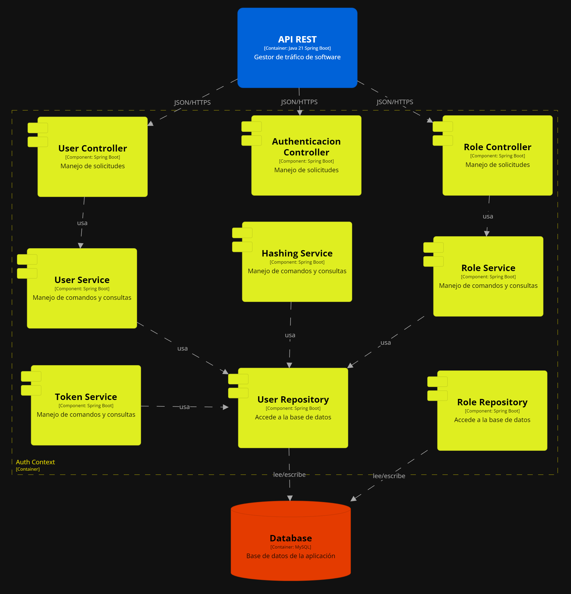
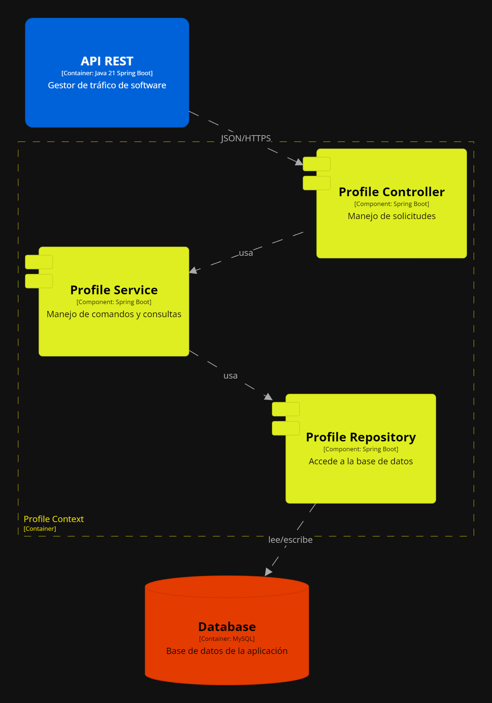

# Capítulo III: Arquitectura

## 3.1. Product Design
El product design será fundamental para nuestro trabajo, ya que nos permitirá crear soluciones centradas en el usuario que aborden de manera efectiva los desafíos identificados. Utilizaremos este enfoque para diseñar productos y servicios que sean intuitivos, atractivos y que cumplan con las expectativas y necesidades de nuestros usuarios. Esto nos ayudará a generar valor para nuestros clientes y a alcanzar nuestros objetivos comerciales de manera más eficiente.
## 3.1.1 Style Guidelines.
Un **Style Guideline** es un conjunto de reglas y normas que definen cómo se debe redactar, diseñar o presentar documentos, contenido web, software u otros trabajos creativos. A continuación, se detallan las especificaciones de los parámetros implementados en la estructura del proyecto.
### 3.1.1.1 General Style Guidelines

# 3.1.2. Information Architecture. 
<td>Esta sección se basa principalmente del contenido visual, los estilos, los tags y más que se tomarán en cuenta para nuestra web y landing page de AquilaFacil. Se verá los tópicos de Organization Systems, Labeling Systemes, SEO and Meta Tags y Searching y Navigation Systems.</td>

## 3.1.2.1.Organization Systems.

## 3.1.2.2 Labeling Systems.
<td>Para los sistemas de etiquetado, hemos optado por organizar el contenido mediante encabezados que agrupen las secciones a las que el usuario puede acceder. De esta manera, el usuario sabe dónde hacer clic para acceder a las secciones correspondientes.</td>

### 3.1.2.3 SEO Tags and Meta Tags. 
<td>Las meta etiquetas nos permiten codificar y especificar metadatos en una página web. Aunque no son visibles para los usuarios, los navegadores y rastreadores web las leen. Estas etiquetas facilitan el análisis de archivos HTML y ayudan en el mantenimiento del contenido. Además, influyen en el posicionamiento de nuestra página en los motores de búsqueda.</td>
  

### 3.1.2.4 Searching Systems.
<td>El motor de búsqueda es fundamental para que los usuarios encuentren rápidamente detalles específicos</td>
  

### 3.1.2.5 Navigation Systems.
<td>El Sistema de Navegación es la estructura que permite a los usuarios desplazarse eficientemente entre las distintas secciones y páginas de la aplicación</td>
  

## 3.1.3. Landing Page UI Design. 
El diseño de la interfaz de usuario para nuestra landing page será crucial para nuestro proyecto, ya que es la primera impresión que tendrán los usuarios de nuestro producto. Nos permitirá crear una experiencia visualmente atractiva y funcional que capture la atención de los visitantes y los motive a explorar más.
### 3.1.3.1. Landing Page Wireframe.
Enlace a los wireframes de la landing page de SafeDrive. 
https://www.figma.com/design/Sr9pPT2n1pHLZJpXgKORls/SafeDrive-LandingPage-Wireframe?node-id=0-1&t=dQkuYGVoYFoVe9Hh-1

### 3.1.3.2. Landing Page Mock-up. 
Enlace a los Mockups de la landing page de SafeDrive. 
https://www.figma.com/design/Sr9pPT2n1pHLZJpXgKORls/SafeDrive-LandingPage-Wireframe?node-id=0-1&t=dQkuYGVoYFoVe9Hh-1

## 3.1.4 Mobile Applications UX/UI Design. 
El diseño de experiencia de usuario (UX) y diseño de interfaz de usuario (UI) para aplicaciones móbiles implica crear una experiencia digital que sea intuitiva, eficiente y satisfactoria para los usuarios. La UX se centra en comprender las necesidades y expectativas del usuario, así como en diseñar flujos de trabajo y arquitectura de información que faciliten la interacción. Por otro lado, la UI se refiere al aspecto visual de la aplicación, incluyendo el diseño de elementos como botones, menús, y la disposición de contenido. Un diseño UX/UI efectivo combina la estética atractiva con la funcionalidad fácil de usar, lo que resulta en una experiencia positiva y memorable para los usuarios.
####  3.1.4.1. Mobile Applications Wireframe.
Enlace a los wireframes de la MobileApp de SafeDrive. 
https://www.figma.com/design/U65pqkExxIUM6UqQEDMm8b/Mockups_SafeDrive?node-id=0-1&t=bKChoXX6AuLIexwP-1

 

####  3.1.4.2  Mobile Applications Wireflow Diagrams. 
Mobile Applications Wireflow Diagrams son representaciones visuales de los flujos de navegación y la arquitectura de una aplicación web. Estos diagramas combinan elementos de wireframes y diagramas de flujo para proporcionar una vista general de cómo los usuarios navegarán a través de la aplicación y cómo interactuarán con ella. Los wireflows son útiles para identificar posibles problemas de usabilidad y diseñar una experiencia de usuario coherente y eficiente.  

####  3.1.4.3. Mobile Applications Mock-ups.
Enlace a los Mockups de la MobileApp de SafeDrive. 
https://www.figma.com/design/U65pqkExxIUM6UqQEDMm8b/Mockups_SafeDrive?node-id=0-1&t=bKChoXX6AuLIexwP-1

####  3.1.4.4. Mobile Applications User Flow Diagrams. 
El diagrama de flujo de usuario es una representación visual de los pasos que un usuario sigue al interactuar con una aplicación móbil. Muestra la secuencia de acciones que el usuario realiza para completar una tarea específica, lo que nos ayuda a identificar posibles puntos de fricción y a optimizar la experiencia del usuario.  

####  3.1.4.5. Mobile Applications Prototyping. 

## 3.2. Architecture Overview. 
### 3.2.1. Domain-Driven Software Architecture.
El desarrollo de software basado en la arquitectura orientada al dominio (DDD) será fundamental para nuestro proyecto. Esta metodología nos permitirá diseñar sistemas de software que reflejen de manera precisa y efectiva el dominio del problema que estamos abordando. Al aplicar los principios de DDD, podremos identificar y modelar correctamente las entidades, agregados y contextos del dominio, lo que nos permitirá construir una arquitectura de software flexible, escalable y fácil de mantener.

#### 3.2.1.1. Software Architecture Context Level Diagram.

#### 3.2.1.2. Software Architecture Container Level Diagram.

#### 3.2.1.3. Software Architecture Components Diagram.
Auth Context

Profile Context

Tracking Context

###  3.2.2. Software Object-Oriented Design.
#### 3.2.2.1. Class Diagrams. 
#### 3.2.2.2. Class Dictionary. 
#### 3.2.2.3. Database Design. 
#### 3.2.2.4 Database Diagram. 
