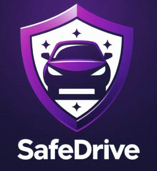
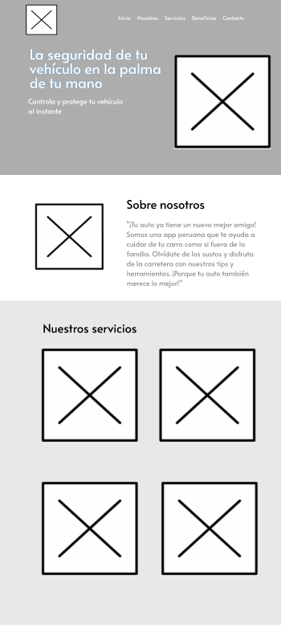

# Capítulo III: Arquitectura

## 3.1. Product Design
El product design será fundamental para nuestro trabajo, ya que nos permitirá crear soluciones centradas en el usuario que aborden de manera efectiva los desafíos identificados. Utilizaremos este enfoque para diseñar productos y servicios que sean intuitivos, atractivos y que cumplan con las expectativas y necesidades de nuestros usuarios. Esto nos ayudará a generar valor para nuestros clientes y a alcanzar nuestros objetivos comerciales de manera más eficiente.
## 3.1.1 Style Guidelines.
Un **Style Guideline** es un conjunto de reglas y normas que definen cómo se debe redactar, diseñar o presentar documentos, contenido web, software u otros trabajos creativos. A continuación, se detallan las especificaciones de los parámetros implementados en la estructura del proyecto.
### 3.1.1.1 General Style Guidelines

- Logo:

El logo de la aplicación presenta un diseño sencillo pero significativo. El fondo moradp, con una gradación de tonos, evoca tranquilidad y confianza. En el centro, encontramos un logo que combina un automóvil y un escudo. Este diseño simboliza la protección y seguridad de los vehículos, comunicando claramente el propósito del proyecto.

- Tipografía:

La tipografía influye directamente en cómo los usuarios interpretan el contenido, y la fuente Atlata ha sido elegida por su estilo moderno y atractivo, lo que la hace ideal para una aplicación enfocada en tecnología y seguridad. Además, su claridad y carácter legible refuerzan la idea de confianza y fiabilidad que "SECURCAR" busca transmitir, complementando a la perfección los colores seleccionados en el diseño.

- Colores:

La eleccion de los colores para nuestra plataforma es fundamental, ya que tienen un gran impacto en la coherencia visual del diseño. Además, los colores transmiten emociones y mensaje específicos, por lo que ingluten en la atraccion visual de nuestro producto.

En "SafeDrive", el color azul se ha seleccionado como color principal, pues es sinónimo de confianza, tecnología y seguridad, siendo estos, atributos clave para la aplicación. El blanco es importante dentro de la paleta, su uso aporta claridad y limpieza al diseño, además de evocar simplicidad y pureza, lo que complementa con la eleccion del color azul. El color lila lo usamos como degradado con el azul, este tono refleja creatividad y calma, añadiendo originalidad al diseño.

La eleccion de estos colores permiten un diseño coherente, atractivo y accesible que mejora la experiencia del usuario y comunica de manera efectiva los valores que "SafeDrive" transmite.

# 3.1.2. Information Architecture. 
<td>Esta sección se basa principalmente del contenido visual, los estilos, los tags y más que se tomarán en cuenta para nuestra web y landing page de SafeDrive. Se verá los tópicos de Organization Systems, Labeling Systemes, SEO and Meta Tags y Searching y Navigation Systems.</td>

## 3.1.2.1.Organization Systems.

El propósito del sistema de organización de la página es establecer la estructura visual del contenido y la navegación en la misma. 

Para nuestra landing page ,destacamos secciones importantes en la barra de navegación, estos son: "Home", Ubicación", "Ofrecemos", "Beneficios", "Nosotros" y "Contacto". 

* Página principal: La parte superior de la página presenta una sección principal destacada por una breve descripción de la plataforma, en la que se destaca su objetivo principal de garantizar la seguridad de los vehículos desde cualquier lugar.

* Ofrecemos: Esta sección muestra las características que ofrece SafeDrive.
Contiene tres elementos: un dispositivo de seguimiento, asistencia para principiantes y avisos de caducidad, cada uno de ellos acompañado de un icono y un botón "Más" para obtener más detalles.

* Beneficios: La sección de beneficios destaca las ventajas de utilizar las funciones de SafeDrive, como las alertas de robo, el mantenimiento de los documentos en orden y los consejos de conducción.
Cada ventaja se presenta en recuadros individuales con imágenes relacionadas y descripciones concisas, lo que facilita a los usuarios la comprensión del valor del servicio.

* Nosotros: En esta sección se presentan los antecedentes de la empresa y su misión. El texto describe SafeDrive como una startup peruana centrada en reducir el robo de vehículos y ayudar a los conductores principiantes.

* Contacto: Esta sección presenta un sencillo formulario de contacto con campos para correo electrónico, número de teléfono y nombre, que permite a los usuarios ponerse en contacto.

## 3.1.2.2 Labeling Systems.
<td>Para los sistemas de etiquetado, hemos optado por organizar el contenido mediante encabezados que agrupen las secciones a las que el usuario puede acceder. De esta manera, el usuario sabe dónde hacer clic para acceder a las secciones correspondientes.</td>

 

1. Secciones:
* "Home": Pagina principal.
* "Nosotros": Mencionamos nuestro objetivo como startup a los usuarios.
* "Servicios": Funcionalidades disponibles del servicio.
* "Beneficios": Ventajas de las caracteristicas dadas anteriormente.
* "Contacto": Comunicacion con nosotros mediante un formulario.

2. Botones:
* Registrarse: Los usuarios pueden crear una cuenta desde el sitio web.
* Iniciar sesión: Permite a los usuarios ingresar a sus cuentas registradas.
* Enviar: Envía el formulario de contacto.
* Descargar en Google Play Store: Enlace para descargar la aplicación desde Google Play Store.
* Descargar en la App Store: Enlace para descargar la aplicación desde la App Store.

3. Formulario de contacto:
* "Email": Espacio para que el visitante coloque su correo electrónico.
* "Teléfono": Espacio para que el visitante coloque su telefono.
* "Nombre": Espacio para que el visitante coloque su nombre. 

### 3.1.2.3 SEO Tags and Meta Tags. 
<td>Las meta etiquetas nos permiten codificar y especificar metadatos en una página web. Aunque no son visibles para los usuarios, los navegadores y rastreadores web las leen. Estas etiquetas facilitan el análisis de archivos HTML y ayudan en el mantenimiento del contenido. Además, influyen en el posicionamiento de nuestra página en los motores de búsqueda.</td>
  

**Title**: SafeDrive - Soluciones Avanzadas de Seguridad Vehicular 
**Description**: Descubre SafeDrive, una aplicación innovadora que ofrece un dispositivo rastreador, alertas de vencimiento y consejos viales para prevenir robos de vehículos y mejorar la seguridad. **Keywords**: safedrive, seguridad vehicular, rastreo de vehículos, prevención de robos, tecnología automotriz, app de rastreo, alertas de caducidad, consejos viales, sistema de seguridad automotriz **Author**: SafeDrive

### 3.1.2.4 Searching Systems.
<td>El motor de búsqueda es fundamental para que los usuarios encuentren rápidamente detalles específicos</td>
  

1. Navbar: En la parte superior de la página se encuentra una barra que incluye enlaces a las secciones principales del sitio. Los enlaces principales son: "Home", "Nosotros", "Servicios", "Beneficios" y "Contacto".

### 3.1.2.5 Navigation Systems.
<td>El Sistema de Navegación es la estructura que permite a los usuarios desplazarse eficientemente entre las distintas secciones y páginas de la aplicación</td>
  

1. Navegación jerárquica: La página principal sigue un patrón de diseño F, lo que enfatiza la importancia de que el usuario conozca la empresa y lo que ofrece. Las opciones de navegación están jerárquicamente organizadas, con las secciones más importantes y relevantes en la parte superior.

2. Boton de llamada a la accion: Un boton flotante que siempre está visible y permite a los usuarios acceder a Registrarse e Iniciar sesion.

3. Sección inferior: En la parte inferior de la página, se incluye una navegación adicional que proporciona acceso rápido a información importante y complementaria, como "Contáctanos".

## 3.1.3. Landing Page UI Design. 
El diseño de la interfaz de usuario para nuestra landing page será crucial para nuestro proyecto, ya que es la primera impresión que tendrán los usuarios de nuestro producto. Nos permitirá crear una experiencia visualmente atractiva y funcional que capture la atención de los visitantes y los motive a explorar más.
### 3.1.3.1. Landing Page Wireframe.
Enlace a los wireframes de la landing page de SafeDrive. 
https://www.figma.com/design/uj53CJK6z8ieVijHrWtM2G/LandingPage-SafeDrive?node-id=0-1&t=62M9uBMTNlwTzOzX-1

### 3.1.3.2. Landing Page Mock-up. 
Enlace a los Mockups de la landing page de SafeDrive. 
https://www.figma.com/design/uj53CJK6z8ieVijHrWtM2G/LandingPage-SafeDrive?node-id=0-1&t=62M9uBMTNlwTzOzX-1

## 3.1.4 Mobile Applications UX/UI Design. 
El diseño de experiencia de usuario (UX) y diseño de interfaz de usuario (UI) para aplicaciones móbiles implica crear una experiencia digital que sea intuitiva, eficiente y satisfactoria para los usuarios. La UX se centra en comprender las necesidades y expectativas del usuario, así como en diseñar flujos de trabajo y arquitectura de información que faciliten la interacción. Por otro lado, la UI se refiere al aspecto visual de la aplicación, incluyendo el diseño de elementos como botones, menús, y la disposición de contenido. Un diseño UX/UI efectivo combina la estética atractiva con la funcionalidad fácil de usar, lo que resulta en una experiencia positiva y memorable para los usuarios.
####  3.1.4.1. Mobile Applications Wireframe.
Enlace a los wireframes de la MobileApp de SafeDrive. 
https://www.figma.com/design/U65pqkExxIUM6UqQEDMm8b/Mockups_SafeDrive?node-id=0-1&t=bKChoXX6AuLIexwP-1

 

####  3.1.4.2  Mobile Applications Wireflow Diagrams. 
Mobile Applications Wireflow Diagrams son representaciones visuales de los flujos de navegación y la arquitectura de una aplicación web. Estos diagramas combinan elementos de wireframes y diagramas de flujo para proporcionar una vista general de cómo los usuarios navegarán a través de la aplicación y cómo interactuarán con ella. Los wireflows son útiles para identificar posibles problemas de usabilidad y diseñar una experiencia de usuario coherente y eficiente.  

####  3.1.4.3. Mobile Applications Mock-ups.
Enlace a los Mockups de la MobileApp de SafeDrive. 
https://www.figma.com/design/U65pqkExxIUM6UqQEDMm8b/Mockups_SafeDrive?node-id=0-1&t=bKChoXX6AuLIexwP-1

####  3.1.4.4. Mobile Applications User Flow Diagrams. 
El diagrama de flujo de usuario es una representación visual de los pasos que un usuario sigue al interactuar con una aplicación móbil. Muestra la secuencia de acciones que el usuario realiza para completar una tarea específica, lo que nos ayuda a identificar posibles puntos de fricción y a optimizar la experiencia del usuario.  

Enlace a los User Flow Diagrams de la MobileApp de SafeDrive. 
https://lucid.app/lucidchart/ea395cd4-aafe-4e71-83e7-33eecebdfc48/edit?viewport_loc=-6326%2C-2956%2C19726%2C9336%2C0_0&invitationId=inv_ec890858-626f-4cb8-870f-5f87e0b1158c

####  3.1.4.5. Mobile Applications Prototyping. 
El prototipado es una parte esencial del proceso de diseño de aplicaciones móviles, ya que nos permite crear una versión interactiva y funcional de la aplicación antes de su lanzamiento. Los prototipos nos permiten probar y validar el diseño de la aplicación, identificar posibles problemas de usabilidad y obtener retroalimentación de los usuarios antes de la implementación final.  

Enlace a los User Flow Diagrams de la MobileApp de SafeDrive. 
https://www.figma.com/proto/U65pqkExxIUM6UqQEDMm8b/Mockups_SafeDrive?page-id=0%3A1&node-id=43-794&node-type=frame&viewport=590%2C257%2C0.3&t=BGdriK2pdgTJyZGU-1&scaling=scale-down&content-scaling=fixed&starting-point-node-id=43%3A794

## 3.2. Architecture Overview. 
### 3.2.1. Domain-Driven Software Architecture.
El desarrollo de software basado en la arquitectura orientada al dominio (DDD) será fundamental para nuestro proyecto. Esta metodología nos permitirá diseñar sistemas de software que reflejen de manera precisa y efectiva el dominio del problema que estamos abordando. Al aplicar los principios de DDD, podremos identificar y modelar correctamente las entidades, agregados y contextos del dominio, lo que nos permitirá construir una arquitectura de software flexible, escalable y fácil de mantener.

#### 3.2.1.1. Software Architecture Context Level Diagram.

#### 3.2.1.2. Software Architecture Container Level Diagram.

#### 3.2.1.3. Software Architecture Components Diagram.
Auth Context

Profile Context

Tracking Context

###  3.2.2. Software Object-Oriented Design.
El diseño orientado a objetos es una metodología de diseño de software que se basa en la creación de clases y objetos que representan entidades del mundo real y sus interacciones. Al aplicar los principios de diseño orientado a objetos, podemos crear sistemas de software modulares, reutilizables y fáciles de mantener. En el contexto de nuestro proyecto, el diseño orientado a objetos nos permitirá modelar de manera efectiva las entidades y relaciones del dominio del problema, lo que nos ayudará a construir una arquitectura de software sólida y coherente.
#### 3.2.2.1. Class Diagrams.

#### 3.2.2.2. Class Dictionary. 
### Vehículo
**Descripción**: Representa un vehículo que está registrado en el sistema IoT. Contiene información sobre sus características y estado actual.

**Atributos**:
- `id_vehiculo`: Identificador único del vehículo.
- `matricula`: La matrícula del vehículo (única).
- `marca`: Marca del vehículo.
- `modelo`: Modelo del vehículo.
- `año`: Año de fabricación del vehículo.
- `color`: Color del vehículo.
- `estado`: El estado actual del vehículo (activo, inactivo, alarma, etc.).
- `dueño`: El dueño asociado al vehículo.

**Métodos**:
- `actualizar_estado(nuevo_estado: EstadoVehiculo)`: Cambia el estado actual del vehículo.
- `obtener_ubicacion_actual() -> UbicacionVehiculo`: Retorna la ubicación más reciente del vehículo.

---

### Dueño
**Descripción**: Representa a un dueño o perfil en el sistema. El dueño puede poseer varios vehículos y es responsable de ellos.

**Atributos**:
- `id_dueño`: Identificador único del dueño.
- `nombre`: Nombre completo del dueño.
- `correo`: Correo electrónico del dueño.
- `telefono`: Número de teléfono de contacto.
- `direccion`: Dirección de ubicación.
- `latitud_dueño`: Latitud de la ubicación del dueño.
- `longitud_dueño`: Longitud de la ubicación del dueño.
- `vehiculos`: Lista de vehículos que posee el dueño.

**Métodos**:
- `obtener_ruta_vehiculo(vehiculo: Vehiculo) -> Ruta`: Genera una ruta desde la ubicación del dueño hasta la ubicación del vehículo utilizando Google Maps.

---

### UbicaciónVehiculo
**Descripción**: Representa la ubicación geográfica de un vehículo en un momento determinado.

**Atributos**:
- `id_ubicacion`: Identificador único de la ubicación.
- `latitud`: Latitud geográfica de la ubicación del vehículo.
- `longitud`: Longitud geográfica de la ubicación del vehículo.
- `direccion`: Dirección estimada a partir de las coordenadas.
- `fecha_hora`: Fecha y hora en la que se registró la ubicación.
- `vehiculo`: El vehículo al que corresponde la ubicación.

**Métodos**:
- `actualizar_ubicacion(nueva_latitud: float, nueva_longitud: float)`: Actualiza la ubicación del vehículo.

---

### EstadoVehiculo
**Descripción**: Representa los posibles estados que un vehículo puede tener, como activo, inactivo, en alarma, etc.

**Atributos**:
- `id_estado`: Identificador único del estado.
- `nombre_estado`: Nombre del estado (ej. Activo, Inactivo).
- `descripcion`: Descripción detallada del estado.

---

### Evento
**Descripción**: Representa un evento importante relacionado con el vehículo, como un robo, una alarma o un movimiento fuera de una zona segura.

**Atributos**:
- `id_evento`: Identificador único del evento.
- `tipo_evento`: Tipo de evento (robo, alarma, etc.).
- `descripcion`: Descripción del evento.
- `fecha_hora`: Fecha y hora en que ocurrió el evento.
- `vehiculo`: El vehículo asociado al evento.
- `dueño`: El dueño del vehículo relacionado con el evento.

**Métodos**:
- `generar_alerta()`: Genera una alerta para el dueño relacionada con el evento.

---

### ZonaSegura
**Descripción**: Define una zona geográfica en la que un vehículo puede moverse sin generar alertas. Se utiliza para implementar el concepto de geofencing.

**Atributos**:
- `id_zona`: Identificador único de la zona segura.
- `nombre_zona`: Nombre de la zona segura.
- `latitud`: Latitud del centro de la zona segura.
- `longitud`: Longitud del centro de la zona segura.
- `radio`: Radio en metros que define el tamaño de la zona segura.
- `vehiculo`: El vehículo asociado a la zona segura.

**Métodos**:
- `esta_dentro_zona(ubicacion: UbicacionVehiculo) -> bool`: Verifica si una ubicación está dentro de la zona segura.

---

### Notificación
**Descripción**: Representa una notificación enviada al dueño del vehículo, informándole sobre eventos o cambios importantes.

**Atributos**:
- `id_notificacion`: Identificador único de la notificación.
- `mensaje`: El contenido de la notificación.
- `fecha_hora`: Fecha y hora en la que se envió la notificación.
- `dueño`: El dueño que recibe la notificación.

**Métodos**:
- `enviar_notificación()`: Envía la notificación al dueño correspondiente.

---

### Ruta
**Descripción**: Representa una ruta generada entre el dueño y la ubicación del vehículo, usando Google Maps para calcular la distancia y la duración estimada.

**Atributos**:
- `id_ruta`: Identificador único de la ruta.
- `dueño`: El dueño que solicita la ruta.
- `vehiculo`: El vehículo cuya ubicación está en el destino de la ruta.
- `latitud_dueño`: Latitud de inicio de la ruta (ubicación del dueño).
- `longitud_dueño`: Longitud de inicio de la ruta.
- `latitud_vehiculo`: Latitud del destino (ubicación del vehículo).
- `longitud_vehiculo`: Longitud del destino.
- `distancia`: Distancia total en kilómetros.

**Métodos**:
- `calcular_ruta()`: Calcula la ruta desde la ubicación del dueño hasta la ubicación del vehículo utilizando Google Maps.

#### 3.2.2.3. Database Design. 
El diseño de la base de datos es un aspecto fundamental de la arquitectura de software, ya que determina cómo se almacenarán y gestionarán los datos en el sistema. Un diseño de base de datos eficiente y bien estructurado es esencial para garantizar un rendimiento óptimo y una escalabilidad adecuada del sistema. En el contexto de nuestro proyecto, el diseño de la base de datos nos permitirá modelar las entidades y relaciones del dominio del problema de manera coherente y eficaz, lo que nos ayudará a construir una arquitectura de software sólida y escalable.
La base de datos de SafeDrive se trabaja desde Mysql, y se ha diseñado con las siguientes tablas:
### Vehículos
**Descripción**: Tabla que almacena los datos de los vehículos registrados en el sistema IoT.

**Atributos**:
- `id_vehiculo`: Identificador único del vehículo (PK).
- `matricula`: Matrícula del vehículo, única.
- `marca`: Marca del vehículo.
- `modelo`: Modelo del vehículo.
- `año`: Año de fabricación del vehículo.
- `color`: Color del vehículo.
- `id_dueño`: Identificador del dueño del vehículo (FK a la tabla **Dueños**).
- `id_estado_actual`: Identificador del estado actual del vehículo (FK a la tabla **Estado_Vehiculo**).

---

### Dueños
**Descripción**: Tabla que almacena los datos de los dueños (perfiles) del sistema.

**Atributos**:
- `id_dueño`: Identificador único del dueño (PK).
- `nombre`: Nombre completo del dueño.
- `correo`: Correo electrónico del dueño, único.
- `telefono`: Número de teléfono del dueño.
- `direccion`: Dirección de actual del dueño.
- `latitud_actual`: Latitud de la actual del dueño.
- `longitud_actual`: Longitud de la actual del dueño.

---

### Ubicación_Vehiculo
**Descripción**: Tabla que almacena las ubicaciones geográficas de los vehículos a lo largo del tiempo.

**Atributos**:
- `id_ubicacion`: Identificador único de la ubicación (PK).
- `id_vehiculo`: Identificador del vehículo (FK a la tabla **Vehículos**).
- `latitud`: Latitud geográfica de la ubicación.
- `longitud`: Longitud geográfica de la ubicación.
- `direccion`: Dirección estimada a partir de las coordenadas.
- `fecha_hora`: Fecha y hora en la que se registró la ubicación.

---

### Estado_Vehiculo
**Descripción**: Tabla que almacena los posibles estados en los que puede estar un vehículo.

**Atributos**:
- `id_estado`: Identificador único del estado (PK).
- `nombre_estado`: Nombre del estado (ej. Activo, Inactivo, Alarma).
- `descripcion`: Descripción del estado.

---

### Eventos
**Descripción**: Tabla que almacena eventos importantes relacionados con los vehículos, como robo, alarma o movimiento fuera de una zona segura.

**Atributos**:
- `id_evento`: Identificador único del evento (PK).
- `id_vehiculo`: Identificador del vehículo relacionado con el evento (FK a la tabla **Vehículos**).
- `id_dueño`: Identificador del dueño relacionado con el evento (FK a la tabla **Dueños**).
- `tipo_evento`: Tipo de evento (ej. Robo, Alarma, Movimiento fuera de zona).
- `descripcion`: Descripción del evento.
- `fecha_hora`: Fecha y hora en que ocurrió el evento.

---

### Zonas_Seguras
**Descripción**: Tabla que almacena las zonas geográficas en las que un vehículo puede moverse sin generar alertas.

**Atributos**:
- `id_zona`: Identificador único de la zona segura (PK).
- `id_vehiculo`: Identificador del vehículo asociado a la zona segura (FK a la tabla **Vehículos**).
- `nombre_zona`: Nombre de la zona segura.
- `latitud`: Latitud del centro de la zona segura.
- `longitud`: Longitud del centro de la zona segura.
- `radio`: Radio en metros que define el tamaño de la zona segura.

---

### Notificaciones
**Descripción**: Tabla que almacena el historial de notificaciones enviadas al dueño del vehículo.

**Atributos**:
- `id_notificacion`: Identificador único de la notificación (PK).
- `id_dueño`: Identificador del dueño que recibe la notificación (FK a la tabla **Dueños**).
- `mensaje`: El contenido de la notificación.
- `fecha_hora`: Fecha y hora en la que se envió la notificación.

---

### Rutas
**Descripción**: Tabla que almacena las rutas generadas entre el dueño y la ubicación del vehículo.

**Atributos**:
- `id_ruta`: Identificador único de la ruta (PK).
- `id_dueño`: Identificador del dueño que genera la ruta (FK a la tabla **Dueños**).
- `id_vehiculo`: Identificador del vehículo cuyo destino es el final de la ruta (FK a la tabla **Vehículos**).

#### 3.2.2.4 Database Diagram. 

