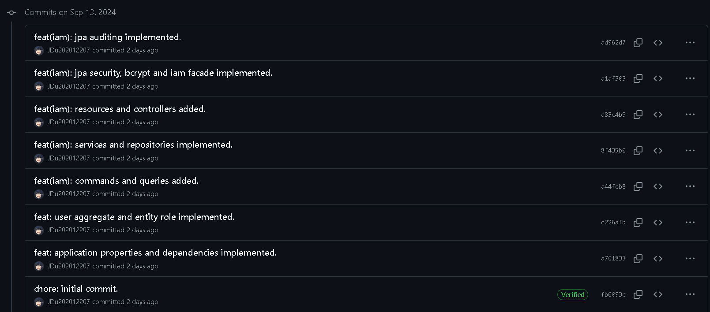
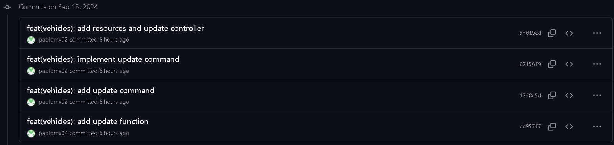
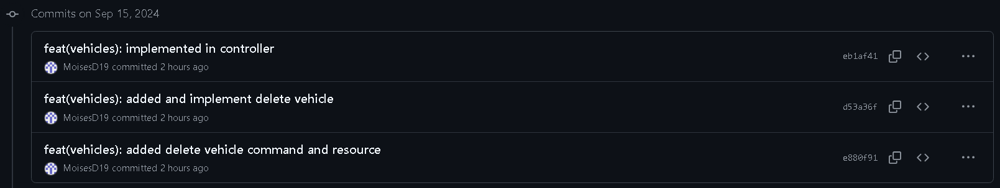
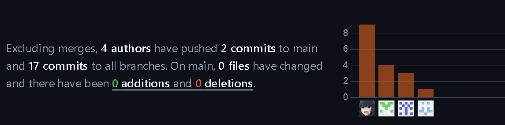
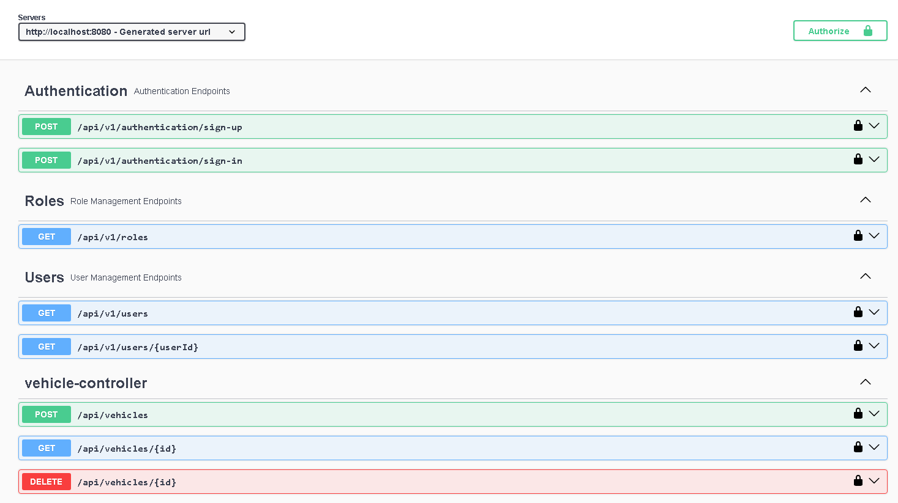

# Capítulo IV: Backend Product Implementation & Validation
La implementación, validación y despliegue del producto son esenciales para asegurar que la visión del producto se convierta en una realidad funcional y accesible para nuestros usuarios. Estas etapas nos permiten transformar el diseño conceptual en una aplicación real, probada y lista para su uso, lo que nos ayuda a validar nuestras ideas, identificar posibles problemas y ofrecer una experiencia de usuario óptima.
## 4.1. Software Configuration Management.
La gestión de la configuración del software es crucial para nuestro trabajo, ya que nos permite mantener un control preciso sobre los elementos de nuestro proyecto, como el código fuente, los documentos de diseño y los activos digitales. Esto garantiza que todos los miembros del equipo estén trabajando con la misma versión de los archivos y facilita la colaboración entre desarrolladores, diseñadores y otros profesionales involucrados en el proyecto.
### 4.1.1. Software Development Environment Configuration.
- ### Project Management:
    * ### Whatsapp:
      Una plataforma de comunicación instantánea, compatible con sistemas operativos Android e iOS, desarrollada por Meta. También dispone de una versión en línea para su uso a través de navegadores web.  
      Link de Descarga: https://www.whatsapp.com/download//?l=uz&lang=es
    * ### Discord:
      Una herramienta de mensajería instantánea diseñada para organizar y facilitar reuniones internas semanales.  
      Link de Descarga: https://discord.com/download
    * ### Trello:
      Una aplicación de gestión de proyectos que facilita el seguimiento de las tareas individuales de cada miembro del equipo de manera sencilla.  
      Link de Registro: https://trello.com/es

- ### Requirement Management:
    * ### Miro:
      Un sistema que ofrece una amplia gama de plantillas diseñadas para abordar diversos aspectos en la creación y gestión de proyectos.  
      Link de Registro: https://miro.com/es/login/
    * ### Structurizr:
      Se trata de una suite de herramientas que posibilita la creación colaborativa de modelos C4 para representar de forma gráfica nuestros productos.  
      Link de Registro: https://structurizr.com
    * ### Vertabelo:
      Una plataforma de colaboración que nos permite diseñar conjuntamente el diagrama de nuestra base de datos.  
      Link de Registro: https://vertabelo.com 
  
- ###  Software Documentation:
    * ### Github:
      Se trata de una plataforma utilizada para el alojamiento de versiones del código fuente de un proyecto. Es una herramienta ampliamente popular en el trabajo colaborativo de programadores.  
      
    * Link De Descarga:  https://desktop.github.com
    * Link de Registro: https://github.com/login
### 4.1.2. Source Code Management.
- #### GitFlow Implementation:
Para implementar el flujo de trabajo Gitflow utilizando Git como nuestra herramienta de control de versiones, nos basamos en la entrada de blog "A successful Git branching model" de Vincent Driessen. Esta referencia nos permitió establecer las convenciones detalladas que serán aplicadas en nuestro proyecto
 

- **Master o Main branch:**
  La rama principal de desarrollo del proyecto es la Master branch. En esta rama reside el código que actualmente se encuentra en producción.
  #### Notación: master o main
- **Develop branch**
La rama "Develop" albergará las más recientes actualizaciones y cambios agregados que serán incluidos en la próxima versión del proyecto. Esta rama sirve como un espacio para la integración y prueba continua de los cambios antes de ser fusionados con la rama principal "Master" para su despliegue en producción.
  #### Notación: develop

- **Release branch**
La rama de lanzamiento (Release branch) facilitará la preparación de una nueva versión del producto. Esta rama permitirá la corrección de errores y permitirá que la rama Develop reciba más actualizaciones.
 Debe derivarse de la rama Develop.
 Debe fusionarse con la rama Develop y Master.
  #### Notación: release

- **Feature branch**
Las ramas de características (Feature branches) serán empleadas para desarrollar nuevas funcionalidades o características del producto que se agregarán en la siguiente versión o en versiones futuras. Estas funcionalidades deberán fusionarse eventualmente con la rama Develop.
 Debe derivarse de la rama Develop.
 Debe fusionarse de vuelta a la rama Develop.
  #### Notación: release

- **Hotfix branch**
La rama de corrección rápida (Hotfix branch) se empleará para resolver y actuar de manera inmediata ante posibles errores en la versión en producción del producto. La característica principal de esta rama es que permite preparar una solución rápida mientras el resto del equipo continúa trabajando en otras funcionalidades o mejoras.
 Debe derivarse de la rama Master
 Debe fusionarse con la rama Develop y Master
  #### Notación: hotfix

- **Conventional Commits**
"Conventional Commits" es una convención para estructurar los mensajes de confirmación (commits) en un formato estándar y semántico. Este formato ayuda a comunicar claramente los cambios realizados en el código y facilita la generación de registros de cambios automáticos. Los "Conventional Commits" suelen seguir un formato que incluye un encabezado, un cuerpo opcional y un pie de página opcional, y se utilizan para describir de manera sucinta y clara los cambios realizados en el código, lo que facilita su seguimiento y comprensión por parte de los desarrolladores y otros miembros del equipo.
 
La estructura de un commit debe seguir las siguientes pautas:
~~~
git commit -m “<type>[optional scope]: <title>“ -m “<description”
~~~
**Tipos De Conventional Commits**
~~~
1. **feat**: Se usa para describir una nueva característica o funcionalidad añadida al código.
2. **fix**: Indica una corrección de errores o solución a un problema.
3. **docs**: Se emplea para cambios o mejoras en la documentación del código.
4. **style**: Describe cambios relacionados con el formato del código, como espacios en blanco, sangrías, etc., que no afectan su funcionalidad.
5. **refactor**: Se utiliza para modificaciones en el código que no corrigen errores ni añaden nuevas funcionalidades, sino que mejoran su estructura o legibilidad.
6. **test**: Indica la adición o modificación de pruebas unitarias o funcionales.
7. **chore**: Se usa para cambios en el proceso de construcción o tareas de mantenimiento que no están directamente relacionadas con el código en sí.
8. **perf**: Describe mejoras de rendimiento en el código.
~~~

### 4.1.3. Source Code Style Guide & Conventions.
- ### Java
    - #### CamelCase Naming Convention
      Esta convención sugiere nombrar variables, métodos y clases utilizando CamelCase, donde cada palabra en el identificador comienza con una letra mayúscula, excepto la primera palabra.
      ~~~ 
      int miVariable;
      void miMetodoNombre() {
          // Cuerpo del método
      }
      class MiClase {
          // Miembros de la clase
      }
      ~~~
    - #### Constants Naming Convention
      Las constantes generalmente se nombran utilizando letras mayúsculas con guiones bajos para separar palabras y distinguirlas de las variables regulares.
      ~~~ 
      final int VALOR_MAXIMO = 100;
      ~~~
    - #### Comments Convention
      Los comentarios deben utilizarse para explicar la funcionalidad del código, especialmente en secciones complejas o no intuitivas, utilizando un lenguaje claro y conciso.
      ~~~ 
      // Este método calcula la suma de dos números
      int suma(int num1, int num2) {
          return num1 + num2;
      }
      ~~~ 
    - #### Method Naming Convention
      Los nombres de los métodos deben ser descriptivos y comenzar con un verbo en minúsculas, seguido de un sustantivo (o sustantivos) que describa la acción del método.
      ~~~ 
      void calcularSuma() {
          // Cuerpo del método
      }
      ~~~
    - #### Indentation Convention
      La indentación consistente mejora la legibilidad del código. Cada nivel de anidamiento de código debe ser indentado por un número fijo de espacios o tabulaciones.
      ~~~ 
      public class MiClase {
          public static void main(String[] args) {
              if (condicion) {
                  // Bloque de código indentado
                  System.out.println("¡Hola, Mundo!");
              }
         
          }
      }
      ~~~
### 4.1.4. Software Deployment Configuration.
-  Creación SafeDrive Platform (BACKEND):
  1. Se crea un repositorio remoto en GitHub
  
  2.Agregar a participantes
  
  

## 4.2. Software Development & Implementation.
### 4.2.1. Sprint 1
El primer sprint es un hito importante en nuestro proceso de desarrollo ágil. Durante este período, nos enfocamos en la implementación de las características y funcionalidades prioritarias identificadas en la planificación inicial. Esto implica traducir los requisitos y especificaciones en código funcional, desarrollando las bases de nuestro producto de manera iterativa.
### 4.2.1.1. Sprint Planning 1.
A continuación, se presenta el resumen del Sprint Planning Meeting, que proporcionará una visión general de los temas discutidos y las decisiones tomadas durante la reunión.

*Tabla del planeamiento a profundidad del Sprint 1.*
<table>
        <tr>
            <td colspan="1">Sprint #</td>
            <td colspan="1">Sprint 1</td>
        </tr>
        <tr>
            <td colspan="2">Sprint Planning Background</td>
        </tr>
        <tr>
            <td>Date</td>
            <td>2024-09-12</td>
        </tr>
          <tr>
            <td>Time</td>
            <td>04:27 PM</td>
        </tr>
            <tr>
            <td>Location</td>
            <td>Discord</td>
        </tr>
            <tr>
            <td>Prepared by</td>
            <td>Fabrizio Sanchez</td>
        </tr>
            <tr>
            <td>Attendees (to planning meeting)</td>
            <td>Fabrizio Sanchez, Paolo Martinez, Juan Cueto, Moises Donayre</td>
            <tr>
            <td>Sprint 1 Review Summary</td>
            <td>En el desarrollo del primer sprint, logramos progresar de manera notable en el desarrollo de al menos el 30% del backend, adempas de una buena colaboracion en el equipo.</td>
        </tr>
            <tr>
            <td>Sprint 1 Retrospective Summary</td>
            <td>En retrospectiva del primer sprint, detectamos áreas de mejora, como la comunicación y el tiempo en que nos tomaba hacer las tareas. Por eso, nos comprometemos a seguir mejorando nuestro proceso de trabajo de manera continua.</td>
        </tr>
            <tr>
            <td colspan="2">Sprint Goal & User Stories</td>
        </tr>
              <tr>
            <td>Sprint 1 Goal</td>
            <td>Lograr un índice de cumplimiento del 100%, lo que confirmará que se han alcanzado los objetivos del primer sprint.</td>
        </tr>
              <tr>
            <td>Sprint 1 Velocity</td>
            <td>Hemos decidido establecer nuestra capacidad de entrega en 4 User Stories para este sprint</td>
        </tr>
              <tr>
            <td>Sum of Story Points</td>
            <td>El total de Story Point asignados a las User Stories que se estan incorporando a este Sprint 1 es 12</td>
        </tr>
    </table>

### 4.2.1.2. Sprint Backlog 1.
*Tabla principal del planeamiento del Sprint Backlog 1.*

<table>
        <tr>
            <td colspan="2">Sprint #</td>
            <td colspan="6">Sprint 1</td>
        </tr>
        <tr>
            <td colspan="2">User Story</td>
            <td colspan="6">Work-Item / Task</td>
        </tr>
        <tr>
            <td>Id</td>
            <td>Title</td>
            <td>Id</td>
            <td>Title</td>
            <td>Descripcion</td>
            <td>Estimation (Hours)</td>
            <td>Assigned To</td>
            <td>Status (To-do / In / Process / ToReview / Done)</td>
        </tr>
        <tr>
            <td>US16</td>
            <td>Autenticación de usuarios</td>
            <td>T01</td>
            <td>Implementación de autenticar usuarios en la aplicación</td>
            <td>Crear un endpoint en la API para registrar usuarios, validando los datos en el backend antes de añadirlos a la base de datos.</td>
            <td>2 hours</td>
            <td>Juan Cueto</td>
            <td>Done</td>
        </tr>
        <tr>
            <td>US17</td>
            <td>Crear vehiculo</td>
            <td>T02</td>
            <td>Desarrollo de endpoint para agregar un vehiculo</td>
            <td>Crear un endpoint en la API que permita agregar nuevos vehiculos a la base de datos, incluyedo la lógica de backend para validar los datos antes de incluirlo.</td>
            <td>2 hours</td>
            <td>Fabrizio Sanchez</td>
            <td>Done</td>
        </tr>
        <tr>
            <td>US18</td>
            <td>Editar vehiculo</td>
            <td>T03</td>
            <td>Desarrollo de endpoint para editar y actualizar un vehiculo</td>
            <td>Crear un endpoint en la API para editar y actualizar vehículos existentes en la base de datos, validando los datos en el backend antes de realizar la actualización.</td>
            <td>3 hours</td>
            <td>Paolo Martinez</td>
            <td>Done</td>
        </tr>
        <tr>
            <td>US19</td>
            <td>Eliminar vehiculo</td>
            <td>T04</td>
            <td>Desarrollo de un endpoint para eliminar un vehiculo</td>
            <td>Crear un endpoint en la API para eliminar vehículos específicos de la base de datos, validando los datos en el backend antes de proceder con la eliminación.</td>
            <td>2 hours</td>
            <td>Moises Donayre</td>
            <td>Done</td>
        </tr>
    </table>

### 4.2.1.3. Development Evidence for Sprint Review.
En esta sección, se describen los avances en la implementación de los productos de la solución relacionados con los Web Services, según el alcance del Sprint 4. Aquí se presentarán los commits ya implementados en el repositorio de GitHub, junto con toda la información relevante y los cambios realizados.

*Tabla de los commits realizados y relacionados con el desarrollo de todas las secciones del Sprint Backlog 1*

| Repository | Branch | Commit Id | Commit Message | Commit Message Body | Commited on (Date) |
|------------|--------|-----------|----------------|---------------------|--------------------|
| safeDrive-service | main | fb6093c | chore |  initial commit | 13/09  |
| safeDrive-service | develop | a761833 | feat | application properties and dependencies implemented. | 13/09 |
| safeDrive-service | develop | c226afb | feat | user aggregate and entity role implemented. | 13/09 |
| safeDrive-service | develop | a44fcb8 | feat | commands and queries added. | 13/09 |
| safeDrive-service | develop | 8f435b6 | feat | services and repositories implemented. | 13/09 |
| safeDrive-service | develop | d83c4b9 | feat | resources and controllers added. | 13/09 |
| safeDrive-service | develop | a1af303 | feat | jpa security, bcrypt and iam facade implemented. | 13/09 |
| safeDrive-service | develop | ad962s7 | feat | jpa auditing implemented. | 13/09 |
| safeDrive-service | develop-vehicles | 1e879ef | feat | added bounded context vehicle | 14/06 |
| safeDrive-service | develop-vehicles-update | dd957f7 | feat | add update function | 15/06 |
| safeDrive-service | develop-vehicles-update | 17f8c5d | feat | add update command | 15/06 |
| safeDrive-service | develop-vehicles-update | 67156f9 | feat | implement update command | 15/06 |
| safeDrive-service | develop-vehicles-update | 5f019cd | feat | add resources and update controller | 15/06 |
| safeDrive-service | develop-vehicles-delete | e880f91 | feat | added delete vehicle command and resource | 15/06 |
| safeDrive-service | develop-vehicles-delete | d53a36f | feat | added and implement delete vehicle | 15/06 |
| safeDrive-service | develop-vehicles-delete | eb1af41 | feat | implemented in controller | 15/06 |

### 4.2.1.4. Testing Suite Evidence for Sprint Review.

| Repository | Branch | Commit Id | Commit Message | Commit Message Body | Commited on (Date) |
|------------|--------|-----------|----------------|---------------------|--------------------|
| safeDrive-service | develop | 73c48a | feat | add test for authentication | 15/09 |
| safeDrive-service | develop-vehicles | 927643c | feat | add test for create vehicles | 15/09 |
| safeDrive-service | develop-vehicles-update | 5e84fae | feat | add test for update vehicles | 15/09 |
| safeDrive-service | develop-vehicles-delete | b654a7b | feat | add test for delete vehicles | 15/09 |

### 4.2.1.5. Execution Evidence for Sprint Review.

En el Sprint 1, se pudo implementar a tiempo las caracteristicas del backend de la aplicación móvil. El equipo completó exitosamente las historias de usuario dadas a cada miembro en este sprint, las cuales incluyeron autenticacion de usuario y gestión de vehiculos.

Contribución del equipo:

Vista del backend:

### 4.2.1.6. Services Documentation Evidence for Sprint Review.
### 4.2.1.7. Software Deployment Evidence for Sprint Review.
### 4.2.1.8. Team Collaboration Insights during Sprint.
