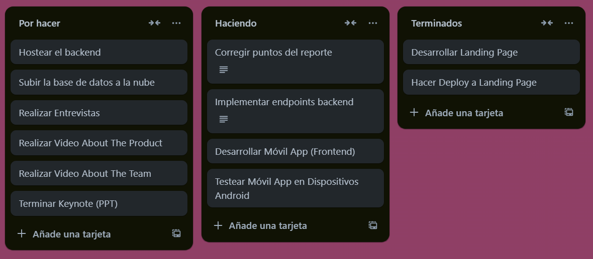
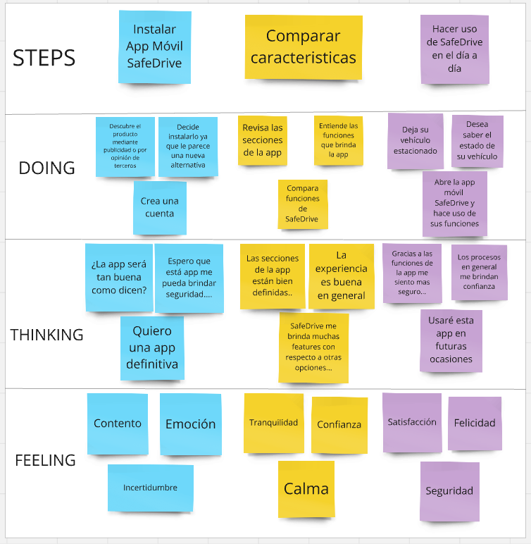
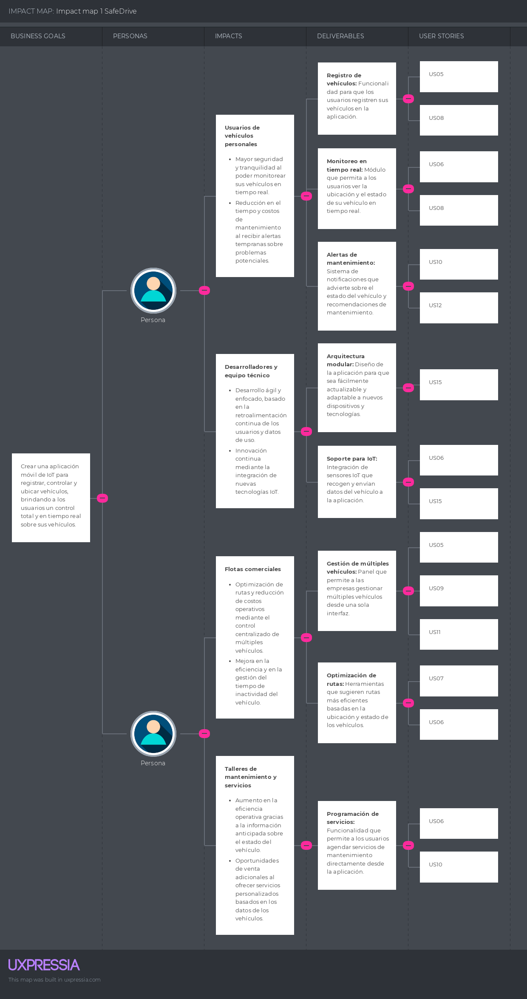
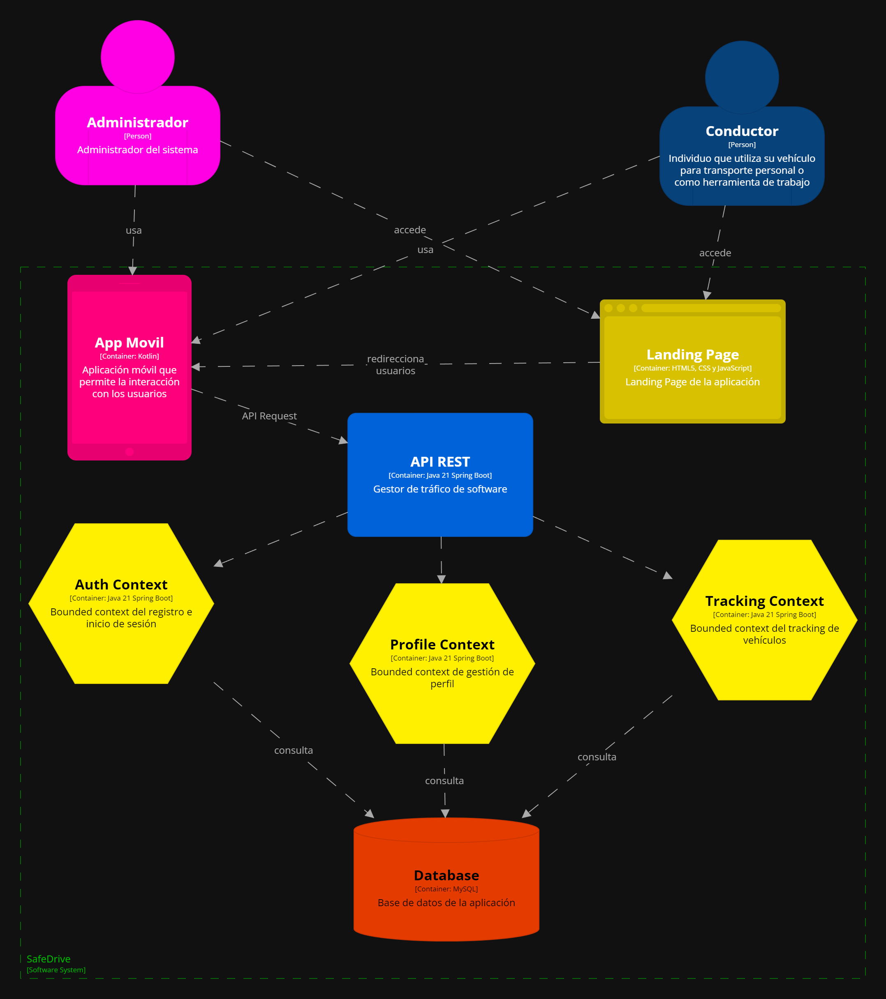
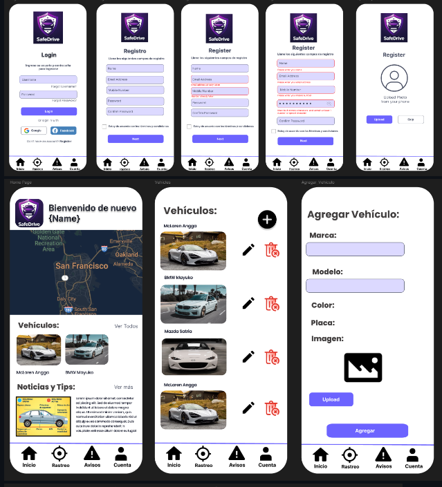
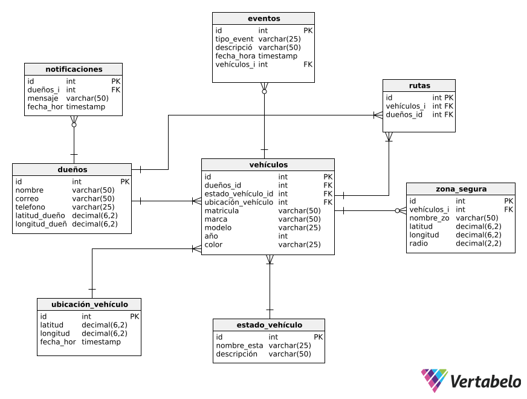
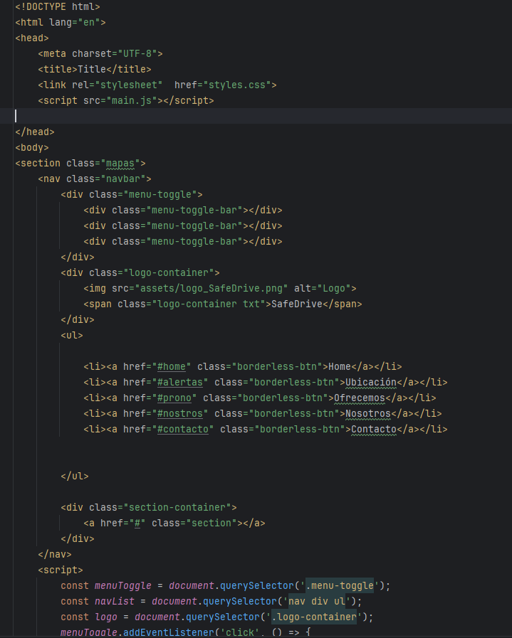
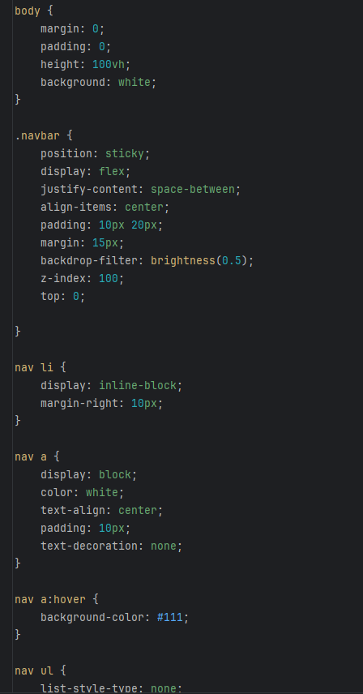
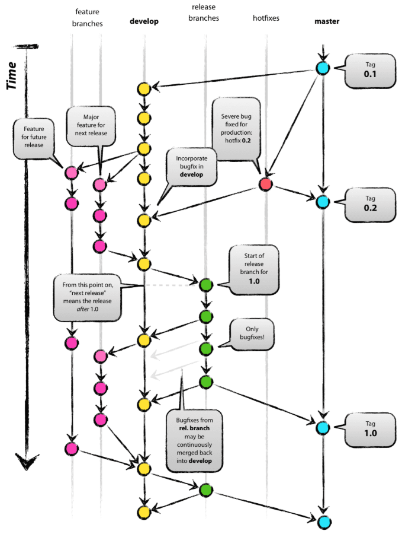

# Capítulo V: Product Implementation & Validation
La implementación, validación y despliegue del producto son esenciales para asegurar que la visión del producto se convierta en una realidad funcional y accesible para nuestros usuarios. Estas etapas nos permiten transformar el diseño conceptual en una aplicación móvil real, probada y lista para su uso, lo que nos ayuda a validar nuestras ideas, identificar posibles problemas y ofrecer una experiencia de usuario óptima.
## 5.1. Software Configuration Management.
La gestión de la configuración del software es crucial para nuestro trabajo, ya que nos permite mantener un control preciso sobre los elementos de nuestro proyecto, como el código fuente, los documentos de diseño y los activos digitales. Esto garantiza que todos los miembros del equipo estén trabajando con la misma versión de los archivos y facilita la colaboración entre desarrolladores, diseñadores y otros profesionales involucrados en el proyecto.
### 5.1.1. Software Development Environment Configuration.
- #### Proyect Management:
  - ##### Trello: 
    Una aplicación de gestión de proyectos que facilita el seguimiento de las tareas individuales de cada miembro del equipo de manera sencilla.
     Link De Registro o Inicio de sesión:
      https://trello.com/invite/b/66f2e32364ac9ab627398e6c/ATTIdeb26a1cb49b87524f3ebf4cd8f9fed730AF3A4B/tareas-para-aplicativos-moviles
      
- ##### Requirement Management:
  - Miro:
    Un sistema que ofrece una amplia gama de plantillas diseñadas para abordar diversos aspectos en la creación y gestión de proyectos.
     Link De Registro o Inicio de sesión:
      https://miro.com/app/board/o9J_lX1J9Z4=/
     Evidencia De Uso
        
      
  - Uxpressia:
    Es una herramienta en línea que simplifica el proceso de mapeo y comprensión de las necesidades del cliente en un proyecto determinado.
     Link De Registro o Inicio de sesión:
      https://uxpressia.com/
     Evidencia De Uso
      
      
  - Structurizr:
    Se trata de una suite de herramientas que posibilita la creación colaborativa de modelos C4 para representar de forma gráfica nuestros productos.
     Link De Registro o Inicio de sesión:
      https://structurizr.com/
     Evidencia De Uso
      
- ##### Requirement Management:
  - Figma:
    Una herramienta de diseño colaborativo basada en la nube que permite a los equipos de diseño trabajar juntos en tiempo real.
     Link De Registro o Inicio de sesión:
      https://www.figma.com/
     Evidencia De Uso
      
      
  - Lucidchart:
    Una plataforma de diagramación en línea que permite a los usuarios crear diagramas de flujo, organigramas, mapas mentales y otros tipos de diagramas.
     Link De Registro o Inicio de sesión:
      https://www.lucidchart.com/
     Evidencia De Uso
      
      
- ##### Software Development:
  - Landing Page:
    - #### HTML5:
      Un lenguaje de marcado que se utiliza para estructurar y presentar el contenido en la web.
       Evidencia De Uso
        
        
    - #### CSS3:
      Un lenguaje de hojas de estilo que se utiliza para dar estilo y diseño a las páginas web.
       Evidencia De Uso
        
        
    - #### JavaScript:
      Un lenguaje de programación que se utiliza para crear interactividad y dinamismo en las páginas web.
        
    - #### WebStorm:
       Un entorno de desarrollo integrado (IDE) que se utiliza para desarrollar aplicaciones web.
        
  - Mobile Application:
     - #### Kotlin:
       Un lenguaje de programación moderno y conciso que se utiliza para desarrollar aplicaciones móviles en Android.
        Evidencia De Uso
         
         
     - #### Jetpack Compose:
        Un kit de herramientas moderno y reactivo que se utiliza para desarrollar interfaces de usuario en Android.
         Evidencia De Uso
          
          
     - #### Android Studio:
         Un entorno de desarrollo integrado (IDE) que se utiliza para desarrollar aplicaciones móviles en Android.

### 5.1.2. Source Code Management.
- #### Gitflow Implementation:  
  Para implementar el flujo de trabajo Gitflow utilizando Git como nuestra herramienta de control de versiones, nos basamos en la entrada de blog "A successful Git branching model" de Vincent Driessen. Esta referencia nos permitió establecer las convenciones detalladas que serán aplicadas en nuestro proyecto
     

    #### Convenciones de Gitflow:
  - **Master o Main branch:** 
    La rama principal de desarrollo del proyecto es la Master branch. En esta rama reside el código que actualmente se encuentra en producción.
    #### Notación: master o main
  - **Develop branch** 
    La rama "Develop" albergará las más recientes actualizaciones y cambios agregados que serán incluidos en la próxima versión del proyecto. Esta rama sirve como un espacio para la integración y prueba continua de los cambios antes de ser fusionados con la rama principal "Master" para su despliegue en producción.
    #### Notación: develop

   - **Release branch** 
   La rama de lanzamiento (Release branch) facilitará la preparación de una nueva versión del producto. Esta rama permitirá la corrección de errores y permitirá que la rama Develop reciba más actualizaciones.
    Debe derivarse de la rama Develop.
    Debe fusionarse con la rama Develop y Master.
    #### Notación: release

   - **Feature branch** 
     Las ramas de características (Feature branches) serán empleadas para desarrollar nuevas funcionalidades o características del producto que se agregarán en la siguiente versión o en versiones futuras. Estas funcionalidades deberán fusionarse eventualmente con la rama Develop.
      Debe derivarse de la rama Develop.
      Debe fusionarse de vuelta a la rama Develop.
     #### Notación: release
  
   - **Hotfix branch** 
     La rama de corrección rápida (Hotfix branch) se empleará para resolver y actuar de manera inmediata ante posibles errores en la versión en producción del producto. La característica principal de esta rama es que permite preparar una solución rápida mientras el resto del equipo continúa trabajando en otras funcionalidades o mejoras.
      Debe derivarse de la rama Master
      Debe fusionarse con la rama Develop y Master
     #### Notación: hotfix

    - **Conventional Commits** 
      "Conventional Commits" es una convención para estructurar los mensajes de confirmación (commits) en un formato estándar y semántico. Este formato ayuda a comunicar claramente los cambios realizados en el código y facilita la generación de registros de cambios automáticos. Los "Conventional Commits" suelen seguir un formato que incluye un encabezado, un cuerpo opcional y un pie de página opcional, y se utilizan para describir de manera sucinta y clara los cambios realizados en el código, lo que facilita su seguimiento y comprensión por parte de los desarrolladores y otros miembros del equipo.
       
      La estructura de un commit debe seguir las siguientes pautas:
    ~~~
    git commit -m “<type>[optional scope]: <title>“ -m “<description”
    ~~~
    **Tipos De Conventional Commits**
    ~~~
    1. **feat**: Se usa para describir una nueva característica o funcionalidad añadida al código.
    2. **fix**: Indica una corrección de errores o solución a un problema.
    3. **docs**: Se emplea para cambios o mejoras en la documentación del código.
    4. **style**: Describe cambios relacionados con el formato del código, como espacios en blanco, sangrías, etc., que no afectan su funcionalidad.
    5. **refactor**: Se utiliza para modificaciones en el código que no corrigen errores ni añaden nuevas funcionalidades, sino que mejoran su estructura o legibilidad.
    6. **test**: Indica la adición o modificación de pruebas unitarias o funcionales.
    7. **chore**: Se usa para cambios en el proceso de construcción o tareas de mantenimiento que no están directamente relacionadas con el código en sí.
    8. **perf**: Describe mejoras de rendimiento en el código.
    ~~~
### 5.1.3. Source Code Style Guide & Conventions.
- **Landing Page**:
  - ### HTML
    - #### Use Lowercase Element Names:
      Es recomendable utilizar minúsculas o lowercase para los nombres de los elementos HTML.
        ~~~ 
      <body>
            
Esto es un párrafo

      <body>
       ~~~
    - #### Close All HTML Elements:
      Es recomendable cerrar todos los elementos HTML correctamente.
        ~~~ 
      <body>
            
Esto es un párrafo

            
Esto es otro párrafo

      <body>
       ~~~
    - #### Use Lowercase Attribute Names:
      Es recomendable utilizar minúsculas para los nombres de los atributos HTML.
      ~~~ 
      <a href="https://www.w3schools.com/html/">Visit our HTMLtutorial</a>
       ~~~
    - #### Always Specify alt, width, and height for Images:
      Es recomendable seguir estas convenciones en caso de que la imagen no se pueda mostrar, lo que ayuda a mejorar la accesibilidad del contenido.
      ~~~ 
      
      ~~~ 
    - #### Spaces and Equal Signs:
      Se recomienda no utilizar espacios en blanco entre las entidades para mejorar la legibilidad.
      ~~~ 
      <link rel="stylesheet" href="styles.css">
      ~~~ 
  - ### CSS
    - #### ID and Class Naming
      Es recomendable utilizar nombres de clases y IDs significativos que expresen claramente el propósito del elemento.
      ~~~ 
      #gallery {}
      #login {}
      .video {}
       ~~~
    - #### ID and Class Name Style
      Se recomienda utilizar nombres cortos para nombrar IDs o clases, pero lo suficientemente descriptivos para entender su propósito.
      ~~~ 
      #nav {}
      .author {}
      ~~~
    - #### Shorthand Properties
      Se recomienda utilizar propiedades CSS de forma abreviada siempre que sea posible para hacer el código más eficiente y comprensible.
       ~~~ 
       border-top: 0;
       font: 100%/1.6 palatino, georgia, serif;
       padding: 0 1em 2em;
       ~~~ 
    - #### 0 and Units
      Es recomendable evitar especificar la unidad después del valor 0 en propiedades que lo permitan, ya que esto ayuda a reducir el tamaño del código y mejora su legibilidad.
       ~~~ 
       margin: 0;
       padding: 0;
       ~~~
    - #### Declaration Order
      Se recomienda ordenar las declaraciones en orden alfabético para facilitar el mantenimiento y la recordación del código.
      ~~~ 
       background: fuchsia;
       border: 1px solid;
       border-radius: 4px;
       color: black;
       text-align: center;
       text-indent: 2em;
      ~~~  
  - ### JAVASCRIPT
    - #### Use expanded syntax
      Cada línea de JavaScript debería estar en una nueva línea, con la llave de apertura en la misma línea de su declaración y la llave de cierre en una nueva línea al final.
      ~~~ 
      function myFunc() {
       console.log('Hello!');
      };
      ~~~
    - #### Variable naming
      Para el nombre de las variables, se recomienda utilizar lowerCamelCase.
      ~~~ 
      let playerScore = 0;
      let speed = distance / time;
      ~~~  
    - #### Declaring variables
      Para la declaración de variables, es recomendable utilizar las palabras reservadas let y const en lugar de var.
      ~~~ 
      const myName = 'Chris';
      console.log(myName);
      let myAge = '40';
      myAge++;
      console.log('Happy birthday!');
      ~~~ 
    - #### Function naming
      Para el nombre de las funciones, se recomienda utilizar lowerCamelCase.
      ~~~ 
      function sayHello() {
      alert('Hello!');
      };
      ~~~
- **Mobile Application**:
  - **KOTLIN**:
    - Naming Conventions:  
        Sigue PascalCase para clases y objetos, camelCase para funciones y variables, y UPPER_CASE para constantes.
        ~~~
        class UserProfile {}
        fun fetchUserData() {}
        const val MAX_RETRY_ATTEMPTS = 3
        ~~~
    
    - Indentation & Spacing:  
      Usa 4 espacios para la indentación y deja una línea en blanco entre funciones.
      ~~~
      fun loginUser() {
      if (user.isLoggedIn()) {
      println("User is logged in")
      }
      }
      ~~~
    
    - Brace Style:  
      Las llaves deben abrirse en la misma línea que la declaración.
      ~~~
      if (user.isAdmin()) {
      println("User is admin")
      }
      ~~~
    
    - Function & Lambda Expressions:  
      Usa funciones de una sola expresión y lambdas con it cuando sea posible.
      ~~~
      val doubled = numbers.map { it * 2 }
      fun isEven(number: Int) = number % 2 == 0
      ~~~
  - **Jetpack Compose**:
    - Naming Conventions:  
      Usa PascalCase para composables y mantenlos pequeños y modulares.
      ~~~
      @Composable
        fun UserProfileScreen() {
        Column {
           UserImage()
           UserDetails()
        }
      }
      ~~~

    - Modifiers y Parámetros Opcionales:  
      Los modificadores van al final de la función y se deben usar valores por defecto en parámetros opcionales.
      ~~~
      @Composable
      fun UserImage(modifier: Modifier = Modifier.size(64.dp), imageUrl: String) {}
      ~~~
      
    - State Handling in Compose:  
      Usa remember y mutableStateOf para manejar el estado local en composables.
      ~~~
      var count by remember { mutableStateOf(0) }
      ~~~

### 5.1.4. Software Deployment Configuration.
## 5.2. Landing Page & Mobile Application Implementation.
### 5.2.1. Sprint 1
#### 5.2.1.1. Sprint Planning 1.
#### 5.2.1.2. Sprint Backlog 1.
#### 5.2.1.3. Development Evidence for Sprint Review.
#### 5.2.1.4. Testing Suite Evidence for Sprint Review.
#### 5.2.1.5. Execution Evidence for Sprint Review.
#### 5.2.1.6. Services Documentation Evidence for Sprint Review.
#### 5.2.1.7. Software Deployment Evidence for Sprint Review.
#### 5.2.1.8. Team Collaboration Insights during Sprint.

### 5.2.2. Sprint 2

El segundo sprint se centra en el desarrollo del frontend de nuestra aplicación móvil. Durante este ciclo, priorizamos la creación de interfaces de usuario interactivas y fluidas, traduciendo los diseños iniciales en pantallas funcionales. Además, nos aseguramos de que la experiencia del usuario sea intuitiva y optimizada para diferentes dispositivos móviles. Este sprint marca un avance clave hacia la entrega de un producto cohesivo y funcional.

#### 5.2.2.1. Sprint Planning 2.
|                                 |                                                                                                                                                                                                                                   |
| ------------------------------- | --------------------------------------------------------------------------------------------------------------------------------------------------------------------------------------------------------------------------------- |
| Sprint #                        | Sprint 2                                                                                                                                                                                                                          |
| Sprint Planning Background      |                                                                                                                                                                                                                                   |
| Date                            | 2024-09-21                                                                                                                                                                                                                        |
| Time                            | 04:27 PM                                                                                                                                                                                                                          |
| Location                        | Discord                                                                                                                                                                                                                           |
| Prepared by                     | Fabrizio Sanchez                                                                                                                                                                                                                  |
| Attendees (to planning meeting) | Fabrizio Sanchez, Paolo Martinez, Juan Cueto, Moises Donayre                                                                                                                                                                      |
| Sprint 1 Review Summary         | En el desarrollo del primer sprint, logramos implementar de manera notable la Landing Page de nuestro proyecto.                                                                                                                   |
| Sprint 1 Retrospective Summary  | En retrospectiva del primer sprint, detectamos áreas de mejora, como la comunicación y el tiempo en que nos tomaba hacer las tareas. Por eso, nos comprometemos a seguir mejorando nuestro proceso de trabajo de manera continua. |
| Sprint Goal & User Stories      |                                                                                                                                                                                                                                   |
| Sprint 2 Goal                   | Realizar un avance del Frontend de nuestra aplicación móvil. Lograr un índice de cumplimiento del 100%, lo que confirmará que se han alcanzado los objetivos del primer sprint.                                                   |
| Sprint 2 Velocity               | Hemos decidido establecer nuestra capacidad de entrega en 5 User Stories para este sprint                                                                                                                                         |
| Sum of Story Points             | El total de Story Point asignados a las User Stories que se estan incorporando a este Sprint 1 es 10                                                                                                                              |

#### 5.2.2.2. Sprint Backlog 2.

_Tabla principal del planeamiento del Sprint Backlog 2._

|            |                                                                   |                  |                       |                                                                                           |                    |                  |                                                 |
| ---------- | ----------------------------------------------------------------- | ---------------- | --------------------- | ----------------------------------------------------------------------------------------- | ------------------ | ---------------- | ----------------------------------------------- |
| Sprint #   |                                                                   | Sprint 1         |                       |                                                                                           |                    |                  |                                                 |
| User Story |                                                                   | Work-Item / Task |                       |                                                                                           |                    |                  |                                                 |
| Id         | Title                                                             | Id               | Title                 | Descripcion                                                                               | Estimation (Hours) | Assigned To      | Status (To-do / In / Process / ToReview / Done) |
| US01       | Interfaz util en la pantalla de inicio de la aplicación móvil     | T01              | Pantalla de inicio    | Crear una interfaz llamativa y funcional en la pantalla de inicio de la aplicación.       | 2 hours            | Moises Donayre   | Done                                            |
| US02       | Implementación de una Navegación Intuitiva en la aplicación móvil | T02              | Navegación            | Crear una barra de navegación para poder navegar fácilmente por las diferentes secciones. | 2 hours            | Fabrizio Sanchez | Done                                            |
| US05       | Registrar vehículos en la aplicación                              | T03              | Registro de vehículos | Crear una sección para registrar vehículos en la aplicación.                              | 3 hours            | Paolo Martinez   | Done                                            |
| US11       | Eliminar vehículo registrado en la aplicación móvil               | T04              | Eliminar vehículo     | Implementar la funcionalidad de eliminar vehículos en la aplicación.                      | 3 hours            | Paolo Martinez   | Done                                            |
| US13       | Comunicación con la base de datos y la aplicación móvil           | T05              | Conexión con API      | Conectar el frontend de la aplicación con nuestro API que conecta con la base de datos.   | 2 hours            | Juan Cueto       | In Progress                                     |

#### 5.2.2.3. Development Evidence for Sprint Review.

En esta sección, se describen los avances en la implementación de los productos de la solución relacionados con el Frontend. Aquí se presentarán los commits ya implementados en el repositorio de GitHub, junto con toda la información relevante y los cambios realizados.

![[Pasted image 20240927223253.png]]

![[Pasted image 20240927223228.png]]

_Tabla de los commits realizados y relacionados con el desarrollo de todas las secciones del Sprint Backlog 2

| Repository          | Branch                  | Commit Id | Commit Message | Commit Message Body                 | Commited on (Date) |
| ------------------- | ----------------------- | --------- | -------------- | ----------------------------------- | ------------------ |
| safeDrive-MobileApp | main                    | 2fcca8e   |                | Initial Commit                      | 23/09              |
| safeDrive-MobileApp | master                  | 10482d4   | feat           | added screens                       | 23/09              |
| safeDrive-MobileApp | master                  | b6977ad   | fix            | fixed code related to images        | 24/09              |
| safeDrive-MobileApp | master                  | ec64de1   | fix            | added code with some errors         | 25/09              |
| safeDrive-MobileApp | master                  | 75d8cde   | docs           | added navigation                    | 26/09              |
| safeDrive-MobileApp | feature/vehicles        | 9de6510   | feat           | add dependencies and permissions    | 26/09              |
| safeDrive-MobileApp | feature/vehicles        | 3d264d3   | feat           | add Constants, Resource & UIState   | 26/09              |
| safeDrive-MobileApp | feature/vehicles        | 7dda5e7   | feat           | add Dto and Service                 | 26/09              |
| safeDrive-MobileApp | feature/vehicles        | f6c0d12   | feat           | add vehicle data class & repository | 26/09              |
| safeDrive-MobileApp | feature/vehicles        | de0e9f0   | feat           | add vehicle detail presentation     | 26/09              |
| safeDrive-MobileApp | feature/vehicles        | 99c33d9   | feat           | add vehicle list presentation       | 26/09              |
| safeDrive-MobileApp | feature/vehicles        | a8aac60   | feat           | add traffic config                  | 26/09              |
| safeDrive-MobileApp | feature/vehicles        | 795c696   | feat           | add retrofit builder                | 26/09              |
| safeDrive-MobileApp | feature/vehicles        | e1342b3   | feat           | add image storage with firebase     | 26/09              |
| safeDrive-MobileApp | feature/vehicles        | 0e3c0c8   | fix            | fix vehicle card                    | 26/09              |

#### 5.2.2.4. Testing Suite Evidence for Sprint Review.

| Repository          | Branch           | Commit Id | Commit Message | Commit Message Body      | Commited on (Date) |
| ------------------- | ---------------- | --------- | -------------- | ------------------------ | ------------------ |
| safeDrive-MobileApp | main             | 7ec42a    | feat           | add test for project     | 26/09              |
| safeDrive-MobileApp | master           | 9b763bc   | feat           | add test navigation      | 27/09              |
| safeDrive-MobileApp | feature/vehicles | 5h81f2e   | feat           | add test vehicle screens | 27/09              |

#### 5.2.1.5. Execution Evidence for Sprint Review.

En esta sección se muestra Frontend de la aplicación funcional. Se puede apreciar las distintas vistas e interfaces realizadas en este sprint:

Pantalla de registro

![[Imagen de WhatsApp 2024-09-27 a las 23.40.53_8c1cf68b.jpg]]

Pantalla de inicio de sesión

![[Imagen de WhatsApp 2024-09-27 a las 23.40.53_8bd15f4a.jpg]]

Pantalla de edición de perfil

![[Imagen de WhatsApp 2024-09-27 a las 23.21.40_4e85d37f.jpg]]

Pantalla de lista de vehículos

![[Imagen de WhatsApp 2024-09-27 a las 23.21.41_8f3b86b2.jpg]]

Pantalla de agregar vehículo

![[Imagen de WhatsApp 2024-09-27 a las 23.21.41_8878b7b3.jpg]]

![[Imagen de WhatsApp 2024-09-27 a las 23.21.41_321af8d3.jpg]]

#### 5.2.2.6. Services Documentation Evidence for Sprint Review.

#### 5.2.2.7. Software Deployment Evidence for Sprint Review.

#### 5.2.2.8. Team Collaboration Insights during Sprint.

Para la realización de este sprint, hemos mantenido contacto continuo mediante reuniones semanales y utilizando herramientas como Discord o Whatsapp. Distribuimos las tareas y responsabilidades de manera equitativa entre los miembros del equipo para facilitar el trabajo constante y equilibrado. Esta comunicación ha sido fundamental para lograr el avance del Frontend de nuestra aplicación, ya que cada uno de los miembros del equipo pudo compartir sus conocimientos en el desarrollo móvil permitiendo que todos aprendiéramos de la experiencia compartida.

![[Pasted image 20240928001900.png]]

## 5.3. Validation Interviews.

El objetivo de estas entrevistas es adquirir una comprensión profunda de las experiencias, perspectivas y opiniones de los usuarios al probar nuestra aplicación móvil. Buscamos obtener información valiosa que nos ayude a entender mejor a nuestro público objetivo y a mejorar nuestra comprensión sobre sus necesidades y deseos.
A través de estas conversaciones, podremos obtener una visión más clara de cómo los usuarios interactúan con la aplicación, qué características consideran más útiles y cuáles podrían mejorarse. Esta retroalimentación será fundamental para adaptar la aplicación de manera más efectiva a los requerimientos de nuestros usuarios, asegurando que cumplamos con sus expectativas y necesidades.

### 5.3.1. Diseño de Entrevistas.

El diseño de estas entrevistas nos permitirá recopilar información valiosa sobre las experiencias, perspectivas y necesidades de los usuarios al interactuar con nuestra aplicación móvil. Esto nos ayudará a comprender mejor sus preocupaciones y expectativas, lo que a su vez nos permitirá desarrollar soluciones más efectivas y adaptadas a sus requerimientos específicos.
Además, estas entrevistas nos brindarán la oportunidad de establecer una conexión significativa con nuestros usuarios, fortaleciendo así nuestra relación con ellos y mejorando la calidad de nuestra aplicación. La retroalimentación obtenida será esencial para optimizar la experiencia del usuario y asegurarnos de que nuestro producto se ajuste a sus necesidades.

* **Experiencia General**

1. ¿Cómo calificarías tu experiencia general con la aplicación del 1 al 5?

2. ¿Qué te gustó más de la aplicación? ¿Por qué?

* **Usabilidad**

3. ¿Fue fácil navegar por la aplicación?

4. ¿Hubo alguna parte que encontraste confusa o difícil de usar?

* **Funciones**

5. ¿Qué funciones te parecieron más útiles?

6. ¿Hay alguna función que te gustaría ver añadida?

* **Notificaciones**

7. ¿Las notificaciones fueron claras y útiles?

8. ¿Qué tan rápido consideras que deben llegar las alertas?

* **Sugerencias**

9. ¿Tienes alguna recomendación para mejorar la aplicación?

### 5.3.2. Registro de Entrevistas.

El registro de entrevistas es una herramienta fundamental que nos ayuda a recopilar y organizar la información obtenida durante las pruebas de nuestra aplicación móvil con los usuarios. Nos permite documentar de manera estructurada las respuestas, comentarios y observaciones relevantes, facilitando su análisis posterior y la identificación de patrones o tendencias en la experiencia del usuario. Además, nos proporciona un registro histórico de las interacciones con los usuarios, lo que nos ayuda a mantenernos alineados con sus necesidades y expectativas a lo largo del tiempo. Este registro es esencial para garantizar que podamos adaptar continuamente nuestra aplicación para mejorar la satisfacción del usuario y optimizar su experiencia.

* **Entrevista #1:**

Nombre y Apellido:

Edad:

Distrito:

Enlace de entrevista:

**Resumen:**

* **Entrevista #2:**

Nombre y Apellido:

Edad:

Distrito:

Enlace de entrevista:

**Resumen:**

* **Entrevista #3:**

Nombre y Apellido:

Edad:

Distrito:

Enlace de entrevista:

**Resumen:**

### 5.3.3. Evaluaciones según heurísticas.
## 5.4. Video About-the-Product.
## Conclusiones
## Conclusiones y recomendaciones.
## Video App Validation
## Video About the product
## Video About the team
## Glosario
## Bibliografía
## Anexos
