# Capítulo V: Product Implementation & Validation

La implementación, validación y despliegue del producto son esenciales para asegurar que la visión del producto se convierta en una realidad funcional y accesible para nuestros usuarios. Estas etapas nos permiten transformar el diseño conceptual en una aplicación móvil real, probada y lista para su uso, lo que nos ayuda a validar nuestras ideas, identificar posibles problemas y ofrecer una experiencia de usuario óptima.

## 5.1. Software Configuration Management.

La gestión de la configuración del software es crucial para nuestro trabajo, ya que nos permite mantener un control preciso sobre los elementos de nuestro proyecto, como el código fuente, los documentos de diseño y los activos digitales. Esto garantiza que todos los miembros del equipo estén trabajando con la misma versión de los archivos y facilita la colaboración entre desarrolladores, diseñadores y otros profesionales involucrados en el proyecto.

### 5.1.1. Software Development Environment Configuration.

- #### Proyect Management:
  - ##### Trello:
    Una aplicación de gestión de proyectos que facilita el seguimiento de las tareas individuales de cada miembro del equipo de manera sencilla.
    <br>Link De Registro o Inicio de sesión:
    <br> https://trello.com/invite/b/66f2e32364ac9ab627398e6c/ATTIdeb26a1cb49b87524f3ebf4cd8f9fed730AF3A4B/tareas-para-aplicativos-moviles
    <br> 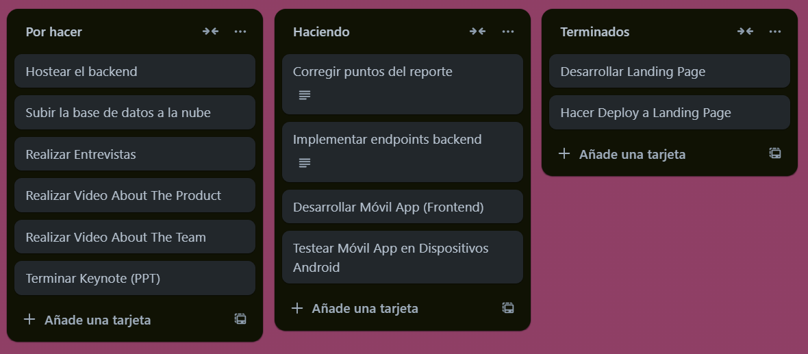
- ##### Requirement Management:
  - Miro:
    Un sistema que ofrece una amplia gama de plantillas diseñadas para abordar diversos aspectos en la creación y gestión de proyectos.
    <br>Link De Registro o Inicio de sesión:
    <br> https://miro.com/app/board/o9J_lX1J9Z4=/
    <br>Evidencia De Uso
    <br> 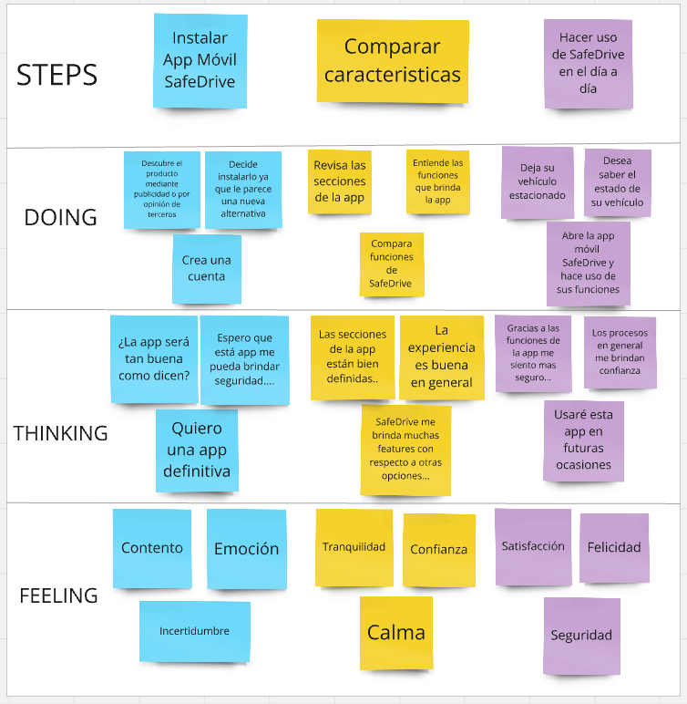  
    <br><br>
  - Uxpressia:
    Es una herramienta en línea que simplifica el proceso de mapeo y comprensión de las necesidades del cliente en un proyecto determinado.
    <br>Link De Registro o Inicio de sesión:
    <br> https://uxpressia.com/
    <br>Evidencia De Uso
    <br> 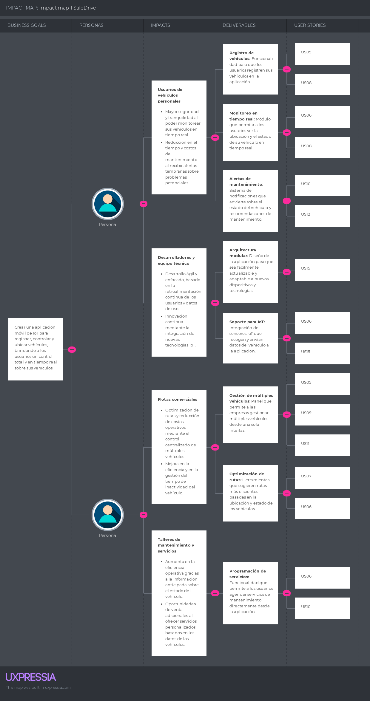
    <br><br>
  - Structurizr:
    Se trata de una suite de herramientas que posibilita la creación colaborativa de modelos C4 para representar de forma gráfica nuestros productos.
    <br>Link De Registro o Inicio de sesión:
    <br> https://structurizr.com/
    <br>Evidencia De Uso
    <br> 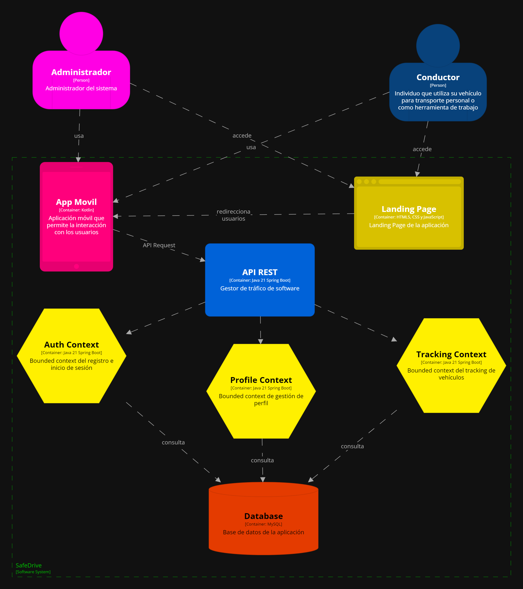
- ##### Requirement Management:
  - Figma:
    Una herramienta de diseño colaborativo basada en la nube que permite a los equipos de diseño trabajar juntos en tiempo real.
    <br>Link De Registro o Inicio de sesión:
    <br> https://www.figma.com/
    <br>Evidencia De Uso
    <br> 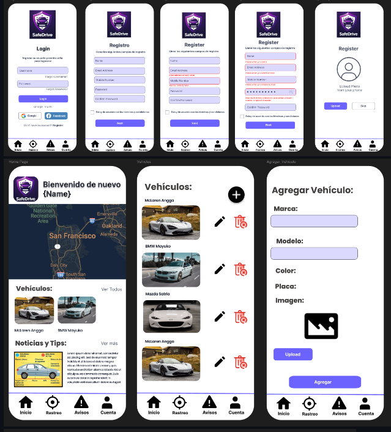
    <br><br>
  - Lucidchart:
    Una plataforma de diagramación en línea que permite a los usuarios crear diagramas de flujo, organigramas, mapas mentales y otros tipos de diagramas.
    <br>Link De Registro o Inicio de sesión:
    <br> https://www.lucidchart.com/
    <br>Evidencia De Uso
    <br> 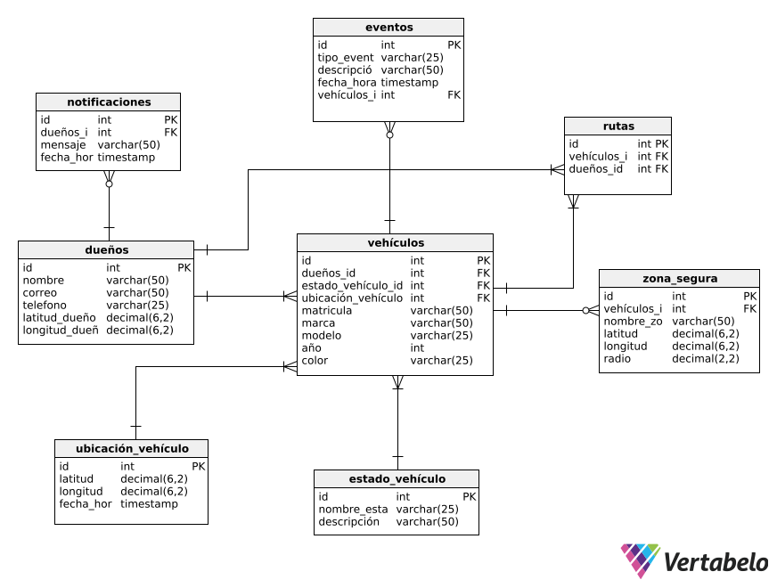
    <br><br>
- ##### Software Development:
  - Landing Page:
    - #### HTML5:
      Un lenguaje de marcado que se utiliza para estructurar y presentar el contenido en la web.
      <br>Evidencia De Uso
      <br> 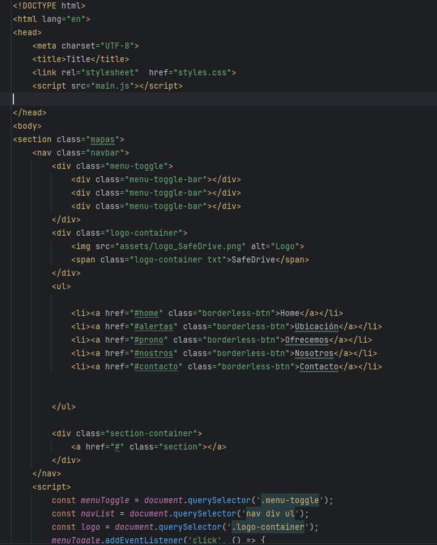
      <br><br>
    - #### CSS3:
      Un lenguaje de hojas de estilo que se utiliza para dar estilo y diseño a las páginas web.
      <br>Evidencia De Uso
      <br> 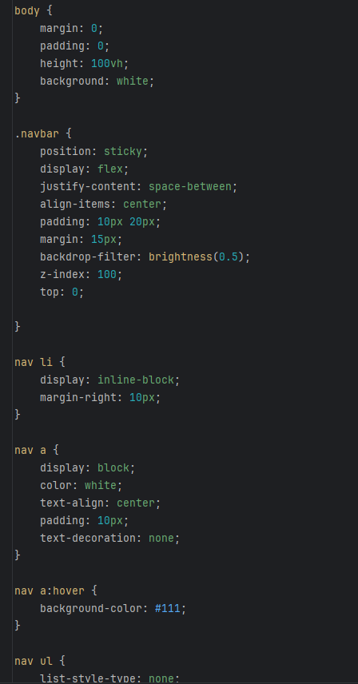
      <br><br>
    - #### JavaScript:
      Un lenguaje de programación que se utiliza para crear interactividad y dinamismo en las páginas web.
      <br><br>
    - #### WebStorm:
      Un entorno de desarrollo integrado (IDE) que se utiliza para desarrollar aplicaciones web.
      <br><br>
  - Mobile Application:
    - #### Kotlin:
      Un lenguaje de programación moderno y conciso que se utiliza para desarrollar aplicaciones móviles en Android.
      <br>Evidencia De Uso
      <br> 
      <br><br>
    - #### Jetpack Compose:
      Un kit de herramientas moderno y reactivo que se utiliza para desarrollar interfaces de usuario en Android.
      <br>Evidencia De Uso
      <br> 
      <br><br>
    - #### Android Studio:
      Un entorno de desarrollo integrado (IDE) que se utiliza para desarrollar aplicaciones móviles en Android.

### 5.1.2. Source Code Management.

- #### Gitflow Implementation: <br>

  Para implementar el flujo de trabajo Gitflow utilizando Git como nuestra herramienta de control de versiones, nos basamos en la entrada de blog "A successful Git branching model" de Vincent Driessen. Esta referencia nos permitió establecer las convenciones detalladas que serán aplicadas en nuestro proyecto
  <br>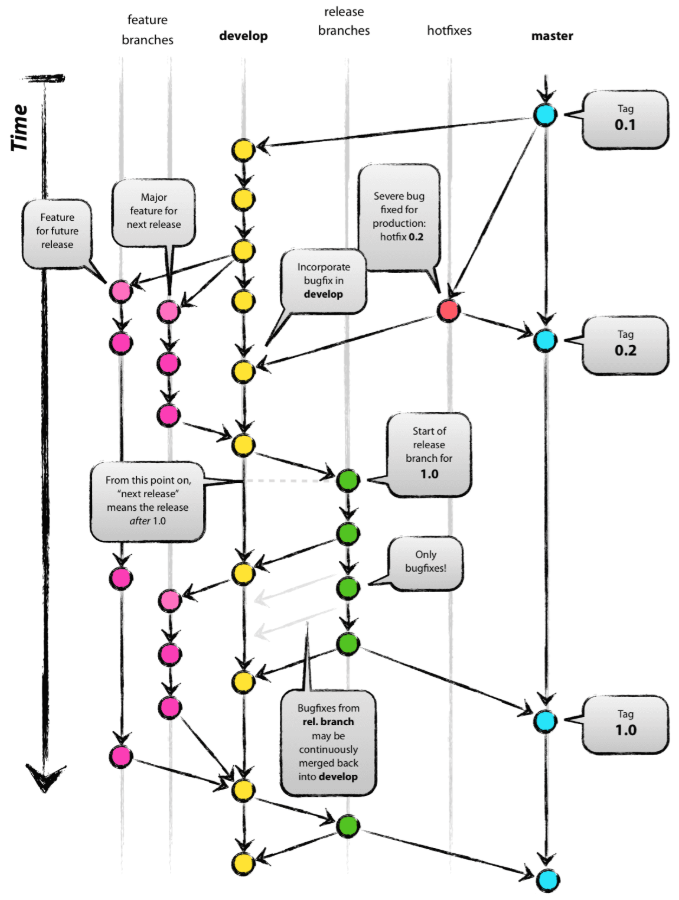 <br>

  #### Convenciones de Gitflow:

  - **Master o Main branch:**<br>
    La rama principal de desarrollo del proyecto es la Master branch. En esta rama reside el código que actualmente se encuentra en producción.
    #### Notación: master o main
  - **Develop branch**<br>
    La rama "Develop" albergará las más recientes actualizaciones y cambios agregados que serán incluidos en la próxima versión del proyecto. Esta rama sirve como un espacio para la integración y prueba continua de los cambios antes de ser fusionados con la rama principal "Master" para su despliegue en producción.

    #### Notación: develop

  - **Release branch**<br>
    La rama de lanzamiento (Release branch) facilitará la preparación de una nueva versión del producto. Esta rama permitirá la corrección de errores y permitirá que la rama Develop reciba más actualizaciones.
    <br>Debe derivarse de la rama Develop.
    <br>Debe fusionarse con la rama Develop y Master.

  #### Notación: release

  - **Feature branch**<br>
    Las ramas de características (Feature branches) serán empleadas para desarrollar nuevas funcionalidades o características del producto que se agregarán en la siguiente versión o en versiones futuras. Estas funcionalidades deberán fusionarse eventualmente con la rama Develop.
    <br>Debe derivarse de la rama Develop.
    <br>Debe fusionarse de vuelta a la rama Develop.

    #### Notación: release

  - **Hotfix branch**<br>
    La rama de corrección rápida (Hotfix branch) se empleará para resolver y actuar de manera inmediata ante posibles errores en la versión en producción del producto. La característica principal de esta rama es que permite preparar una solución rápida mientras el resto del equipo continúa trabajando en otras funcionalidades o mejoras.
    <br>Debe derivarse de la rama Master
    <br>Debe fusionarse con la rama Develop y Master

    #### Notación: hotfix

  - **Conventional Commits**<br>
    "Conventional Commits" es una convención para estructurar los mensajes de confirmación (commits) en un formato estándar y semántico. Este formato ayuda a comunicar claramente los cambios realizados en el código y facilita la generación de registros de cambios automáticos. Los "Conventional Commits" suelen seguir un formato que incluye un encabezado, un cuerpo opcional y un pie de página opcional, y se utilizan para describir de manera sucinta y clara los cambios realizados en el código, lo que facilita su seguimiento y comprensión por parte de los desarrolladores y otros miembros del equipo.
    <br>
    La estructura de un commit debe seguir las siguientes pautas:

  ```
  git commit -m “<type>[optional scope]: <title>“ -m “<description”
  ```

  **Tipos De Conventional Commits**

  ```
  1. **feat**: Se usa para describir una nueva característica o funcionalidad añadida al código.
  2. **fix**: Indica una corrección de errores o solución a un problema.
  3. **docs**: Se emplea para cambios o mejoras en la documentación del código.
  4. **style**: Describe cambios relacionados con el formato del código, como espacios en blanco, sangrías, etc., que no afectan su funcionalidad.
  5. **refactor**: Se utiliza para modificaciones en el código que no corrigen errores ni añaden nuevas funcionalidades, sino que mejoran su estructura o legibilidad.
  6. **test**: Indica la adición o modificación de pruebas unitarias o funcionales.
  7. **chore**: Se usa para cambios en el proceso de construcción o tareas de mantenimiento que no están directamente relacionadas con el código en sí.
  8. **perf**: Describe mejoras de rendimiento en el código.
  ```

### 5.1.3. Source Code Style Guide & Conventions.

- **Landing Page**:
  - ### HTML
    - #### Use Lowercase Element Names:
      Es recomendable utilizar minúsculas o lowercase para los nombres de los elementos HTML.
      ```
      <body>
          <p>Esto es un párrafo</p>
      <body>
      ```
    - #### Close All HTML Elements:
      Es recomendable cerrar todos los elementos HTML correctamente.
      ```
      <body>
          <p>Esto es un párrafo</p>
          <p>Esto es otro párrafo</p>
      <body>
      ```
    - #### Use Lowercase Attribute Names:
      Es recomendable utilizar minúsculas para los nombres de los atributos HTML.
      ```
      <a href="https://www.w3schools.com/html/">Visit our HTMLtutorial</a>
      ```
    - #### Always Specify alt, width, and height for Images:
      Es recomendable seguir estas convenciones en caso de que la imagen no se pueda mostrar, lo que ayuda a mejorar la accesibilidad del contenido.
      ```
      
      ```
    - #### Spaces and Equal Signs:
      Se recomienda no utilizar espacios en blanco entre las entidades para mejorar la legibilidad.
      ```
      <link rel="stylesheet" href="styles.css">
      ```
  - ### CSS
    - #### ID and Class Naming
      Es recomendable utilizar nombres de clases y IDs significativos que expresen claramente el propósito del elemento.
      ```
      #gallery {}
      #login {}
      .video {}
      ```
    - #### ID and Class Name Style
      Se recomienda utilizar nombres cortos para nombrar IDs o clases, pero lo suficientemente descriptivos para entender su propósito.
      ```
      #nav {}
      .author {}
      ```
    - #### Shorthand Properties
      Se recomienda utilizar propiedades CSS de forma abreviada siempre que sea posible para hacer el código más eficiente y comprensible.
      ```
      border-top: 0;
      font: 100%/1.6 palatino, georgia, serif;
      padding: 0 1em 2em;
      ```
    - #### 0 and Units
      Es recomendable evitar especificar la unidad después del valor 0 en propiedades que lo permitan, ya que esto ayuda a reducir el tamaño del código y mejora su legibilidad.
      ```
      margin: 0;
      padding: 0;
      ```
    - #### Declaration Order
      Se recomienda ordenar las declaraciones en orden alfabético para facilitar el mantenimiento y la recordación del código.
      ```
       background: fuchsia;
       border: 1px solid;
       border-radius: 4px;
       color: black;
       text-align: center;
       text-indent: 2em;
      ```
  - ### JAVASCRIPT
    - #### Use expanded syntax
      Cada línea de JavaScript debería estar en una nueva línea, con la llave de apertura en la misma línea de su declaración y la llave de cierre en una nueva línea al final.
      ```
      function myFunc() {
       console.log('Hello!');
      };
      ```
    - #### Variable naming
      Para el nombre de las variables, se recomienda utilizar lowerCamelCase.
      ```
      let playerScore = 0;
      let speed = distance / time;
      ```
    - #### Declaring variables
      Para la declaración de variables, es recomendable utilizar las palabras reservadas let y const en lugar de var.
      ```
      const myName = 'Chris';
      console.log(myName);
      let myAge = '40';
      myAge++;
      console.log('Happy birthday!');
      ```
    - #### Function naming
      Para el nombre de las funciones, se recomienda utilizar lowerCamelCase.
      ```
      function sayHello() {
      alert('Hello!');
      };
      ```
- **Mobile Application**:

  - **KOTLIN**:

    - Naming Conventions: <br>
      Sigue PascalCase para clases y objetos, camelCase para funciones y variables, y UPPER_CASE para constantes.

      ```
      class UserProfile {}
      fun fetchUserData() {}
      const val MAX_RETRY_ATTEMPTS = 3
      ```

    - Indentation & Spacing: <br>
      Usa 4 espacios para la indentación y deja una línea en blanco entre funciones.

      ```
      fun loginUser() {
      if (user.isLoggedIn()) {
      println("User is logged in")
      }
      }
      ```

    - Brace Style: <br>
      Las llaves deben abrirse en la misma línea que la declaración.

      ```
      if (user.isAdmin()) {
      println("User is admin")
      }
      ```

    - Function & Lambda Expressions: <br>
      Usa funciones de una sola expresión y lambdas con it cuando sea posible.
      ```
      val doubled = numbers.map { it * 2 }
      fun isEven(number: Int) = number % 2 == 0
      ```

  - **Jetpack Compose**:

    - Naming Conventions: <br>
      Usa PascalCase para composables y mantenlos pequeños y modulares.

      ```
      @Composable
        fun UserProfileScreen() {
        Column {
           UserImage()
           UserDetails()
        }
      }
      ```

    - Modifiers y Parámetros Opcionales: <br>
      Los modificadores van al final de la función y se deben usar valores por defecto en parámetros opcionales.
      ```
      @Composable
      fun UserImage(modifier: Modifier = Modifier.size(64.dp), imageUrl: String) {}
      ```
    - State Handling in Compose: <br>
      Usa remember y mutableStateOf para manejar el estado local en composables.
      ```
      var count by remember { mutableStateOf(0) }
      ```

### 5.1.4. Software Deployment Configuration.

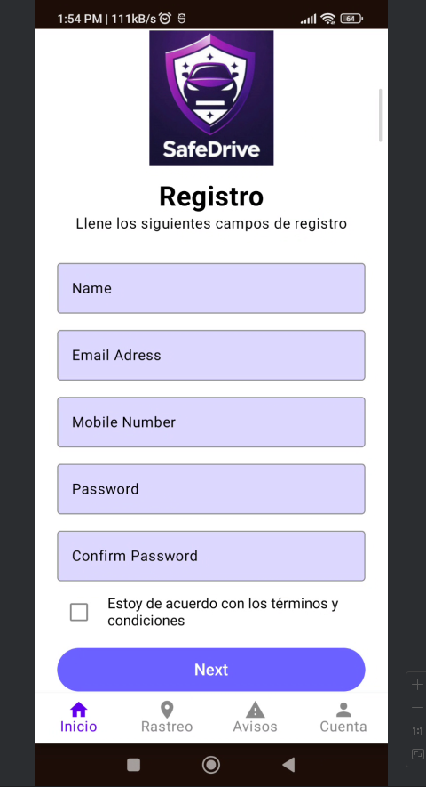
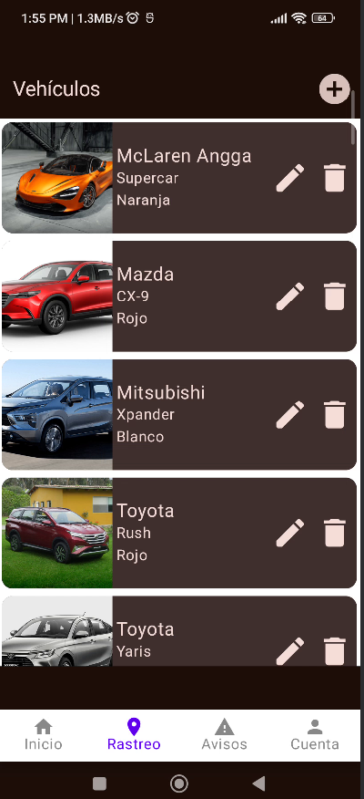
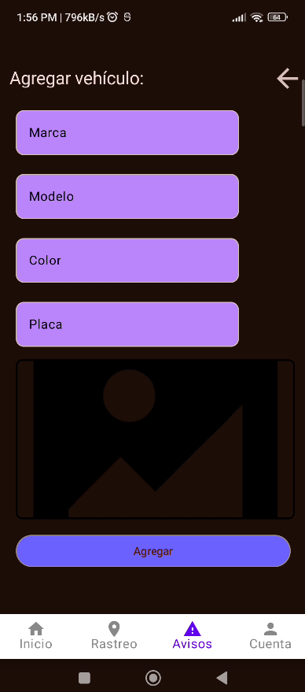
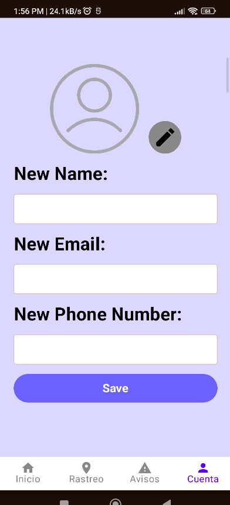

## 5.2. Landing Page & Mobile Application Implementation.

### 5.2.1. Sprint 1

El primer sprint es un hito importante en nuestro proceso de desarrollo ágil. Durante este período, nos enfocamos en la implementación de las características y funcionalidades prioritarias identificadas en la planificación inicial. Esto implica traducir los requisitos y especificaciones en código funcional, desarrollando las bases de nuestro producto de manera iterativa.

#### 5.2.1.1. Sprint Planning 1.

A continuación, se presenta el resumen del Sprint Planning Meeting, que proporcionará una visión general de los temas discutidos y las decisiones tomadas durante la reunión.

_Tabla del planeamiento a profundidad del Sprint 1._

<table>
        <tr>
            <td colspan="1">Sprint #</td>
            <td colspan="1">Sprint 1</td>
        </tr>
        <tr>
            <td colspan="2">Sprint Planning Background</td>
        </tr>
        <tr>
            <td>Date</td>
            <td>2024-09-25</td>
        </tr>
          <tr>
            <td>Time</td>
            <td>09:21 PM</td>
        </tr>
            <tr>
            <td>Location</td>
            <td>Discord</td>
        </tr>
            <tr>
            <td>Prepared by</td>
            <td>Fabrizio Sanchez</td>
        </tr>
            <tr>
            <td>Attendees (to planning meeting)</td>
            <td>Fabrizio Sanchez, Paolo Martinez, Juan Cueto, Moises Donayre</td>
            <tr>
            <td>Sprint 1 Review Summary</td>
            <td>En el desarrollo del primer sprint, logramos completar el landing page de nuestro proyecto, por lo que este sprint fue todo un éxito.</td>
        </tr>
            <tr>
            <td>Sprint 1 Retrospective Summary</td>
            <td>En retrospectiva del primer sprint, cabe resaltar áreas de mejora, como la planificación de tareas.</td>
        </tr>
            <tr>
            <td colspan="2">Sprint Goal & User Stories</td>
        </tr>
              <tr>
            <td>Sprint 1 Goal</td>
            <td>Lograr un índice de cumplimiento del 100%, lo que confirmará que se han alcanzado los objetivos del primer sprint.</td>
        </tr>
              <tr>
            <td>Sprint 1 Velocity</td>
            <td>Hemos decidido establecer nuestra capacidad de entrega en 4 User Stories para este sprint</td>
        </tr>
              <tr>
            <td>Sum of Story Points</td>
            <td>El total de Story Point asignados a las User Stories que se estan incorporando a este Sprint 1 es 16</td>
        </tr>
    </table>

#### 5.2.1.2. Sprint Backlog 1.

_Tabla principal del planeamiento del Sprint Backlog 1._

<table>
        <tr>
            <td colspan="2">Sprint #</td>
            <td colspan="6">Sprint 1</td>
        </tr>
        <tr>
            <td colspan="2">User Story</td>
            <td colspan="6">Work-Item / Task</td>
        </tr>
        <tr>
            <td>Id</td>
            <td>Title</td>
            <td>Id</td>
            <td>Title</td>
            <td>Descripcion</td>
            <td>Estimation (Hours)</td>
            <td>Assigned To</td>
            <td>Status (To-do / In / Process / ToReview / Done)</td>
        </tr>
        <tr>
            <td>US24</td>
            <td>Presentación de sitio web</td>
            <td>T01</td>
            <td>Implementación de un resumen claro de las caracteristicas y beneficios de la aplicacipon movil.</td>
            <td>Crear un resumen en la página de inicio que presente de manera clara y concisa las principales características y beneficios del sitio web, destacando los puntos más relevantes de manera atractiva y fácil de entender.</td>
            <td>3 hours</td>
            <td>Fabrizio Sanchez</td>
            <td>Done</td>
        </tr>
        <tr>
            <td>US25</td>
            <td>Información footer</td>
            <td>T02</td>
            <td>Desarrollor de footer intuitivo y amigable para los usuarios donde destaque información adicional</td>
            <td>Crear un footer con buen diseño y que de información adicional.</td>
            <td>1 hours</td>
            <td>Paolo Martinez</td>
            <td>Done</td>
        </tr>
        <tr>
            <td>US26</td>
            <td>Navegación de información</td>
            <td>T03</td>
            <td>Presentar de forma rápida cada sección de la página</td>
            <td>Crear un navbar que siga al usuario mientras scrollea, asi puede ir de una sección a otra cuando quiera.</td>
            <td>2 hours</td>
            <td>Juan Cueto</td>
            <td>Done</td>
        </tr>
        <tr>
            <td>US27</td>
            <td>Sección de contacto</td>
            <td>T04</td>
            <td>Mostrar contacto visible y accesible</td>
            <td>Mostrar la información de contacto, redes sociales, correo, telefono y un formulario donde los visitantes puedan aclarar sus dudas.</td>
            <td>2 hours</td>
            <td>Moises Donayre</td>
            <td>Done</td>
        </tr>
    </table>

#### 5.2.1.3. Development Evidence for Sprint Review.

En esta sección, se describen los avances en la implementación de los productos de la solución relacionados con la Landing Page, según el alcance del Sprint 1. Aquí se presentarán los commits ya implementados en el repositorio de GitHub, junto con toda la información relevante y los cambios realizados.

| Repository            | Branch | Commit Id | Commit Message | Commit Message Body      | Commited on (Date) |
| --------------------- | ------ | --------- | -------------- | ------------------------ | ------------------ |
| SafeDrive-LandingPage | main   | 6655481   | feat           | added index              | 28/09              |
| SafeDrive-LandingPage | main   | 8eb3fdd   | feat           | added styles and scripts | 28/09              |
| SafeDrive-LandingPage | main   | 8824128   | feat           | added assets             | 28/09              |

#### 5.2.1.4. Testing Suite Evidence for Sprint Review.

En esta sección, presentamos la evidencia de las pruebas realizadas durante el sprint. Hemos utilizado Gherkin para definir los escenarios de prueba y hemos registrado cada prueba en commits específicos en nuestro repositorio. A continuación, se muestra un registro de estos commits:

| Repository            | Branch | Commit Id | Commit Message | Commit Message Body      | Commited on (Date) |
| --------------------- | ------ | --------- | -------------- | ------------------------ | ------------------ |
| SafeDrive-LandingPage | main   | 6655481   | feat           | added tests for footer   | 28/09              |
| SafeDrive-LandingPage | main   | 8eb3fdd   | feat           | added tests for navbar   | 28/09              |
| SafeDrive-LandingPage | main   | 8824128   | feat           | added tests for sections | 28/09              |

#### 5.2.1.5. Execution Evidence for Sprint Review.

Durante el Sprint 1, se logró terminar con la implementación de las características clave de la página de inicio del sitio web.

- HomePage


- Nosotros

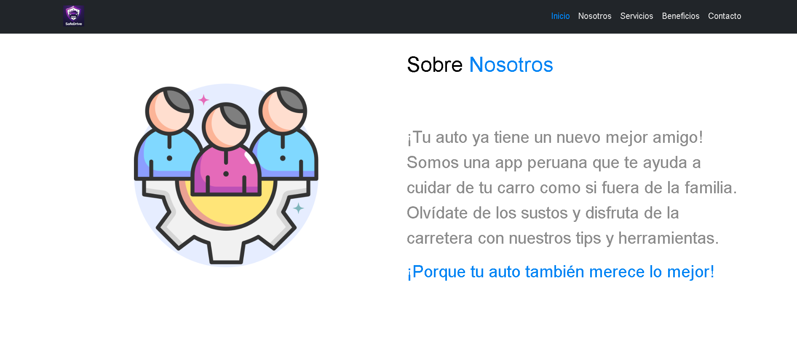

- Servicios

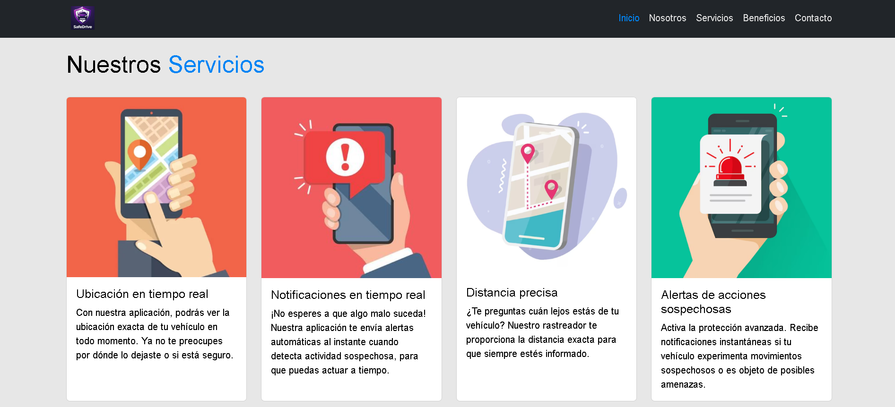

- Beneficios

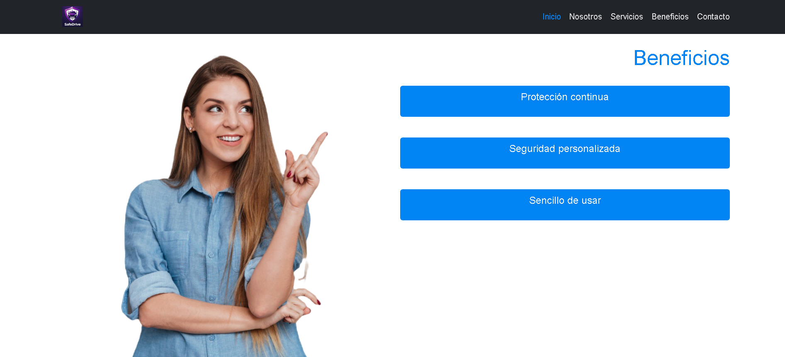

- Contacto

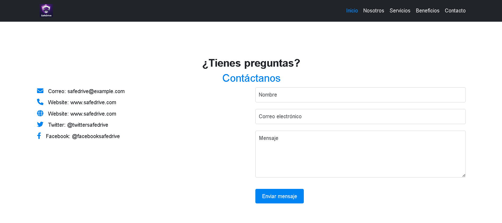

- Footer


#### 5.2.1.6. Services Documentation Evidence for Sprint Review.

Durante este Sprint 1, nos enfocamos en desarrollar el landing page, sin implementación de cualquier servicio. Por lo tanto, este punto quedará sin actividad en este aspecto.

#### 5.2.1.7. Software Deployment Evidence for Sprint Review.

Durante el Sprint 1, realizamos el despliegue de nuestra landing page en GitHub Pages. A continuación, describimos los pasos que seguimos:

1. Creación del Repositorio en GitHub: Iniciamos estableciendo un repositorio específico en GitHub para la landing page.
2. Configuración de la Rama main: Nos aseguramos de que la rama principal del repositorio fuera main, ya que GitHub Pages utiliza esta rama para el despliegue automático.
3. Preparación del Contenido: Diseñamos y desarrollamos la landing page, asegurándonos de que todos los archivos y recursos estuvieran disponibles en el repositorio.
4. Generación del Enlace de GitHub Pages: En la configuración del repositorio, accedimos a la sección "Pages" y configuramos GitHub Pages para que usara el contenido de la rama main.
5. Despliegue Automático: GitHub Pages detectó automáticamente los cambios en la rama main y publicó la landing page en la URL generada.

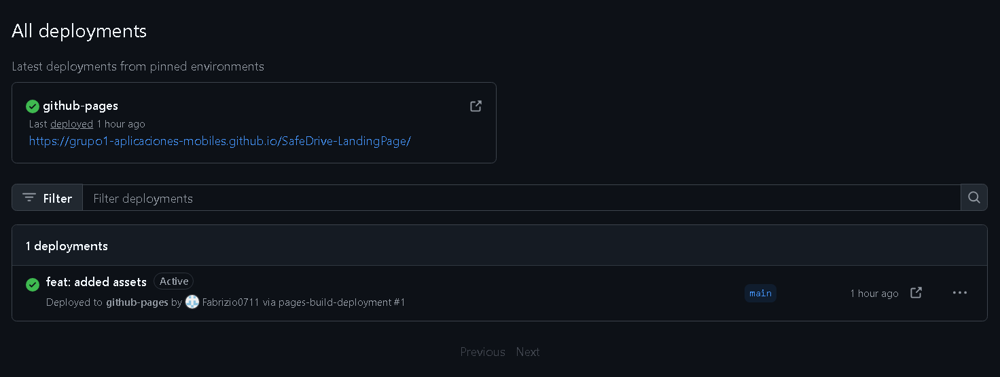

#### 5.2.1.8. Team Collaboration Insights during Sprint.

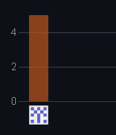

### 5.2.2. Sprint 2

El segundo sprint se centra en el desarrollo del frontend de nuestra aplicación móvil. Durante este ciclo, priorizamos la creación de interfaces de usuario interactivas y fluidas, traduciendo los diseños iniciales en pantallas funcionales. Además, nos aseguramos de que la experiencia del usuario sea intuitiva y optimizada para diferentes dispositivos móviles. Este sprint marca un avance clave hacia la entrega de un producto cohesivo y funcional.

#### 5.2.2.1. Sprint Planning 2.

|                                 |                                                                                                                                                                                                                                   |
| ------------------------------- | --------------------------------------------------------------------------------------------------------------------------------------------------------------------------------------------------------------------------------- |
| Sprint #                        | Sprint 2                                                                                                                                                                                                                          |
| Sprint Planning Background      |                                                                                                                                                                                                                                   |
| Date                            | 2024-09-21                                                                                                                                                                                                                        |
| Time                            | 04:27 PM                                                                                                                                                                                                                          |
| Location                        | Discord                                                                                                                                                                                                                           |
| Prepared by                     | Fabrizio Sanchez                                                                                                                                                                                                                  |
| Attendees (to planning meeting) | Fabrizio Sanchez, Paolo Martinez, Juan Cueto, Moises Donayre                                                                                                                                                                      |
| Sprint 1 Review Summary         | En el desarrollo del primer sprint, logramos implementar de manera notable la Landing Page de nuestro proyecto.                                                                                                                   |
| Sprint 1 Retrospective Summary  | En retrospectiva del primer sprint, detectamos áreas de mejora, como la comunicación y el tiempo en que nos tomaba hacer las tareas. Por eso, nos comprometemos a seguir mejorando nuestro proceso de trabajo de manera continua. |
| Sprint Goal & User Stories      |                                                                                                                                                                                                                                   |
| Sprint 2 Goal                   | Realizar un avance del Frontend de nuestra aplicación móvil. Lograr un índice de cumplimiento del 100%, lo que confirmará que se han alcanzado los objetivos del primer sprint.                                                   |
| Sprint 2 Velocity               | Hemos decidido establecer nuestra capacidad de entrega en 5 User Stories para este sprint                                                                                                                                         |
| Sum of Story Points             | El total de Story Point asignados a las User Stories que se estan incorporando a este Sprint 1 es 10                                                                                                                              |

[](https://github.com/Grupo1-Aplicaciones-Mobiles/Report/blob/chapter05/chapter05.md#5211-sprint-planning-n)

#### 5.2.2.2. Sprint Backlog 2.

_Tabla principal del planeamiento del Sprint Backlog 2._

|            |                                                                   |                  |                       |                                                                                           |                    |                  |                                                 |
| ---------- | ----------------------------------------------------------------- | ---------------- | --------------------- | ----------------------------------------------------------------------------------------- | ------------------ | ---------------- | ----------------------------------------------- |
| Sprint #   |                                                                   | Sprint 1         |                       |                                                                                           |                    |                  |                                                 |
| User Story |                                                                   | Work-Item / Task |                       |                                                                                           |                    |                  |                                                 |
| Id         | Title                                                             | Id               | Title                 | Descripcion                                                                               | Estimation (Hours) | Assigned To      | Status (To-do / In / Process / ToReview / Done) |
| US01       | Interfaz util en la pantalla de inicio de la aplicación móvil     | T01              | Pantalla de inicio    | Crear una interfaz llamativa y funcional en la pantalla de inicio de la aplicación.       | 2 hours            | Moises Donayre   | Done                                            |
| US02       | Implementación de una Navegación Intuitiva en la aplicación móvil | T02              | Navegación            | Crear una barra de navegación para poder navegar fácilmente por las diferentes secciones. | 2 hours            | Fabrizio Sanchez | Done                                            |
| US05       | Registrar vehículos en la aplicación                              | T03              | Registro de vehículos | Crear una sección para registrar vehículos en la aplicación.                              | 3 hours            | Paolo Martinez   | Done                                            |
| US11       | Eliminar vehículo registrado en la aplicación móvil               | T04              | Eliminar vehículo     | Implementar la funcionalidad de eliminar vehículos en la aplicación.                      | 3 hours            | Paolo Martinez   | Done                                            |
| US13       | Comunicación con la base de datos y la aplicación móvil           | T05              | Conexión con API      | Conectar el frontend de la aplicación con nuestro API que conecta con la base de datos.   | 2 hours            | Juan Cueto       | In Progress                                     |

#### 5.2.2.3. Development Evidence for Sprint Review.

En esta sección, se describen los avances en la implementación de los productos de la solución relacionados con el Frontend. Aquí se presentarán los commits ya implementados en el repositorio de GitHub, junto con toda la información relevante y los cambios realizados.


\_Tabla de los commits realizados y relacionados con el desarrollo de todas las secciones del Sprint Backlog 2

| Repository          | Branch           | Commit Id | Commit Message | Commit Message Body                 | Commited on (Date) |
| ------------------- | ---------------- | --------- | -------------- | ----------------------------------- | ------------------ |
| safeDrive-MobileApp | main             | 2fcca8e   |                | Initial Commit                      | 23/09              |
| safeDrive-MobileApp | master           | 10482d4   | feat           | added screens                       | 23/09              |
| safeDrive-MobileApp | master           | b6977ad   | fix            | fixed code related to images        | 24/09              |
| safeDrive-MobileApp | master           | ec64de1   | fix            | added code with some errors         | 25/09              |
| safeDrive-MobileApp | master           | 75d8cde   | docs           | added navigation                    | 26/09              |
| safeDrive-MobileApp | feature/vehicles | 9de6510   | feat           | add dependencies and permissions    | 26/09              |
| safeDrive-MobileApp | feature/vehicles | 3d264d3   | feat           | add Constants, Resource & UIState   | 26/09              |
| safeDrive-MobileApp | feature/vehicles | 7dda5e7   | feat           | add Dto and Service                 | 26/09              |
| safeDrive-MobileApp | feature/vehicles | f6c0d12   | feat           | add vehicle data class & repository | 26/09              |
| safeDrive-MobileApp | feature/vehicles | de0e9f0   | feat           | add vehicle detail presentation     | 26/09              |
| safeDrive-MobileApp | feature/vehicles | 99c33d9   | feat           | add vehicle list presentation       | 26/09              |
| safeDrive-MobileApp | feature/vehicles | a8aac60   | feat           | add traffic config                  | 26/09              |
| safeDrive-MobileApp | feature/vehicles | 795c696   | feat           | add retrofit builder                | 26/09              |
| safeDrive-MobileApp | feature/vehicles | e1342b3   | feat           | add image storage with firebase     | 26/09              |
| safeDrive-MobileApp | feature/vehicles | 0e3c0c8   | fix            | fix vehicle card                    | 26/09              |

#### 5.2.2.4. Testing Suite Evidence for Sprint Review.

| Repository          | Branch           | Commit Id | Commit Message | Commit Message Body      | Commited on (Date) |
| ------------------- | ---------------- | --------- | -------------- | ------------------------ | ------------------ |
| safeDrive-MobileApp | main             | 7ec42a    | feat           | add test for project     | 26/09              |
| safeDrive-MobileApp | master           | 9b763bc   | feat           | add test navigation      | 27/09              |
| safeDrive-MobileApp | feature/vehicles | 5h81f2e   | feat           | add test vehicle screens | 27/09              |

#### 5.2.1.5. Execution Evidence for Sprint Review.

En esta sección se muestra Frontend de la aplicación funcional. Se puede apreciar las distintas vistas e interfaces realizadas en este sprint:

Pantalla de registro


Pantalla de inicio de sesión


Pantalla de edición de perfil


Pantalla de lista de vehículos


Pantalla de agregar vehículo


#### 5.2.2.6. Services Documentation Evidence for Sprint Review.

#### 5.2.2.7. Software Deployment Evidence for Sprint Review.

#### 5.2.2.8. Team Collaboration Insights during Sprint.

Para la realización de este sprint, hemos mantenido contacto continuo mediante reuniones semanales y utilizando herramientas como Discord o Whatsapp. Distribuimos las tareas y responsabilidades de manera equitativa entre los miembros del equipo para facilitar el trabajo constante y equilibrado. Esta comunicación ha sido fundamental para lograr el avance del Frontend de nuestra aplicación, ya que cada uno de los miembros del equipo pudo compartir sus conocimientos en el desarrollo móvil permitiendo que todos aprendiéramos de la experiencia compartida.


# 5.2.3. Sprint 3

Para este tercer sprint, nos enfocamos en migrar nuestro aplicativo móvil a flutter, con el objetivo de mejorar la experiencia del usuario y optimizar el rendimiento de la aplicación. Durante este ciclo, nos centramos en la implementación de las funcionalidades clave de la aplicación, asegurándonos de que la transición a flutter sea exitosa y que el producto final cumpla con los estándares de calidad y usabilidad esperados.

## 5.2.3.1. Sprint Planning 3.

|                                 |                                                                                                                                                                                                                                                     |
| ------------------------------- | --------------------------------------------------------------------------------------------------------------------------------------------------------------------------------------------------------------------------------------------------- |
| Sprint #                        | Sprint 3                                                                                                                                                                                                                                            |
| Sprint Planning Background      | El propósito de este sprint es continuar el desarrollo de la aplicación móvil enfocándonos en el frontend y la migración completa a Flutter para mejorar la compatibilidad y el rendimiento.                                                        |
| Date                            | 2024-10-19                                                                                                                                                                                                                                          |
| Time                            | 04:27 PM                                                                                                                                                                                                                                            |
| Location                        | Discord                                                                                                                                                                                                                                             |
| Prepared by                     | Fabrizio Sanchez, Paolo Martinez, Juan Cueto, Moises Donayre                                                                                                                                                                                        |
| Attendees (to planning meeting) | Fabrizio Sanchez, Paolo Martinez, Juan Cueto, Moises Donayre                                                                                                                                                                                        |
| Sprint 3 Review Summary         | En el desarrollo del tercer sprint, logramos implemetar responsive web design a la Landing Page de nuestro proyecto, asi como tambien migramos nuestra app móvil de Android Studio a Flutter.                                                       |
| Sprint 3 Retrospective Summary  | Después de revisar el tercer sprint, identificamos algunas áreas para mejorar, como la comunicación y el tiempo que nos tomaba completar las tareas. Por ello, nos comprometemos a seguir optimizando nuestro proceso de trabajo de forma continua. |
| Sprint Goal & User Stories      | Goal: Desarrollar el frontend de la aplicación móvil con Flutter, garantizando una interfaz de usuario responsive y optimizada.                                                                                                                     |
| Sprint 3 Goal                   | Desarrollar el Frontend de nuestra aplicación móvil utilizando Flutter y alcanzar un 100% de cumplimiento, asegurará que hayamos cumplido los objetivos del tercer sprint.                                                                          |
| Sprint 3 Velocity               | Hemos decidido fijar nuestra capacidad de entrega en 5 User Stories para este sprint. Con esto, nos aseguramos de tener un objetivo claro y alcanzable.                                                                                             |
| Sum of Story Points             | Para el Sprint 3, hemos asignado un total de 10 Story Points a las User Stories que se están incorporando. Este objetivo nos permitirá centrarnos en entregas concretas y medibles.                                                                 |

## 5.2.3.2. Sprint Backlog 3.

_Tabla principal del planeamiento del Sprint Backlog 3._

|            |                                                                   |                  |                       |                                                                                                                 |                    |                |                                                 |
| ---------- | ----------------------------------------------------------------- | ---------------- | --------------------- | --------------------------------------------------------------------------------------------------------------- | ------------------ | -------------- | ----------------------------------------------- |
| Sprint #   |                                                                   | Sprint 3         |                       |                                                                                                                 |                    |                |                                                 |
| User Story |                                                                   | Work-Item / Task |                       |                                                                                                                 |                    |                |                                                 |
| Id         | Title                                                             | Id               | Title                 | Descripcion                                                                                                     | Estimation (Hours) | Assigned To    | Status (To-do / In / Process / ToReview / Done) |
| US01       | Interfaz util en la pantalla de inicio de la aplicación móvil     | T01              | Pantalla de inicio    | Crear una pantalla inicial visualmente atractiva y funcional para la aplicación móvil.                          | 2 hours            | Moises Donayre | Done                                            |
| US02       | Implementación de una Navegación Intuitiva en la aplicación móvil | T02              | Navegación            | Implementar una barra de navegación que facilite el desplazamiento entre diferentes secciones de la aplicación. | 2 hours            | Paolo Martinez | Done                                            |
| US05       | Registrar vehículos en la aplicación                              | T03              | Registro de vehículos | Añadir una sección en la aplicación para registrar vehículos.                                                   | 3 hours            | Paolo Martinez | Done                                            |
| US11       | Eliminar vehículo registrado en la aplicación móvil               | T04              | Eliminar vehículo     | Habilitar la opción de eliminar vehículos dentro de la aplicación.                                              | 3 hours            | Paolo Martinez | Done                                            |
| US13       | Comunicación con la base de datos y la aplicación móvil           | T05              | Conexión con API      | Conectar la interfaz de la aplicación con la API para comunicarse con la base de datos.                         | 2 hours            | Juan Cueto     | In Progress                                     |

## 5.2.3.3. Development Evidence for Sprint Review.

En esta sección, se describen los avances en la implementación de los productos de la solución relacionados con el Frontend. Aquí se presentarán los commits ya implementados en el repositorio de GitHub, junto con toda la información relevante y los cambios realizados.

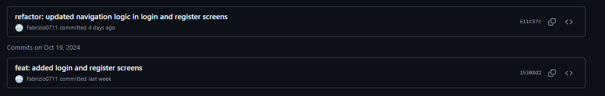
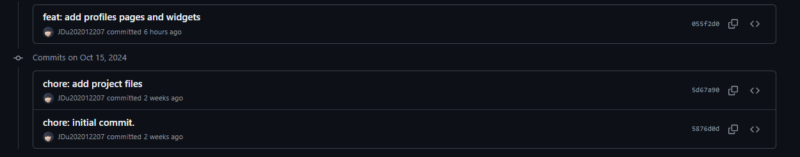

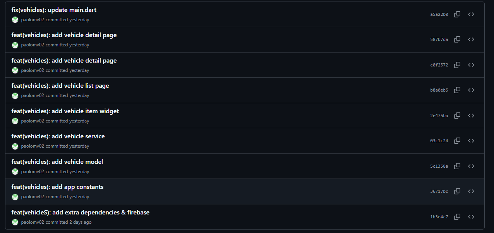

- Tabla de los commits realizados principales y relacionados con el desarrollo de todas las secciones del Sprint Backlog 3

| Repository        | Branch               | Commit Id | Commit Message | Commit Message Body                                    | Commited on (Date) |
| ----------------- | -------------------- | --------- | -------------- | ------------------------------------------------------ | ------------------ |
| safeDrive-Flutter | login_and_register   | 15308d2   | feat           | added login and register screens                       | 19/10              |
| safeDrive-Flutter | login_and_register   | 611c57c   | refactor       | updated navigation logic in login and register screens | 22/10              |
| safeDrive-Flutter | features/notications | 88fd4cf   | feat           | add notifications page                                 | 25/10              |
| safeDrive-Flutter | features/profile     | 055f2d0   | feat           | add profiles pages and widgets                         | 26/10              |
| safeDrive-Flutter | features/vehicles    | 1b3e4c7   | feat           | add extra dependencies & firebase                      | 24/09              |
| safeDrive-Flutter | features/vehicles    | 36717bc   | feat           | add app constants                                      | 24/09              |
| safeDrive-Flutter | features/vehicles    | 3d264d3   | feat           | add vehicle model                                      | 24/09              |
| safeDrive-Flutter | features/vehicles    | 7dda5e7   | feat           | add vehicle service                                    | 24/09              |
| safeDrive-Flutter | features/vehicles    | f6c0d12   | feat           | add vehicle item widget                                | 24/09              |
| safeDrive-Flutter | features/vehicles    | de0e9f0   | feat           | add vehicle list page                                  | 24/09              |
| safeDrive-Flutter | features/vehicles    | 99c33d9   | feat           | add vehicle detail page                                | 24/09              |
| safeDrive-Flutter | features/vehicles    | a8aac60   | feat           | add vehicle detail page                                | 24/09              |
| safeDrive-Flutter | features/vehicles    | 795c696   | fix            | update main.dart                                       | 25/09              |
| safeDrive-Flutter | features/vehicles    | e1342b3   | feat           | create navbar                                          | 25/09              |

## 5.2.3.4. Testing Suite Evidence for Sprint Review.

En esta sección, presentamos la evidencia de las pruebas realizadas durante el sprint. Hemos utilizado Gherkin para definir los escenarios de prueba y hemos registrado cada prueba en commits específicos en nuestro repositorio. A continuación, se muestra un registro de estos commits:

| Repository        | Branch                     | Commit Id | Commit Message | Commit Message Body             | Commited on (Date) |
| ----------------- | -------------------------- | --------- | -------------- | ------------------------------- | ------------------ |
| safeDrive-Flutter | develop-login_and_register | 7ec42a    | feat           | add test for login and register | 26/09              |
| safeDrive-Flutter | feature/notifications      | 9b763bc   | feat           | add test notifications screen   | 27/09              |
| safeDrive-Flutter | feature/vehicles           | 5h81f2e   | feat           | add test vehicle screens        | 27/09              |
| safeDrive-Flutter | feature/profile            | 5f2d0     | feat           | add test profile screen         | 27/09              |
| safeDrive-Flutter | feature/tracking           | 055f2d0   | feat           | add test tracking screen        | 27/09              |

## 5.2.3.5. Execution Evidence for Sprint Review.

En esta sección se muestra el Frontend de la aplicación funcional. Para este sprint, decidimos rehacer nuestro Frontend utilizando el framework de Flutter, se puede apreciar las distintas vistas e interfaces realizadas en este sprint:

Pantalla de registro


Pantalla de inicio de sesión


Pantalla de perfil de usuario


Pantalla de edición de perfil


Pantalla de lista de vehículos


Pantalla de agregar vehículo


Pantalla de notificaciones


## 5.2.3.6. Services Documentation Evidence for Sprint Review.

Para este sprint, nos enfocamos en la implementación de las funcionalidades clave de la aplicación móvil, asegurándonos de que la transición a flutter sea exitosa y que el producto final cumpla con los estándares de calidad y usabilidad esperados. A continuación, se presenta la documentación de los servicios desarrollados durante este sprint.<br>

## 5.2.3.7. Software Deployment Evidence for Sprint Review.

Para el despliegue de nuestro servicio, se ha realizado en heroKu, una plataforma que permite a los desarrolladores construir, ejecutar y operar aplicaciones en la nube.
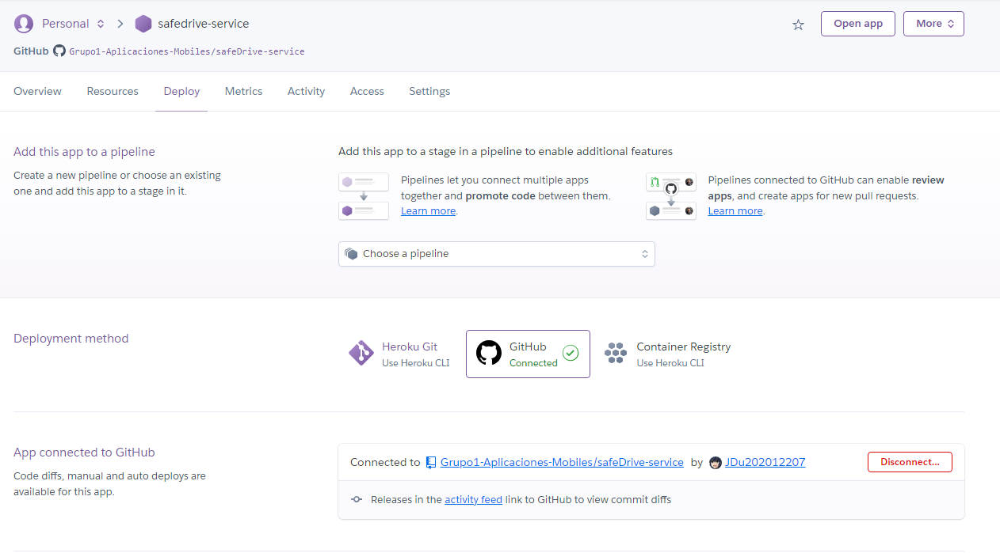 <br>
Para el despliegue de la base de datos se ha utilizado aws, una plataforma que ofrece servicios de almacenamiento en la nube, bases de datos y otras funcionalidades para ayudar a las empresas a escalar y crecer.
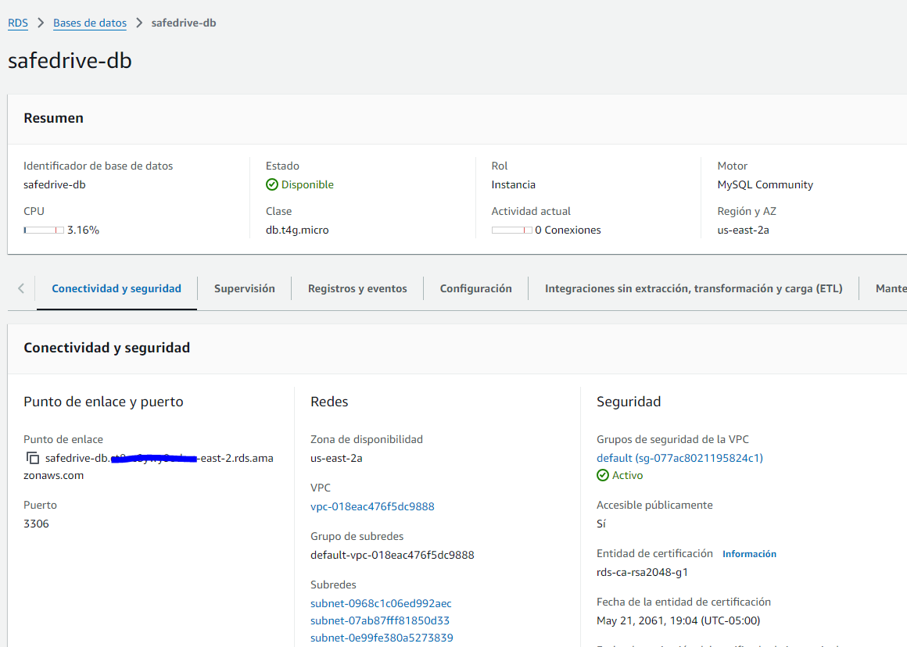

## 5.2.3.8. Team Collaboration Insights during Sprint.

Para la realización de este sprint, hemos mantenido contacto continuo mediante reuniones semanales y utilizando herramientas como Discord o Whatsapp. Distribuimos las tareas y responsabilidades de manera equitativa entre los miembros del equipo para facilitar el trabajo constante y equilibrado. Esta comunicación ha sido fundamental para lograr el avance del Frontend de nuestra aplicación, ya que cada uno de los miembros del equipo pudo compartir sus conocimientos en el desarrollo móvil permitiendo que todos aprendiéramos de la experiencia compartida.

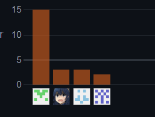

## Sprint 4

Para este cuarto sprint, nos enfocamos en la implementación de la funcionalidad de rastreo de vehículos en tiempo real. Durante este ciclo, priorizamos la integración de la API de rastreo y la actualización de las coordenadas de usuario y vehículo en la aplicación móvil. Este sprint marca un avance clave hacia la entrega de un producto funcional y listo para su lanzamiento.

## 5.2.3.9. Sprint Planning 4.

|                                 |                                                                                                                                                                                                                                     |
|---------------------------------|-------------------------------------------------------------------------------------------------------------------------------------------------------------------------------------------------------------------------------------|
| Sprint #                        | Sprint 4                                                                                                                                                                                                                            |
| Sprint Planning Background      | El propósito de este sprint es continuar el desarrollo de la aplicación móvil, enfocándonos en la integración de nuevas funcionalidades y la optimización del rendimiento.                                                          |
| Date                            | 2024-11-02                                                                                                                                                                                                                          |
| Time                            | 04:30 PM                                                                                                                                                                                                                            |
| Location                        | Discord                                                                                                                                                                                                                             |
| Prepared by                     | Fabrizio Sanchez, Paolo Martinez, Juan Cueto, Moises Donayre                                                                                                                                                                        |
| Attendees (to planning meeting) | Fabrizio Sanchez, Paolo Martinez, Juan Cueto, Moises Donayre                                                                                                                                                                        |
| Sprint 4 Review Summary         | En el desarrollo del cuarto sprint, logramos integrar nuevas funcionalidades y optimizar el rendimiento de la aplicación móvil.                                                                                                     |
| Sprint 4 Retrospective Summary  | Después de revisar el cuarto sprint, identificamos algunas áreas para mejorar, como la gestión del tiempo y la asignación de tareas. Por ello, nos comprometemos a seguir optimizando nuestro proceso de trabajo de forma continua. |
| Sprint Goal & User Stories      | Goal: Integrar nuevas funcionalidades y optimizar el rendimiento de la aplicación móvil.                                                                                                                                            |
| Sprint 4 Goal                   | Integrar nuevas funcionalidades y optimizar el rendimiento de la aplicación móvil, alcanzando un 100% de cumplimiento, asegurará que hayamos cumplido los objetivos del cuarto sprint.                                              |
| Sprint 4 Velocity               | Hemos decidido fijar nuestra capacidad de entrega en 6 User Stories para este sprint. Con esto, nos aseguramos de tener un objetivo claro y alcanzable.                                                                             |
| Sum of Story Points             | Para el Sprint 4, hemos asignado un total de 12 Story Points a las User Stories que se están incorporando. Este objetivo nos permitirá centrarnos en entregas concretas y medibles.                                                 |

## 5.2.4. Sprint Backlog 4.

_Tabla principal del planeamiento del Sprint Backlog 4._

|            |                                                               |                  |                                    |                                                                                                           |                    |                  |                                                 |
|------------|---------------------------------------------------------------|------------------|------------------------------------|-----------------------------------------------------------------------------------------------------------|--------------------|------------------|-------------------------------------------------|
| Sprint #   |                                                               | Sprint 4         |                                    |                                                                                                           |                    |                  |                                                 |
| User Story |                                                               | Work-Item / Task |                                    |                                                                                                           |                    |                  |                                                 |
| Id         | Title                                                         | Id               | Title                              | Descripción                                                                                               | Estimation (Hours) | Assigned To      | Status (To-do / In / Process / ToReview / Done) |
| US01       | Interfaz util en la pantalla de inicio de la aplicación móvil | T01              | Implementación de la vista Home    | Desarrollar una interfaz de presentación intuitiva principal que dirigia y muestra los items importantes. | 2 hours            | Fabrizio Sanchez | Done                                            |
| US07       | Determinar la distancia entre el vehículo y el usuario        | T02              | Uso de la Api                      | Implementar la integración de la API para determinar las rutas y distancias entre vehículos y usuario.    | 2 hours            | Moises Donayre   | Done                                            |
| US16       | Autenticación de usuario                                      | T03              | Autentificación                    | Conectar los endpoint de autentificación con las pantallas de inicio de sesión y registro.                | 2 hours            | Paolo Martinez   | Done                                            |
| US20       | Actualizar coordenadas de usuario                             | T04              | Actualizar Coordenadas de Usuario  | Implementar la integración de este endpoint con la aplicación móvil.                                      | 3 hours            | Moises Donayre   | In Progress                                     |
| US21       | Actualizar coordenadas de vehiculo                            | T05              | Actualizar Coordenadas de Vehículo | Implementar la integración de este endpoint con la aplicación móvil.                                      | 3 hours            | Moises Donayre   | In Progress                                     |
| US13       | Comunicación con la base de datos y la aplicación móvil       | T06              | Conexión con API                   | Conectar la interfaz de la aplicación con la API para comunicarse con la base de datos.                   | 2 hours            | Juan Cueto       | Done                                            |

## 5.2.4.1. Development Evidence for Sprint Review.

En esta sección, se describen los avances en la implementación de los productos de la solución relacionados con el Frontend y Backend. Aquí se presentarán los commits ya implementados en el repositorio de GitHub, junto con toda la información relevante y los cambios realizados.


- Tabla de los commits realizados principales y relacionados con el desarrollo de todas las secciones del Sprint Backlog 4

| Repository        | Branch                 | Commit Id | Commit Message | Commit Message Body                    | Commited on (Date) |
|-------------------|------------------------|-----------|----------------|----------------------------------------|--------------------|
| safeDrive-Flutter | feature/authentication | d714180   | feat           | change routes & add styles             | 26/10              |
| safeDrive-service | develop                | ed56976   | feat           | add user attributes and update methods | 07/11              |
| safeDrive-service | develop                | 8cce9fc   | refactor       | update web security                    | 08/11              |
| safeDrive-Flutter | feature/authentication | c622235   | feat           | add jwt authentication                 | 08/11              |
| safeDrive-Flutter | feature/authentication | 8e17a3b   | feat           | change sign up method                  | 09/11              |


## 5.2.4.2. Testing Suite Evidence for Sprint Review.

En esta sección, presentamos la evidencia de las pruebas realizadas durante el sprint. Hemos utilizado Gherkin para definir los escenarios de prueba y hemos registrado cada prueba en commits específicos en nuestro repositorio. A continuación, se muestra un registro de estos commits:

| Repository        | Branch                     | Commit Id | Commit Message | Commit Message Body             | Commited on (Date) |
|-------------------|----------------------------|-----------|----------------|---------------------------------|--------------------|
| safeDrive-Flutter | develop-login_and_register | 7ed42a    | feat           | add test for login and register | 03/11              |
| safeDrive-service | develop-vehicles           | 5h81f2e   | feat           | add test vehicle credentials    | 03/11              |
| safeDrive-service | develop-iam                | 5f2d0     | feat           | add test user credentials       | 03/11              |
| safeDrive-service | develop-tracking           | 055f2d0   | feat           | add test coordinates points     | 03/11              |

## 5.2.4.3. Execution Evidence for Sprint Review.
Se muestra el Frontend de la aplicación funcional. Las nuevas vistas e interfaces realizadas en este sprint son las siguientes:
Home <br><br>
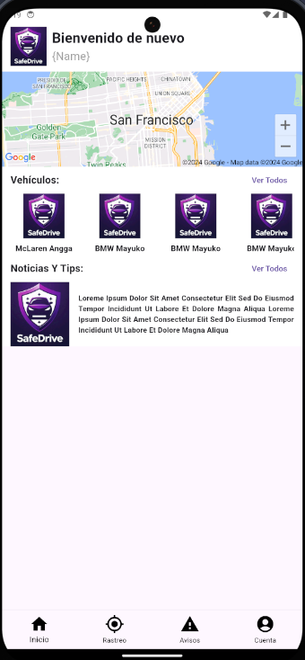 <br><br>
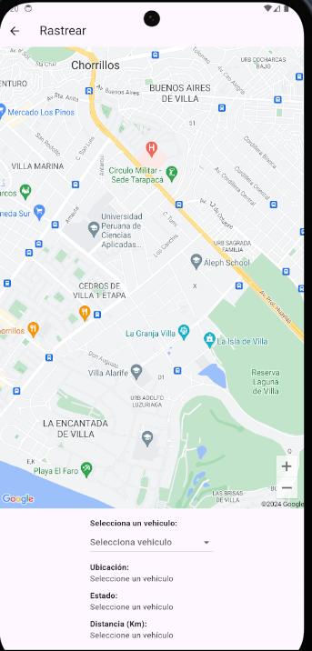 <br><br>
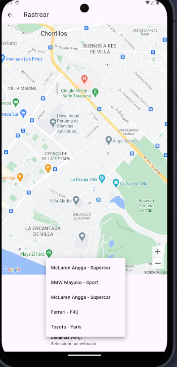 <br><br>


## 5.2.4.4. Services Documentation Evidence for Sprint Review.
Para este sprint, actualizamos y añadimos nuevas pantallas a nuestra aplicación móvil, así como también implementamos la autenticación de usuario y la actualización de coordenadas de usuario y vehículo. A si mismo, se ha realizado la integración de la API para determinar la distancia entre el vehículo y el usuario.

## 5.2.4.5. Software Deployment Evidence for Sprint Review.
El servicio actualizado con los últimos cambios del sprint, se ha mantenido en heroKu, una plataforma que permite a los desarrolladores construir, ejecutar y operar aplicaciones en la nube.
 <br>
Para el despliegue de la base de datos igualmente se ha utilizado aws, una plataforma que ofrece servicios de almacenamiento en la nube, bases de datos y otras funcionalidades para ayudar a las empresas a escalar y crecer.<br>


## 5.2.4.6. Team Collaboration Insights during Sprint.
Para la realización de este sprint, hemos mantenido contacto continuo mediante reuniones semanales y utilizando herramientas como Discord o Whatsapp. Distribuimos las tareas y responsabilidades de manera equitativa entre los miembros del equipo para facilitar el trabajo constante y equilibrado. Esta comunicación ha sido fundamental para lograr el avance del Frontend de nuestra aplicación, ya que cada uno de los miembros del equipo pudo compartir sus conocimientos en el desarrollo móvil permitiendo que todos aprendiéramos de la experiencia compartida.


## 5.2.4.7 Sprint 5

Para este quinto sprint, nos enfocamos en continuar el desarrollo de la aplicación móvil, enfocándonos en la integración y culmino de las últimas funcionalidades a terminar y mejorar el rendimiento de la aplicación. Durante este ciclo, priorizamos terminar la implementación de las características asegurándonos de que el producto final cumpla con los estándares de calidad y usabilidad esperados.

## 5.2.4.8. Sprint Planning 5.

|                                 |                                                                                                                                                                                                                                     |
|---------------------------------|-------------------------------------------------------------------------------------------------------------------------------------------------------------------------------------------------------------------------------------|
| Sprint #                        | Sprint 5                                                                                                                                                                                                                            |
| Sprint Planning Background      | El propósito de este sprint es culminar con el desarrollo de la aplicación móvil, enfocándonos en las ultimas integraciones funcionalidades sin terminar y  optimización del rendimiento.                                           |
| Date                            | 2024-11-16                                                                                                                                                                                                                          |
| Time                            | 03:30 PM                                                                                                                                                                                                                            |
| Location                        | Discord                                                                                                                                                                                                                             |
| Prepared by                     | Fabrizio Sanchez, Paolo Martinez, Juan Cueto, Moises Donayre                                                                                                                                                                        |
| Attendees (to planning meeting) | Fabrizio Sanchez, Paolo Martinez, Juan Cueto, Moises Donayre                                                                                                                                                                        |
| Sprint 5 Review Summary         | Se implemento las ultimas funcionalidades e integraciones con la API de Google Maps e interacciones entre el usuario con su vehiculo. Manteniendo los datos protegidos y actualizados en todo momento.                              |
| Sprint 5 Retrospective Summary  | Después de revisar el cuarto sprint, identificamos algunas áreas para mejorar, como la gestión del tiempo y la asignación de tareas. Por ello, nos comprometemos a seguir optimizando nuestro proceso de trabajo de forma continua. |
| Sprint Goal & User Stories      | Goal: Culminar con el desarrollo e implementación de funcionalidades no terminadas de desarrollar y optimizar el rendimiento de la aplicación móvil.                                                                                |
| Sprint 5 Goal                   | Optimizar e Integrar las ultimas funcionalidades de la aplicación móvil, alcanzando un 100% de cumplimiento.                                                                                                                        |
| Sprint 5 Velocity               | Hemos decidido fijar nuestra capacidad de entrega en 3 User Stories para este sprint. Con esto, nos aseguramos de tener un objetivo claro y alcanzable.                                                                             |
| Sum of Story Points             | Para el Sprint 5, hemos asignado un total de 11 Story Points a las User Stories que se están incorporando. Este objetivo nos permitirá centrarnos en entregas concretas y medibles.                                                 |

## 5.2.4.9. Sprint Backlog 5.

_Tabla principal del planeamiento del Sprint Backlog 5._

|            |                           |                  |                                              |                                                                                                            |                    |                  |                                                 |
|------------|---------------------------|------------------|----------------------------------------------|------------------------------------------------------------------------------------------------------------|--------------------|------------------|-------------------------------------------------|
| Sprint #   |                           | Sprint 5         |                                              |                                                                                                            |                    |                  |                                                 |
| User Story |                           | Work-Item / Task |                                              |                                                                                                            |                    |                  |                                                 |
| Id         | Title                     | Id               | Title                                        | Descripción                                                                                                | Estimation (Hours) | Assigned To      | Status (To-do / In / Process / ToReview / Done) |
| US16       | Autenticación de usuario  | T01              | Implementación de la función "Editar Perfil" | Implementar la función de editar perfil, para mantener actualizados los datos del usuario en todo momento. | 2 hours            | Paolo Martinez   | Done                                            |
| US23       | Crear notificaciones      | T02              | Implementación de la vista Home              | Desarrollar a través de una API notificaciones para mantener informado al usuario respecto a su vehiculo.  | 2 hours            | Moises Donayre   | Done                                            |
| US26       | Navegación de información | T03              | Uso de tips informativos                     | Implementar tips en la pantalla home acerca del cuidado y precauciones sobre el vehiculo del usuario.      | 2 hours            | Fabrizio Sanchez | Done                                            |

## 5.2.5. Development Evidence for Sprint Review.

En esta sección, se describen los avances en la implementación de los productos de la solución relacionados con el Frontend y Backend. Aquí se presentarán los commits ya implementados en el repositorio de GitHub, junto con toda la información relevante y los cambios realizados.


- Tabla de los commits realizados principales y relacionados con el desarrollo de todas las secciones del Sprint Backlog 5

| Repository        | Branch                 | Commit Id | Commit Message | Commit Message Body                    | Commited on (Date) |
|-------------------|------------------------|-----------|----------------|----------------------------------------|--------------------|
| safeDrive-Flutter | feature/authentication |           | feat           | change routes & add styles             | 26/10              |
| safeDrive-Flutter | develop                |           | feat           | add user attributes and update methods | 07/11              |
| safeDrive-Flutter | develop                |           | refactor       | update web security                    | 08/11              |
| safeDrive-Flutter | feature/authentication |           | feat           | add jwt authentication                 | 08/11              |
| safeDrive-Flutter | feature/authentication |           | feat           | change sign up method                  | 09/11              |


## 5.2.5.1. Testing Suite Evidence for Sprint Review.

En esta sección, presentamos la evidencia de las pruebas realizadas durante el sprint. Hemos utilizado Gherkin para definir los escenarios de prueba y hemos registrado cada prueba en commits específicos en nuestro repositorio. A continuación, se muestra un registro de estos commits:

| Repository        | Branch | Commit Id | Commit Message | Commit Message Body | Commited on (Date) |
|-------------------|--------|-----------|----------------|---------------------|--------------------|
| safeDrive-Flutter |        |           | feat           |                     | 03/11              |
| safeDrive-Flutter |        |           | feat           |                     | 03/11              |
| safeDrive-Flutter |        |           | feat           |                     | 03/11              |
| safeDrive-Flutter |        |           | feat           |                     | 03/11              |

## 5.2.5.2. Execution Evidence for Sprint Review.

## 5.2.5.3. Services Documentation Evidence for Sprint Review.

## 5.2.5.4. Software Deployment Evidence for Sprint Review.
Los servicios se mantienen en heroKu, una plataforma que permite a los desarrolladores construir, ejecutar y operar aplicaciones en la nube.
 <br>
Para el despliegue de la base de datos se ha utilizado aws, una plataforma que ofrece servicios de almacenamiento en la nube, bases de datos y otras funcionalidades para ayudar a las empresas a escalar y crecer.<br>


## 5.2.5.5. Team Collaboration Insights during Sprint.
Para la realización de este sprint, hemos mantenido contacto continuo mediante reuniones semanales y utilizando herramientas como Discord o Whatsapp. Distribuimos las tareas y responsabilidades de manera equitativa entre los miembros del equipo para facilitar el trabajo constante y equilibrado. Esta comunicación ha sido fundamental para lograr el avance del Frontend de nuestra aplicación, ya que cada uno de los miembros del equipo pudo compartir sus conocimientos en el desarrollo móvil permitiendo que todos aprendiéramos de la experiencia compartida.


## 5.3. Validation Interviews.

El objetivo de estas entrevistas es adquirir una comprensión profunda de las experiencias, perspectivas y opiniones de los usuarios al probar nuestra aplicación móvil. Buscamos obtener información valiosa que nos ayude a entender mejor a nuestro público objetivo y a mejorar nuestra comprensión sobre sus necesidades y deseos.
A través de estas conversaciones, podremos obtener una visión más clara de cómo los usuarios interactúan con la aplicación, qué características consideran más útiles y cuáles podrían mejorarse. Esta retroalimentación será fundamental para adaptar la aplicación de manera más efectiva a los requerimientos de nuestros usuarios, asegurando que cumplamos con sus expectativas y necesidades.

### 5.3.1. Diseño de Entrevistas.

El diseño de estas entrevistas nos permitirá recopilar información valiosa sobre las experiencias, perspectivas y necesidades de los usuarios al interactuar con nuestra aplicación móvil. Esto nos ayudará a comprender mejor sus preocupaciones y expectativas, lo que a su vez nos permitirá desarrollar soluciones más efectivas y adaptadas a sus requerimientos específicos.
Además, estas entrevistas nos brindarán la oportunidad de establecer una conexión significativa con nuestros usuarios, fortaleciendo así nuestra relación con ellos y mejorando la calidad de nuestra aplicación. La retroalimentación obtenida será esencial para optimizar la experiencia del usuario y asegurarnos de que nuestro producto se ajuste a sus necesidades.

- **Experiencia General**

1. ¿Cómo calificarías tu experiencia general con la aplicación del 1 al 5?

2. ¿Qué te gustó más de la aplicación? ¿Por qué?

- **Usabilidad**

3. ¿Fue fácil navegar por la aplicación?

4. ¿Hubo alguna parte que encontraste confusa o difícil de usar?

- **Funciones**

5. ¿Qué funciones te parecieron más útiles?

6. ¿Hay alguna función que te gustaría ver añadida?

- **Notificaciones**

7. ¿Las notificaciones fueron claras y útiles?

8. ¿Qué tan rápido consideras que deben llegar las alertas?

- **Sugerencias**

9. ¿Tienes alguna recomendación para mejorar la aplicación?

### 5.3.2. Registro de Entrevistas.

El registro de entrevistas es una herramienta fundamental que nos ayuda a recopilar y organizar la información obtenida durante las pruebas de nuestra aplicación móvil con los usuarios. Nos permite documentar de manera estructurada las respuestas, comentarios y observaciones relevantes, facilitando su análisis posterior y la identificación de patrones o tendencias en la experiencia del usuario. Además, nos proporciona un registro histórico de las interacciones con los usuarios, lo que nos ayuda a mantenernos alineados con sus necesidades y expectativas a lo largo del tiempo. Este registro es esencial para garantizar que podamos adaptar continuamente nuestra aplicación para mejorar la satisfacción del usuario y optimizar su experiencia.

- **Entrevista #1:**

Nombre y Apellido: Andres Torres

Edad: 20

Distrito: Lince

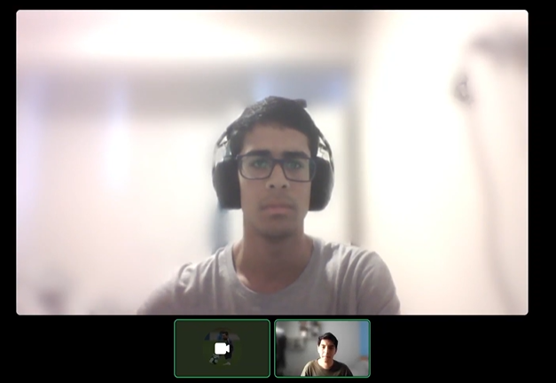

Enlace de entrevista: https://upcedupe-my.sharepoint.com/:v:/g/personal/u202213652_upc_edu_pe/EZ43ddB2yk5BicL8laoF184BNuTU_TiFWMpnxf_JaqSkrQ?e=Tj0b9w&nav=eyJyZWZlcnJhbEluZm8iOnsicmVmZXJyYWxBcHAiOiJTdHJlYW1XZWJBcHAiLCJyZWZlcnJhbFZpZXciOiJTaGFyZURpYWxvZy1MaW5rIiwicmVmZXJyYWxBcHBQbGF0Zm9ybSI6IldlYiIsInJlZmVycmFsTW9kZSI6InZpZXcifX0%3D

**Resumen:** El usuario se mostró satisfecho con la aplicación, destacando su facilidad de uso y la claridad de las notificaciones. Sugirió añadir una función de seguimiento de vehículos en tiempo real y mejorar la velocidad de las alertas.

- **Entrevista #2:**

Nombre y Apellido:

Edad: Liliana Vasquez

Distrito: Villa María Del Triunfo

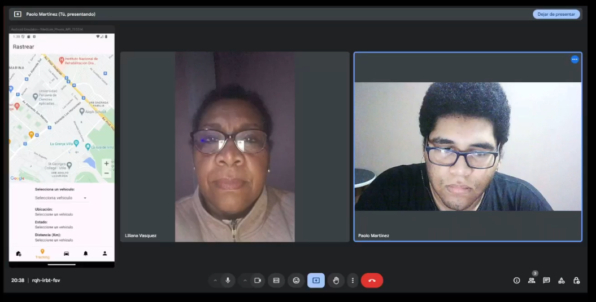

Enlace de entrevista: https://upcedupe-my.sharepoint.com/:v:/g/personal/u202010039_upc_edu_pe/Ee_72-n8gZZAnEjGW8GiqhIB2DJ05RP2rB29y7tvu5bDuw?nav=eyJyZWZlcnJhbEluZm8iOnsicmVmZXJyYWxBcHAiOiJTdHJlYW1XZWJBcHAiLCJyZWZlcnJhbFZpZXciOiJTaGFyZURpYWxvZy1MaW5rIiwicmVmZXJyYWxBcHBQbGF0Zm9ybSI6IldlYiIsInJlZmVycmFsTW9kZSI6InZpZXcifX0%3D&e=yH5ZpQ

**Resumen:** El usuario mostró agrado por la aplicación, destacando su funcionalidad principal y brindando sugerencias y recomendaciones para poder mejorar sus funcionalidades. 

- **Entrevista #3:**

Nombre y Apellido:

Edad:

Distrito:


Enlace de entrevista:

**Resumen:**

### 5.3.3. Evaluaciones según heurísticas.

## 5.4. Video About-the-Product.


<br>
Enlace del video: <br>
https://youtu.be/WDJ-XRbNykY?si=MlSkqI13CQAbPe12

## Conclusiones

## Conclusiones y recomendaciones.
- Durante el desarrollo de los sprints, logramos implementar un Frontend funcional y atractivo para nuestra aplicación móvil, utilizando Flutter para mejorar la experiencia del usuario y optimizar el rendimiento de la aplicación.
- Aprender y lograr implementar las funcionalidades clave de la aplicación, como la autenticación de usuario, la actualización de coordenadas de usuario y vehículo, y la integración de la API de rastreo en tiempo real, nos permitió avanzar significativamente hacia la entrega de un producto funcional y listo para su lanzamiento.
- Las entrevistas de validación con usuarios fue esencial para obtener retroalimentación sobre la experiencia de uso de la aplicación, identificar áreas de mejora y adaptar la aplicación a las necesidades y expectativas de nuestros usuarios.
- El despliegue de nuestra aplicación en HeroKu y AWS garantiza la disponibilidad y escalabilidad, asegurando que nuestros usuarios puedan acceder a la aplicación de manera segura y eficiente.
- Mantener una comunicación constante y equitativa entre los miembros del equipo, fue importante para la distribución de las tareas de manera equilibrada y asegurarnos un avance constante y equilibrado en el desarrollo de la aplicación.


## Video App Validation

## Video About the product

<br>
Enlace del video: <br>
https://youtu.be/WDJ-XRbNykY?si=MlSkqI13CQAbPe12

## Video About the team

<br>
Enlace del video: <br>
https://youtu.be/dJs9D_2jW8U
## Glosario
- **API:** Interfaz de programación de aplicaciones.
- **Flutter:** Framework de código abierto creado por Google para desarrollar aplicaciones móviles.
- **Frontend:** Parte de la aplicación que interactúa con el usuario.
- **Gherkin:** Lenguaje de dominio específico para definir escenarios de prueba.
- **GitHub:** Plataforma de desarrollo colaborativo de software.
- **HeroKu:** Plataforma en la nube que permite a los desarrolladores construir, ejecutar y operar aplicaciones.
- **Sprint:** Periodo de tiempo en el que se desarrolla un conjunto de funcionalidades.
- **UI:** Interfaz de usuario.
- **UX:** Experiencia de usuario.
- **Vista:** Pantalla o sección de la aplicación.
- **Widget:** Componente visual de la interfaz de usuario.
- **AWS:** Amazon Web Services, plataforma de servicios en la nube.
- **Base de datos:** Sistema de almacenamiento de información.
- **Retrofit:** Biblioteca de Android para consumir servicios web.

## Bibliografía
- Flutter. (2024). Flutter. Recuperado de https://flutter.dev/
- GitHub. (2024). GitHub. Recuperado de https://github.com
- HeroKu. (2024). HeroKu. Recuperado de https://www.heroku.com/
- Amazon Web Services. (2024). Amazon Web Services. Recuperado de https://aws.amazon.com/
- Retrofit. (2024). Retrofit. Recuperado de https://square.github.io/retrofit/
- Gherkin. (2024). Gherkin. Recuperado de https://cucumber.io/docs/gherkin/
- Google. (2024). Google. Recuperado de https://www.google.com/

## Anexos
- **Anexo 1:** [Entrevista #1](https://upcedupe-my.sharepoint.com/:v:/g/personal/u202213652_upc_edu_pe/EZ43ddB2yk5BicL8laoF184BNuTU_TiFWMpnxf_JaqSkrQ?e=Tj0b9w&nav=eyJyZWZlcnJhbEluZm8iOnsicmVmZXJyYWxBcHAiOiJTdHJlYW1XZWJBcHAiLCJyZWZlcnJhbFZpZXciOiJTaGFyZURpYWxvZy1MaW5rIiwicmVmZXJyYWxBcHBQbGF0Zm9ybSI6IldlYiIsInJlZmVycmFsTW9kZSI6InZpZXcifX0%3D)
